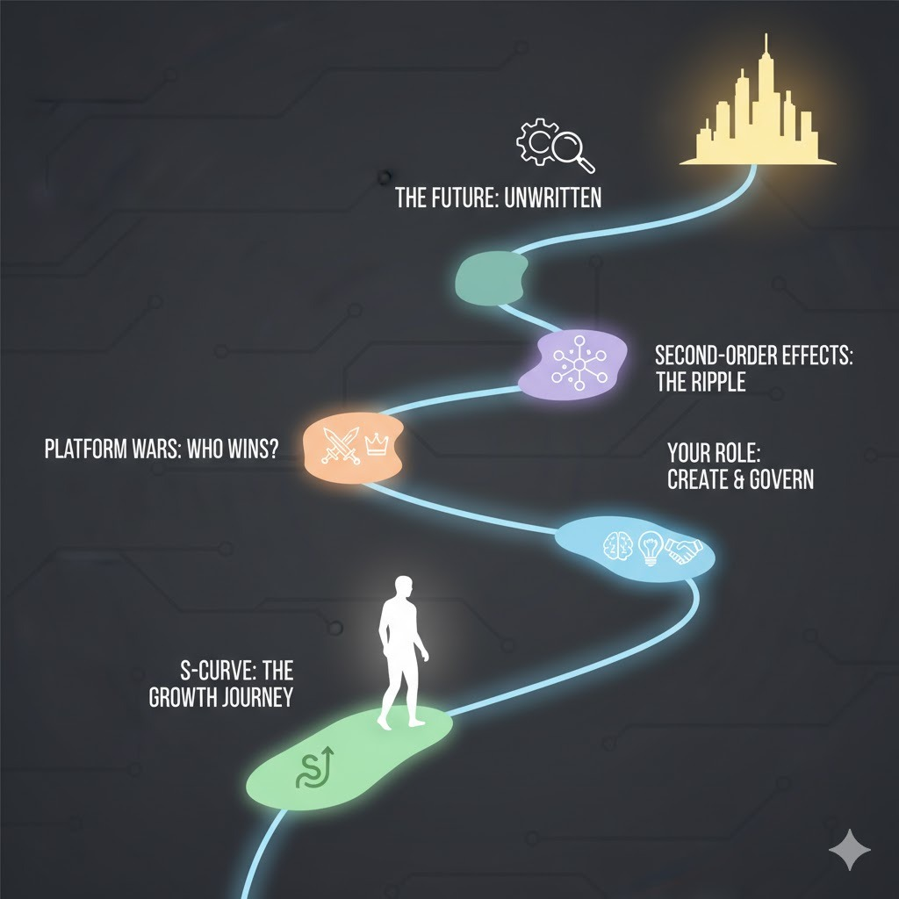

# OpenAI's Vision for an AI-Driven Future Learning Guide

**Panaversity's Learning Handbook Series**

**October 2025**

**How to use this book**

Each chapter follows the Panaversity Teaching Method inspired by the Schaum’s Outline series: a short theory primer, basic check‑in questions, many step‑by‑step solved problems, practice problems with answers at the end of the chapter, and stretch challenges. Remember the goal is to convert knowledge into intelligence by applying real world examples.

- **Teacher use**: Open with 2–3 check‑ins, model 1–2 worked examples, assign practice, then a brief reflection.
- **Student use**: Skim the primer, answer check‑ins first, study 2–3 worked examples, then do practice and check answers.
- **Time guide**: For each chapter 30 minute session, aim ~5 min check‑ins, 10 min examples, 10 min practice, ~3–5 min reflect.

## Table of contents
- [Introduction](#introduction)
- [Chapter 1: Understanding the AI Revolution](#chapter-1-understanding-the-ai-revolution)
- [Chapter 2: OpenAI's Strategic Vision—The Operating System for AI](#chapter-2-openais-strategic-vision-the-operating-system-for-ai)
- [Chapter 3: Implications for Stakeholders](#chapter-3-implications-for-stakeholders)
- [Chapter 4: Challenges and Critical Considerations](#chapter-4-challenges-and-critical-considerations)
- [Chapter 5: Looking to the Future](#chapter-5-looking-to-the-future)
- [Conclusion](#conclusion)


## Introduction

Welcome to an exploration of one of the most transformative technological shifts of our time. This book examines OpenAI's ambitious strategy to reshape how we interact with the internet and digital services through artificial intelligence. Whether you're a student, professional, or simply curious about the future of technology, this guide will help you understand the forces driving the next era of the web.

In just three years, OpenAI's ChatGPT has grown from a novel chatbot to a platform used by 800 million people weekly—a milestone that took the internet itself 13 years to achieve. This unprecedented adoption signals something profound: we are witnessing the emergence of a new technological paradigm, one where artificial intelligence serves as the primary interface between humans and digital services.

This book is structured to take you from fundamental concepts to complex strategic implications. We'll explore what OpenAI is building, why it matters, and how it will affect users, developers, businesses, and society at large. No prior knowledge of business strategy or advanced technology is required—we'll build your understanding step by step.

---

## Chapter 1: Understanding the AI Revolution

### 1.1 Brief Theory Introduction

Artificial intelligence represents humanity's fourth great technological transformation, following steam power, electricity, and digital computing. Unlike previous revolutions that primarily automated physical tasks, AI augments human cognitive capabilities—our ability to think, reason, communicate, and create.

**Key Concept: AI as Augmentation**  
Rather than simply replacing human workers, modern AI is designed to enhance human capabilities. Think of it as giving everyone access to a highly capable assistant who can help with research, writing, analysis, and decision-making.

**The Platform Ecosystem Model**  
Throughout technology history, the most successful companies have built "platforms"—systems that allow others to create value on top of them. Examples include:
- Microsoft Windows (a platform for software applications)
- Apple iOS (a platform for mobile apps)
- Amazon Web Services (a platform for cloud computing)

OpenAI is attempting to make ChatGPT a platform for AI-powered applications and services.

**Infrastructure as Foundation**  
Just as roads, electricity grids, and internet cables form the infrastructure of modern society, OpenAI is building computational infrastructure (massive data centers and AI models) to power the next generation of applications.

### 1.2 Check the Basics

**Remembering Questions:**

1. What are the four major technological eras in human history?
   
   **Answer:** Steam power, electricity, digital computing, and artificial intelligence.

2. How many weekly active users does ChatGPT have as of 2025?
   
   **Answer:** Approximately 800 million weekly active users.

3. What does "AI augmentation" mean?
   
   **Answer:** AI augmentation means enhancing human capabilities rather than replacing humans entirely. It involves AI working alongside people to make them more productive and capable.

**Understanding Questions:**

4. Explain why ChatGPT's growth is considered historically significant.
   
   **Answer:** ChatGPT reached 800 million users in just two years, while it took the internet 13 years to reach a similar milestone. This represents the fastest technology adoption curve in history, indicating both the utility of the technology and a fundamental shift in how people interact with computers.

5. What is a "platform" in technology, and why are platforms important?
   
   **Answer:** A platform is a technological foundation that allows third parties to build products and services on top of it. Platforms are important because they create ecosystems—they enable innovation beyond what the platform creator alone could accomplish, and they often become the standard way users access a category of services.

6. How does the AI revolution differ from previous technological revolutions?
   
   **Answer:** While previous revolutions (steam, electricity, digital) primarily automated physical tasks and processes, the AI revolution augments cognitive capabilities—helping with thinking, reasoning, communication, and creative tasks. This makes it uniquely positioned to transform knowledge work and intellectual activities.

### 1.3 Introduce Solved Problems

**Applying Problem 1:**  
A small business owner currently uses five different tools to manage their company: email, calendar, accounting software, customer relationship management (CRM), and social media scheduling. Using what you've learned about AI platforms, describe how an AI assistant like ChatGPT could potentially simplify their workflow.

**Solution:**  
An AI platform approach could consolidate these tools through a conversational interface. Instead of logging into five separate systems, the business owner could interact with a single AI assistant that:

1. **Reads and drafts emails** by integrating with their email system
2. **Schedules meetings** by accessing their calendar and checking availability
3. **Generates financial reports** by connecting to accounting software
4. **Manages customer relationships** by pulling data from the CRM and suggesting follow-ups
5. **Creates and schedules social media posts** through connected apps

The key insight is that the AI becomes the "interface layer"—the business owner describes what they need in natural language, and the AI orchestrates the appropriate tools behind the scenes. This reduces cognitive load (remembering how each tool works), saves time (no switching between applications), and enables more complex workflows (the AI can coordinate actions across multiple systems).

**Analyzing Problem 2:**  
OpenAI has invested over $1 trillion in partnerships for computing infrastructure, including $500B with Project Stargate, $100B with Nvidia, and $100B with AMD. Analyze why OpenAI would make such massive infrastructure investments rather than simply licensing computing power as needed.

**Solution:**  
This question requires us to think about strategic positioning and long-term competitive advantage. Several factors explain this approach:

**Control and Reliability:**  
By owning or having dedicated access to infrastructure, OpenAI ensures it can serve 800 million users reliably without depending on the availability or pricing decisions of third parties. If ChatGPT experienced frequent outages due to insufficient computing capacity, users would lose trust.

**Economic Scaling:**  
At massive scale, owning infrastructure becomes more cost-effective than renting. If OpenAI processes 2.5 billion messages daily, even small per-query costs multiply enormously. Dedicated infrastructure provides predictable economics.

**Competitive Moat:**  
These investments create a barrier to entry—competitors cannot easily replicate this scale of infrastructure. It's similar to how early telephone companies or railroad companies gained advantages by building physical networks that were expensive to duplicate.

**Platform Credibility:**  
If OpenAI wants developers to build businesses on its platform, those developers need confidence that the platform will be fast, reliable, and available long-term. Massive infrastructure investment signals commitment and capability.

**Technological Advancement:**  
Owning the infrastructure allows OpenAI to optimize the entire stack—from AI models down to chip design—potentially achieving performance improvements impossible with generic cloud services.

This analysis reveals a critical business principle: companies building foundational platforms often need to control their core infrastructure to deliver reliable service at scale.

**Analyzing Problem 3:**  
Compare OpenAI's strategy to become "the platform for AI applications" with Google's historical strategy to become "the gateway to the web" through search. What similarities and differences exist?

**Solution:**  
This comparison requires understanding how technology platforms capture value and build competitive advantages.

**Similarities:**

1. **Becoming the Starting Point:** Google made its search engine the first place people went to find information online. OpenAI wants ChatGPT to become the first place people go to accomplish tasks using AI.

2. **Massive Infrastructure Investment:** Google built enormous data centers to index the web and serve search results quickly. OpenAI is building comparable infrastructure for AI processing.

3. **Intermediation:** Both companies position themselves between users and content/services. Google sits between users and websites; OpenAI wants to sit between users and applications.

4. **Free Consumer Service, Monetize Elsewhere:** Google search was free for users, with revenue from advertising and business services. OpenAI offers free ChatGPT while planning to monetize through subscriptions, business services, and potentially developer fees.

**Differences:**

1. **Interaction Model:** Google's model was query-based (you search, get results, then leave). OpenAI's model is conversational and action-oriented (ongoing dialogue that accomplishes tasks within the platform).

2. **Content vs. Capability:** Google organized existing content. OpenAI generates responses and orchestrates actions—it's more active than passive.

3. **Openness vs. Walled Garden:** Google drove traffic to external websites. OpenAI's vision involves keeping users within ChatGPT while third-party apps run inside it—a more enclosed ecosystem.

4. **Competitive Landscape:** Google emerged when search was new. OpenAI faces established tech giants (Google, Microsoft, Meta) who are simultaneously partners and competitors.

**Strategic Implication:**  
OpenAI's strategy is riskier but potentially more valuable. By attempting to become the interface layer for all digital interactions, OpenAI could capture more value than Google's search business—but only if users accept AI intermediation and if competitors don't fragment the market with alternative AI platforms.

### 1.4 Assign Practice Problems

Try solving these problems on your own before checking the answers at the end of the chapter.

**Practice Problem 1 (Applying):**  
A university student uses ChatGPT for research help. Describe three specific ways that an AI platform approach (where apps run inside ChatGPT) could improve their research process compared to traditional methods of using separate websites and tools.

**Practice Problem 2 (Analyzing):**  
OpenAI's valuation reached $500 billion, making it the world's most valuable startup, despite reportedly losing $7.8 billion in the first half of 2025. Analyze what factors would lead investors to value the company so highly despite current losses.

**Practice Problem 3 (Analyzing):**  
Consider the statistic that 34% of U.S. adults have used ChatGPT. What does this adoption rate suggest about the technology's accessibility, usefulness, and potential for future growth? Compare this to other technologies you're familiar with.

## Practice Problem Answer Key

### Chapter 1 Answers

**Practice Problem 1:**  
A university student could benefit from an AI platform approach in several ways:

1. **Integrated Research Workflow:** Instead of separately searching Google Scholar, accessing university library databases, and managing references, the student could say "Research the impact of social media on teenage mental health" and ChatGPT would search multiple academic databases (through integrated apps), organize findings, generate annotated bibliographies, and identify research gaps—all in one conversation.

2. **Citation and Writing Assistance:** A citation management app integrated into ChatGPT could automatically format references as the student writes, check for citation errors, and suggest additional sources. Rather than switching between writing and citation tools, everything flows conversationally: "Add that study about Instagram and anxiety to my references in APA format."

3. **Collaborative Features:** Apps for note-taking, document collaboration, and calendar scheduling could be coordinated. The student could say "Schedule a study group session with my classmates when we're all available, create a shared document for our notes, and remind everyone the day before." ChatGPT orchestrates the calendar app, document app, and communication app without the student manually coordinating them.

The advantage over traditional methods is reduced cognitive load, time saved from switching between tools, and contextual integration (the AI understands the research project context across all these activities).

**Practice Problem 2:**  
Investors value OpenAI highly despite losses because:

1. **Growth Trajectory:** 800 million weekly users in three years demonstrates product-market fit and massive demand. Investors bet on future revenue from this user base.

2. **Platform Potential:** If OpenAI becomes the platform for AI applications (like AWS for cloud computing), it could capture enormous value from the entire AI economy, not just one product.

3. **Strategic Position:** OpenAI has first-mover advantage in conversational AI and strong technological capabilities. Being early leader in potentially the most important technology of the century justifies high valuation.

4. **Network Effects:** As more users join and more developers build apps, the platform becomes more valuable (self-reinforcing growth), suggesting current losses are investment in future dominant position.

5. **Comparable Precedents:** Amazon, Uber, and other platforms lost money for years while building dominance, then became highly profitable. Investors may see similar trajectory for OpenAI.

6. **Revenue Growth:** Despite losses, revenue is growing rapidly ($12B annualized), indicating the path to profitability exists once the company scales.

The valuation is forward-looking, based on potential future value if OpenAI succeeds in becoming infrastructure for AI, not on current profitability.

**Practice Problem 3:**  
The 34% U.S. adult adoption rate suggests several things:

**Accessibility:** ChatGPT is relatively easy to use and broadly accessible—a third of adults includes diverse ages, education levels, and technical skills. This indicates the interface is intuitive enough for mainstream adoption.

**Usefulness:** People are finding practical value; 34% isn't just early adopters or tech enthusiasts, but includes mainstream users who perceive benefits worth the effort of trying something new.

**Growth Potential:** 66% haven't used ChatGPT yet, indicating significant room for growth. If current users recommend it and capabilities expand, adoption could reach majority of population.

**Comparison:**  
- Social media reached ~70% U.S. adult adoption over 15+ years
- Smartphones reached ~85% over 12 years  
- Internet reached ~90% over 20+ years

ChatGPT reaching 34% in under 3 years is extremely rapid, suggesting it could potentially reach majority adoption within 5-10 years if current trajectory continues. However, the pace might also indicate early adoption plateau—many who tried it occasionally but don't use it regularly. The distinction between "have used" and "active users" matters for assessing long-term adoption.


---

## Chapter 2: OpenAI's Strategic Vision The Operating System for AI

### 2.1 Brief Theory Introduction

OpenAI is executing a bold strategy to transform ChatGPT from a simple chatbot into what executives call an "operating system" for the AI era. To understand this vision, we need to grasp several key concepts.

**Operating Systems Explained**  
An operating system (OS) is software that manages computer hardware and provides services for applications. Examples include Windows, macOS, iOS, and Android. The OS serves as an intermediary—applications don't need to know how to communicate with your specific hardware; they just need to work with the OS.

Why are operating systems powerful?

1. **They control the user interface** (how people interact with technology)
2. **They provide distribution** (app developers build for the OS to reach users)
3. **They set standards** (developers must follow the OS's rules and capabilities)
4. **They capture value** (through app stores, subscriptions, or data)

**The "Post-App" Vision**  
OpenAI envisions a future where users don't navigate between dozens of separate apps and websites. Instead, they interact with a single AI assistant that:
- Understands what you want to accomplish in natural language
- Determines which services or capabilities are needed
- Orchestrates those services behind the scenes
- Presents results in a unified conversational interface

This is called the "post-app" or "agent-centric" web—where AI agents become the primary interface rather than traditional graphical user interfaces.

**The Three Pillars of OpenAI's Strategy**

1. **Software Platform (Apps SDK & AgentKit):** Tools that let developers build applications and AI agents that run inside ChatGPT
2. **Physical Infrastructure (Data Centers & Computing):** Massive investments in servers, chips, and connectivity to power AI at scale
3. **Ecosystem Development (Partnerships & Developer Relations):** Attracting companies and developers to build on the platform

### 2.2 Check the Basics

**Remembering Questions:**

1. What does OS stand for, and what does it do?
   
   **Answer:** OS stands for Operating System. It manages computer hardware and provides services for applications, serving as an intermediary between applications and hardware.

2. Name three tools OpenAI announced to support its platform vision.
   
   **Answer:** Apps SDK (for building applications inside ChatGPT), AgentKit (for building and deploying AI agents), and Agents SDK (the underlying framework for agent development).

3. What is Project Stargate?
   
   **Answer:** Project Stargate is a partnership involving OpenAI, Oracle, and others to invest up to $500 billion in new AI data center infrastructure in the United States.

**Understanding Questions:**

4. Explain what "agent-centric web" means and how it differs from today's web experience.
   
   **Answer:** The agent-centric web is a paradigm where AI agents serve as the primary interface for users instead of traditional apps and websites. Rather than opening different applications and clicking through graphical interfaces, users would converse with an AI assistant that understands their goals and orchestrates multiple services to accomplish tasks. The difference is interaction model (conversation vs. navigation) and unification (one interface vs. many separate apps).

5. Why would developers want to build applications for ChatGPT instead of building standalone apps?
   
   **Answer:** Developers would be attracted by ChatGPT's massive built-in audience (800 million weekly users), reduced need to build their own user interface and user acquisition strategy, access to OpenAI's AI capabilities through APIs, and the potential for their app to be discovered contextually when relevant to user conversations. It's similar to why developers built apps for the iPhone—instant access to millions of potential users.

6. What is the relationship between OpenAI's massive infrastructure investments and its platform strategy?
   
   **Answer:** The infrastructure investments support the platform strategy in several ways. First, the platform needs enormous computing power to serve 800 million users and process 2.5 billion messages daily. Second, reliable, fast performance is essential for developers to trust the platform for their businesses. Third, controlling infrastructure allows OpenAI to optimize the entire system for AI workloads. Fourth, the scale of investment creates competitive barriers—few companies can match this level of infrastructure commitment.

### 2.3 Introduce Solved Problems

**Applying Problem 4:**  
You're a product manager at a travel company. OpenAI has approached you about building a travel planning app for ChatGPT using their Apps SDK. Your traditional website handles flight searches, hotel bookings, and itinerary planning. Describe how you would redesign this as a conversational app for ChatGPT and what new capabilities might be possible.

**Solution:**  
Let's think through this systematically:

**Traditional Website Workflow:**
1. User navigates to your website
2. Fills out search forms (destination, dates, travelers)
3. Reviews search results in a structured display
4. Clicks through multiple pages to compare options
5. Creates an account or logs in
6. Completes booking through a payment form
7. Receives confirmation via email

**Conversational ChatGPT App Workflow:**

**Conversation Initiation:**  
User: "I need to plan a family trip to Japan next spring for two weeks"  
ChatGPT: [Recognizes travel context, invokes your app]  
Your App: "I'd love to help with your Japan trip! I can see you're looking at spring—that's cherry blossom season. How many people are traveling?"

**Natural Information Gathering:**  
Rather than forms, the conversation naturally collects: number of travelers, budget preferences, interests (cultural sites, food experiences, outdoor activities), accommodation preferences, and mobility considerations (especially relevant for families).

**Intelligent Suggestions:**  
Your app, integrated with ChatGPT, can:
- Suggest optimal timing: "Late March to early April is peak cherry blossom season but more expensive. Early March or late April offers savings with good weather."
- Propose itineraries: "For two weeks, I recommend: 4 days Tokyo, 3 days Kyoto, 2 days Osaka, 2 days Hiroshima, 3 days rural/mountain experience."
- Present real-time pricing for the entire package

**Interactive Planning:**  
User: "That sounds good but we prefer more time in nature"  
App: [Adjusts itinerary] "I'll add more time in the Japanese Alps and reduce urban days. Here's the updated plan..."

**Booking Coordination:**  
Because the app runs in ChatGPT, it can:
- Check the user's calendar (with permission) for scheduling
- Coordinate multiple bookings (flights + hotels + trains) in one conversation
- Handle changes conversationally: "Can we shift the dates by three days?"
- Present interactive booking cards within the chat

**New Capabilities Enabled:**

1. **Contextual Awareness:** If the user mentioned in a previous conversation that they have a toddler, your app can proactively suggest family-friendly accommodations and activities.

2. **Proactive Assistance:** "Your Japan trip is in 30 days. Would you like me to check visa requirements and suggest packing lists?"

3. **Real-Time Problem Solving:** During the trip, users could ask "Our flight is delayed—can you rebook our hotel check-in?" and the agent handles it.

4. **Learning Preferences:** The more a user interacts with your app through ChatGPT, the better it understands their travel style, budget sensitivity, and preferences.

**Key Insight:**  
The conversational model transforms travel planning from a transactional process (filling out forms) to a consultative dialogue. This is particularly powerful for complex travel planning where understanding context, preferences, and trade-offs matters more than just finding the cheapest flight.

**Applying Problem 5:**  
AgentKit includes three main components: Agent Builder (visual interface), ChatKit (embeddable chat), and Connector Registry (for integrating external tools). A healthcare company wants to build an AI agent to help patients schedule appointments, access medical records, and get medication reminders. Explain which AgentKit components they would use for each function and how.

**Solution:**  
Let's map each patient-facing function to the appropriate AgentKit component:

**1. Appointment Scheduling**

*Primary Component: Agent Builder + Connector Registry*

**Agent Builder Usage:**  
Using the visual workflow interface, the healthcare company would design the appointment scheduling logic:
- Trigger: User requests appointment
- Action 1: Query available time slots from scheduling system (via connector)
- Action 2: Check patient's calendar for conflicts (via connector)
- Action 3: Present options to patient conversationally
- Action 4: Confirm selection
- Action 5: Create appointment in scheduling system (via connector)
- Action 6: Send confirmation and calendar invite

**Connector Registry Usage:**  
The Connector Registry would provide secure integration with:
- Electronic Health Records (EHR) system to verify patient identity and insurance
- Practice management software for available time slots
- Calendar systems (Google Calendar, Outlook) for patient's personal schedule
- SMS/email systems for appointment confirmations and reminders

**Why This Approach:**  
The visual Agent Builder allows non-programmers (healthcare administrators) to design the logic flow, while connectors handle the secure technical integration with existing healthcare IT systems.

**2. Medical Records Access**

*Primary Component: Connector Registry + ChatKit*

**Connector Registry Usage:**  
Securely connects to the EHR system with appropriate authentication and authorization. This is critical because medical records are highly regulated (HIPAA in the US, GDPR in Europe).

**ChatKit Usage:**  
The embeddable chat interface would be integrated into the healthcare provider's patient portal. When a patient asks "Can I see my lab results from last month?" ChatKit provides the conversational interface while the connector safely retrieves records from the EHR.

**Security Considerations:**  
The agent needs to:
- Verify patient identity (multi-factor authentication)
- Log all record access for compliance
- Only show records the patient is authorized to see
- Present medical information clearly, potentially offering to explain complex terms

**3. Medication Reminders**

*Primary Component: Agent Builder + Connector Registry*

**Agent Builder Usage:**  
Design a proactive agent workflow:
- Trigger: Scheduled time for medication (e.g., 8 AM daily)
- Action 1: Check patient's medication list from EHR
- Action 2: Determine which medications are due
- Action 3: Send reminder via preferred channel (SMS, app notification, email)
- Action 4: If patient confirms taking medication, log in compliance system
- Action 5: If no response after 30 minutes, send follow-up
- Action 6: Alert healthcare provider if multiple doses missed

**Connector Registry Usage:**  
- EHR integration for medication list and dosage schedules
- Notification systems (SMS, push notifications, email)
- Compliance tracking system for medication adherence
- Alert system for healthcare providers

**Integration Architecture:**  
All three functions would work together through a single conversational agent:

Patient: "I need to see my doctor about my blood pressure"  
Agent: [Checks records] "Your last blood pressure reading was elevated. I can schedule an appointment with Dr. Smith. She has availability Tuesday at 2 PM or Thursday at 10 AM. Which works for you?"  
Patient: "Thursday at 10 AM"  
Agent: [Schedules appointment] "Booked! I've added it to your calendar. By the way, I notice you've missed two doses of your blood pressure medication this week. Would you like me to adjust the reminder time?"

**Key Insight:**  
AgentKit's modular components allow building sophisticated multi-function agents without extensive programming. The visual Agent Builder handles logic and workflows, ChatKit provides the user interface, and the Connector Registry safely bridges to existing systems. This democratizes AI agent development—healthcare providers can create useful agents without hiring large software teams.

**Analyzing Problem 6:**  
OpenAI's Nick Turley stated, "We never meant to build a chatbot; we meant to build a super assistant." Analyze what this distinction means for OpenAI's business model, user expectations, and competitive positioning.

**Solution:**  
This statement reveals important strategic positioning. Let's analyze the implications:

**1. Business Model Implications**

*Chatbot Model:*  
- Typically sold per-seat or per-query to businesses
- Value proposition is automation (reduce customer service costs)
- Limited revenue potential—replaces specific job functions
- Commoditizable—many chatbot companies exist

*Super Assistant Model:*  
- Platform business model with multiple revenue streams
- Revenue from consumer subscriptions (ChatGPT Plus/Pro)
- Revenue from enterprise licenses (whole-company access)
- Revenue from developer ecosystem (app fees, API usage)
- Revenue from compute resources (hosting AI agents)
- Revenue from embedded services (e-commerce transactions)
- Potential advertising or premium placement for apps

**Value Multiplier:**  
A "super assistant" that people use throughout their day for multiple purposes has much higher lifetime value than a tool used for one specific task. If ChatGPT becomes how people book travel, manage schedules, learn new skills, shop online, and access services, OpenAI touches many high-value transactions and subscription relationships.

**2. User Expectation Implications**

*Chatbot Expectations:*  
- Answers predefined questions within a narrow domain
- Users expect limitations
- Interaction is transactional and brief
- Users don't develop "relationships" with chatbots

*Super Assistant Expectations:*  
- Handles diverse, unpredictable requests across domains
- Users expect continuous capability expansion
- Interaction is ongoing and contextual (remembers past conversations)
- Users develop preferences and reliance—it becomes a daily tool
- Much higher bar for quality and reliability

**Challenge:**  
By positioning as a "super assistant," OpenAI must continuously meet rising expectations. Any significant limitations or failures disappoint users more because they've integrated the tool into critical workflows.

**3. Competitive Positioning Implications**

*Chatbot Competition:*  
Would compete against specific tools—customer service platforms, FAQ bots, writing assistants, etc. This would be a "better mousetrap" strategy in existing categories.

*Super Assistant Competition:*  
Competes against the entire digital ecosystem:
- Against Google (for being the starting point for information)
- Against Apple/Microsoft (for operating system-level integration)
- Against Amazon (for e-commerce transactions)
- Against specialized apps (for calendar, email, tasks, etc.)

**Strategic Positioning:**  
Rather than competing feature-by-feature in many categories, OpenAI is attempting to transcend categories by becoming the unified interface. This is a much more ambitious strategy—it requires:

**Horizontal Breadth:**  
Capability across many domains (travel, finance, health, education, entertainment, productivity, etc.)

**Platform Network Effects:**  
Each new app or capability makes the platform more valuable, attracting more users, which attracts more developers—a virtuous cycle

**Switching Costs:**  
If users integrate a super assistant into their daily life across multiple domains, switching to a competitor becomes very difficult (all your preferences, history, and integrated services are in one place)

**Market Size:**  
The total addressable market for a "super assistant" includes virtually all digital spending and activity, not just a slice of chatbot services

**4. Execution Risk**

This positioning also reveals OpenAI's execution risk:
- A chatbot can fail in predictable ways within its narrow scope
- A super assistant that fails broadly (hallucinations, bad recommendations, security breaches) damages trust across all use cases
- The technical challenge of reliable performance across domains is enormous
- Managing an ecosystem of third-party apps introduces quality control and liability issues

**Conclusion:**  
The "super assistant" positioning signals that OpenAI is playing for extremely high stakes—attempting to become a foundational layer of how people interact with technology rather than a tool for specific tasks. This justifies massive infrastructure investment and explains both the $500 billion valuation and the current losses (investing heavily before monetization). It's a "winner-take-most" strategy where being the dominant super assistant is worth hundreds of billions, but being one of many chatbots is worth much less.

### 2.4 Assign Practice Problems

**Practice Problem 4 (Applying):**  
A financial services company wants to create an AI agent that helps users with budgeting, investment advice, and bill payment. Using AgentKit's components (Agent Builder, ChatKit, Connector Registry), design how this agent would work. Be specific about which component handles which function.

**Practice Problem 5 (Analyzing):**  
OpenAI faces competition from Google, Microsoft, Meta, and Anthropic—all building AI assistants. Analyze OpenAI's competitive advantages and disadvantages compared to these tech giants. Consider factors like user base, infrastructure, partnerships, business model, and platform ecosystem.

**Practice Problem 6 (Evaluating):**  
Evaluate the trade-offs for developers who choose to build on OpenAI's platform versus creating standalone applications. Under what conditions would building for ChatGPT make strategic sense, and when would it be better to remain independent?

### Chapter 2 Answers

**Practice Problem 4:**  
A financial services AI agent using AgentKit components:

**Agent Builder** would design the logic:

*Budgeting Workflow:*
- User describes financial situation conversationally
- Agent accesses account balances (via Connector Registry)
- Analyzes spending patterns from transaction history
- Generates personalized budget recommendations
- Creates alerts for overspending categories
- Provides ongoing monitoring and adjustment suggestions

**ChatKit** would provide the interface:
- Embeddable in the financial services company's website/app
- Conversational interface for discussing finances naturally
- Visual displays (charts, graphs) within chat when helpful
- Secure, authenticated environment

**Connector Registry** would integrate with:
- Banking APIs (checking, savings, credit card accounts)
- Investment platforms (for portfolio data)
- Bill payment systems (to execute payments)
- External financial data (market rates, comparison services)
- Notification systems (alerts for bills due, budget concerns)

**Example Interaction:**  
User: "Am I overspending this month?"  
Agent: [Connector checks accounts] "You've spent $3,200 so far this month versus your usual $2,800. The difference is mostly dining out ($450 vs. your $250 average). Would you like me to suggest lower-cost alternatives or adjust your budget?"

The modular approach allows the financial services company to build sophisticated functionality without building the AI infrastructure from scratch.

**Practice Problem 5:**  
OpenAI's competitive position:

**Advantages:**
- **Largest User Base:** 800 million weekly users gives OpenAI the strongest distribution
- **Platform Focus:** OpenAI is building platform-first while others are adapting existing products
- **Developer Ecosystem:** First-mover advantage in establishing developer community
- **Brand:** "ChatGPT" has become synonymous with AI assistants
- **Neutrality:** Unlike Google/Microsoft/Meta, OpenAI doesn't have major existing product suites that might bias the assistant

**Disadvantages:**
- **Resources:** Google, Microsoft, Meta have larger financial resources and infrastructure
- **Integrated Platforms:** Microsoft has Windows and Office; Google has Search and Android; Apple has iOS—built-in distribution
- **AI Capability:** Google, Microsoft, and Anthropic have competitive AI models; OpenAI doesn't have clear technical lead
- **Diversification:** Competitors have other revenue sources if AI doesn't succeed; OpenAI is all-in on AI
- **Partnerships:** Microsoft's OpenAI partnership is also a risk—Microsoft could eventually compete directly

**Strategic Assessment:**  
OpenAI's best advantage is momentum and focus—it moved fastest to capture consumer attention and developer interest. However, competitors with integrated platforms could eventually leverage their existing user relationships to overtake OpenAI if they execute well. The battle likely depends on whether OpenAI can build strong enough lock-in (through network effects and ecosystem) before competitors fully mobilize their advantages.

**Practice Problem 6:**  
Developers should build for ChatGPT when:

**Favorable Conditions:**
1. **Large Addressable Market:** The app serves a broad audience that overlaps with ChatGPT's user base
2. **Conversational Advantage:** The use case works better conversationally than through traditional GUI
3. **Discovery Challenge:** The app solves a problem users might ask about but wouldn't know to download a specific app for
4. **Low Switching Costs:** The app doesn't require significant user data investment (so platform lock-in is less risky)
5. **Complementary to Platform:** The app extends ChatGPT's capabilities rather than competing with core functionality

**Example:** A specialized travel app for planning accessible trips for people with disabilities—conversational interface is natural, addresses a need users would express ("help me plan a wheelchair-accessible trip to Paris"), reaches ChatGPT's large audience, and complements rather than competes with the platform.

Developers should stay independent when:

**Favorable Conditions:**
1. **Unique Brand Value:** The business relies on brand recognition and direct customer relationships
2. **Complex User Journeys:** The experience requires extensive interaction that doesn't fit conversational format
3. **Data Ownership Critical:** The business model requires owning customer data
4. **Platform Risk:** Dependence on ChatGPT would be existential risk if terms change
5. **Differentiated Experience:** The app offers a carefully designed experience that ChatGPT's general interface would diminish

**Example:** A professional design tool like Adobe Photoshop—requires precise control, complex workflows, brand reputation matters, and the specific interface is core to the value proposition. Integration with ChatGPT might be useful (AI-assisted design features) but the primary experience should remain independent.

**Strategic Recommendation:** Many businesses should pursue a hybrid approach—light integration with ChatGPT for discovery and basic features, while maintaining independent platforms for core, deep engagement. This provides optionality without excessive risk.


---

## Chapter 3: Implications for Stakeholders

### 3.1 Brief Theory Introduction

Any major technological shift creates winners and losers among different stakeholder groups. Understanding these implications helps us anticipate how markets, careers, and industries might evolve.

**Stakeholder Analysis Framework**  
When analyzing technological change, we examine impacts on:

1. **End Users** (How will everyday people's experiences change?)
2. **Developers** (What new opportunities and challenges arise for software creators?)
3. **Businesses** (How must companies adapt their strategies?)
4. **Society** (What broader economic and social effects occur?)

### Introduction: The Shopping Mall Analogy

**Think about shopping in 1990 vs. today:**

### The Old Way (1990s):

- Drive to electronics store for a phone
- Drive to bookstore for books
- Drive to music store for CDs
- Drive to travel agency for trips
- Each store: different hours, payment systems, parking

### The Mall Revolution:

- **Everything under one roof**
- Park once, shop everywhere
- Eat lunch there too

### Who Benefits?

✅ **Shoppers** - Maximum convenience

❌ **Small stores outside** - Lost customers

⚡ **Mall owner** - Gained most power

### The Connection to AI:

Just like malls changed shopping, **AI platforms like ChatGPT are changing how we use apps and technology**. Instead of opening 20 different apps, you just talk to ChatGPT!

---

## Core Concept #1: Jobs-to-be-Done Framework

### The Big Idea:

**People don't buy products—they buy solutions to their problems!**

### Classic Example: The Drill vs. The Hole

### ❌ Traditional Thinking:

"Let's make better drills!"

- Faster motor
- Shinier design
- More features

### ✅ Jobs-to-be-Done Thinking:

"Why do people need a drill?"

- To hang family photos (functional job)
- To finish home projects (emotional job)
- To feel accomplished (social job)

**The insight:** People don't want a drill. They want a hole in the wall!

---

### Real-World Examples:

### Example 1: Music

- **Product focus:** "I want an MP3 player"
- **Jobs-to-be-done:** "I want to feel energized during my workout"
- **Winner:** Spotify (solves the real job!)

### Example 2: Food

- **Product focus:** "I want a restaurant menu"
- **Jobs-to-be-done:** "I want dinner without cooking or deciding"
- **Winner:** UberEats (solves the real job!)

### Example 3: Education

- **Product focus:** "I want a textbook"
- **Jobs-to-be-done:** "I want to understand this concept for my exam"
- **Winner:** YouTube tutorials (solves the real job!)

---

### Why ChatGPT Wins with This Approach:

### Traditional Apps:

- Calculator app → only math
- Weather app → only weather
- Calendar app → only scheduling

### ChatGPT Approach:

**You say:** "I have an exam this Saturday—help me prepare, what topics should I focus on, and create a study schedule for the next 3 days?"

**Single job:** Help me ace my exam

**Behind the scenes:** Calendar + Study planning + Content review + Practice questions (all coordinated!)

---

## Core Concept #2: Multi-Sided Markets

### Definition:

A platform that serves multiple groups where everyone benefits from each other's participation.

### The YouTube Model:

```
[VIEWERS] ←→ [YOUTUBE] ←→ [CREATORS]
                ↕
          [ADVERTISERS]

```

### For Viewers:

- FREE unlimited videos
- Watch anything, anytime
- No subscription needed

### For Creators:

- Access to billions of viewers
- No need for TV network
- Make money from ads

### For Advertisers:

- Reach exact target audience
- Pay only when people watch
- See instant results

### For YouTube:

- Takes small cut from ad revenue
- Connects everyone
- Gets richer as platform grows

**Key Question:** Who has the most power? **YouTube!** (They set all the rules)

---

### How ChatGPT Creates the Same Structure:

```
[800M USERS] ←→ [CHATGPT] ←→ [DEVELOPERS]
                    ↕
              [BUSINESSES]

```

### Benefits for Users (You!):

- Single interface for everything
- No need to download 50 apps
- AI understands your needs
- Everything works together seamlessly

### Benefits for Developers:

- Instant access to 800 million potential customers
- No need to spend millions on marketing
- Don't need to design complicated interfaces
- ChatGPT handles conversations

### Benefits for Businesses:

- New sales channel
- Customers find them through AI
- Integration with other services
- Access to AI technology

### Benefits for OpenAI (ChatGPT's owner):

- Takes percentage of every transaction
- Gets data from all interactions
- Becomes more essential over time
- **Controls the rules of the game**

---

### The Power Dynamic (VERY IMPORTANT!)

### The Dream Scenario:

✅ Build popular app on ChatGPT

✅ Get 1 million users quickly

✅ Make good money

✅ Life is great!

### The Nightmare Scenario:

❌ OpenAI raises fee from 10% to 30%

❌ Algorithm changes—fewer people find your app

❌ OpenAI builds competing app themselves

❌ **What can you do?** → Not much! You're dependent!

### Real Historical Example: Uber Drivers

- **2013:** Uber paid drivers 80% of fares
- **2025:** Uber pays drivers 50-60% of fares
- **Result:** Drivers became dependent, had to accept lower pay

---

### The Balancing Act:

### 👍 Good Side (Democratization):

- Small developer in Pakistan can reach global users
- No huge marketing budget needed
- Somewhat level playing field

### 👎 Scary Side (Gatekeeper Power):

- Platform controls your business
- Platform can change rules anytime
- Platform might compete with you

---

## Core Concept #3: Network Effects

### The Simple Definition:

**The more people who use something, the more valuable it becomes for EVERYONE.**

### The WhatsApp Principle:

### Scenario A: You're the ONLY person with WhatsApp

- Can you message anyone? **NO**
- Is it valuable? **NO**
- Would you keep it? **NO**

### Scenario B: 1 BILLION people have WhatsApp

- Can you message almost anyone? **YES**
- Is it valuable? **YES**
- Would you delete it? **NO WAY!**

**The Formula:**

```
More Users = More Value for EVERYONE
(This is the network effect!)

```

---

### The Snowball Effect (Unstoppable Momentum):

### Stage 1: Small snowball

- ChatGPT launches
- 1 million users
- 100 developers build apps

### Stage 2: Growing snowball

- 10 million users (attracted by those 100 apps)
- 1,000 developers join (see the opportunity!)

### Stage 3: MASSIVE snowball

- 100 million users (attracted by 1,000 apps)
- 10,000 developers rush in

### Stage 4: UNSTOPPABLE

- 800 million users
- Everyone MUST be there or become invisible

---

### Winner-Take-All Dynamic:

This is why:

- **Facebook** beat MySpace and stays dominant
- **Google** dominates search (even though Bing exists)
- **WhatsApp** dominates messaging in many countries

**Once ahead, they stay ahead automatically!**

---

### ChatGPT's Three Network Effects:

### Effect #1: User-Developer Loop

```
More users → developers see opportunity
More developers → better apps created
Better apps → more users join
REPEAT INFINITELY!

```

### Effect #2: Data Improvement Loop

```
More users → more conversations
More conversations → AI learns more
Smarter AI → better experience
Better experience → more users
REPEAT INFINITELY!

```

### Effect #3: Ecosystem Lock-In

```
You use ChatGPT for calendar
+ Add email integration
+ Add shopping integration
+ Add banking integration
= Now switching means losing ALL these connections!

```

---

### Real Student Example:

### Scenario A: You're on Instagram

- All your friends are there
- All your photos are there
- All your memories are there
- **New app launches → Will you switch?** *Probably not!*

### Scenario B: You use ChatGPT daily

- It knows your schedule
- It knows your preferences
- It manages your tasks
- It coordinates your apps
- **Competitor launches → Will you switch?** *Definitely not!*

---

### Critical Insight for Your Career:

Network effects mean:

- ✅ Early movers win BIG
- ✅ Late movers struggle HARD
- ✅ The leader gets stronger automatically
- ✅ Second place gets weaker automatically

**Your Career Lesson:**

When a new platform emerges, there's a **SHORT window** to jump in early before network effects lock in the leader!

---

## Real-World Applications

### Application #1: Your Daily Life Transformation (Applying)

### Monday Morning: THE OLD WAY (Stressful!)

**7:00 AM - Wake Up:**

1. Check phone → 15 different app notifications
2. Open Calendar app → Biology class at 9 AM
3. Close Calendar, open Weather app → It's raining
4. Close Weather, open Task Manager → Assignment due tomorrow
5. Close Task Manager, open Banking app → Check lunch money
6. **Result: Mental overload! Exhausted before leaving bed!**

**7:45 AM - Planning Your Day:**

- Open Study app to review notes
- Don't understand a concept
- Open Google to search
- Read three different websites
- Still confused
- **Result: 15 minutes wasted, still don't understand**

**1:00 PM - Group Project:**

- Where are my group meeting notes?
- Check Google Drive → Not there
- Check Email → Not there
- Check WhatsApp → Not there
- **Finally find notes in Messenger! UGH!**

---

### Monday Morning: THE CHATGPT WAY (Seamless!)

**7:00 AM - One Conversation:**

**You:** "Good morning, what's up today?"

**ChatGPT:**

"Good morning! Quick heads-up:

- 9 AM: Biology class (Hall 3)
- It's raining - you'll want an umbrella
- Assignment due tomorrow at midnight (you said you need 3 hours)
- You have $23 in your account until Friday
- There's a 90-minute gap at 3 PM - perfect for that assignment?
- By the way, want breakfast suggestions with what's in your fridge?"

**Result: Single conversation = Everything managed!**

---

**7:45 AM - Study Help:**

**You:** "I'm confused about cellular respiration from yesterday's lecture"

**ChatGPT:**

"Let me help! Which part specifically:

- The overall process?
- Glycolysis vs Krebs cycle?
- The ATP production?

Also, I see your Biology exam is in 2 weeks - want me to create a study schedule?"

**Result: It TEACHES you, CREATES practice questions, and TRACKS your progress - all in one place!**

---

**1:00 PM - Group Project:**

**You:** "What did my team decide in our last meeting?"

**ChatGPT:**

"From your October 12th meeting notes:

- Sarah: Research methodology
- James: Data visualizations
- You: Introduction + literature review
- Meeting today at 2 PM at library

I see you have a draft in Google Drive called 'Sociology Project Intro v2.' Want me to:

1. Review it for errors?
2. Send it to your team with a meeting agenda?
3. Suggest improvements?"

**Result: Everything flows naturally!**

---

### The Key Difference:

| Approach | Cognitive Load | Result |
| --- | --- | --- |
| **Traditional** | You remember what app does what, where things are stored, how each interface works | **HIGH** - Mental exhaustion |
| **ChatGPT** | You just say what you need, AI figures out the rest | **LOW** - Effortless |

---

### Application #2: Business Strategy Decision (Evaluating)

### Meet Zara - Online Boutique Owner

**Background:**

- Sells handmade jewelry online
- Small business, $500,000 annual revenue
- Gets email from OpenAI: "Integrate your shop with ChatGPT!"

**Zara must decide:**

- Should I join this platform?
- What are the risks?
- What if I don't join and competitors do?

---

### Scenario Planning (2×2 Matrix):

```
                    ChatGPT STAYS SMALL | ChatGPT BECOMES HUGE
                    ─────────────────────┼─────────────────────
OpenAI is FAIR      │   No big deal      │   MUST JOIN
                    │   (minor benefit)   │   (or lose customers)
                    ─────────────────────┼─────────────────────
OpenAI is GREEDY    │   Glad I avoided   │   NIGHTMARE
                    │   (wasted effort)   │   (trapped & exploited)

```

---

### Scenario 1: HUGE + FAIR (Top-Right)

**This is like Google in 2000:**

- Businesses that got online early → **THRIVED**
- Businesses that ignored internet → **DIED**
- If ChatGPT becomes how people shop, Zara MUST be there!

### Scenario 2: HUGE + GREEDY (Bottom-Right)

**This is like Amazon today:**

- Sellers depend on Amazon for 80% of sales
- Amazon charges higher and higher fees
- Amazon copies successful products and competes
- Sellers are **TRAPPED** - can't leave but can't make good profit

### Scenario 3: SMALL + FAIR (Top-Left)

**ChatGPT stays as one option among many:**

- Nice to have
- Brings some extra customers
- Not game-changing
- Zara doesn't regret joining but it's not critical

### Scenario 4: SMALL + GREEDY (Bottom-Left)

**ChatGPT fails to take off AND treats partners badly:**

- Zara wasted development resources
- Better to have focused on Instagram or TikTok
- Glad she didn't bet everything on it

---

### Zara's Smart Strategy:

### Phase 1: Toe in the Water

✅ Basic integration (be discoverable)

✅ Spend minimal resources

✅ Learn how it works

✅ Keep all other sales channels strong

**Don't put all eggs in one basket!**

### Phase 2: Watch and Learn (6-12 months)

- **Track:** How many customers come from ChatGPT?
- **Monitor:** What are competitors doing?
- **Observe:** Is OpenAI being fair or greedy?
- **Measure:** Is this worth more investment?

### Phase 3: Decision Time

**Go ALL IN if:**
✅ ChatGPT traffic > 10% of sales

✅ Customers expect ChatGPT shopping

✅ OpenAI's terms stay reasonable

✅ Competitors are succeeding there

**PULL BACK if:**
❌ ChatGPT brings <2% of sales after 12 months

❌ OpenAI raises fees dramatically

❌ OpenAI starts competing with sellers

❌ Better platforms emerge

---

### The Universal Lesson:

This isn't just about ChatGPT! This applies to:

- **Every new platform** (TikTok, Instagram Shops, whatever comes next)
- **Every technological shift** (mobile apps, social media, AI)
- **Every business decision** under uncertainty

**The strategy:**

Test carefully → Monitor closely → Adapt quickly → Never become completely dependent!

---

## The Big Picture Synthesis

### The Mental Model (How It All Connects):

`JOBS-TO-BE-DONE
(Focus on what users actually want)
        ↓
MULTI-SIDED MARKETS
(Connect users, developers, businesses)
        ↓
NETWORK EFFECTS
(Early leader becomes unstoppable)
        ↓
POWER DYNAMICS
(Democratization + Gatekeeper risk)`

---

### Pattern Recognition: This Has Happened Before!

### iPhone App Store (2008)

- **Opportunity:** Reach millions of users
- **Risk:** Apple controls everything

### Amazon Marketplace (2000s)

- **Opportunity:** Access to massive customer base
- **Risk:** Amazon competes with you

### YouTube (2005)

- **Opportunity:** Anyone can be a creator
- **Risk:** Algorithm decides your success

### ChatGPT (2024+)

- **Same opportunity, same risk, NEW TECHNOLOGY**

---

### Your Personal Takeaways:

### As a Student:

- Tools like ChatGPT can be YOUR superpower
- Reduce time on boring tasks
- Focus energy on creative/critical thinking
- Stay aware of what you're depending on

### As a Future Professional:

- Understand platform dynamics
- Jump on opportunities early (network effects!)
- Never become completely dependent
- Build skills that transfer across platforms

### As a Citizen:

- Technology creates winners and losers
- Democratization is real (more access!)
- Gatekeeper power is real (less control!)
- We need smart regulations to balance both

---

## The Ultimate Framework

### When Any New Platform Emerges, Ask These 5 Questions:

1. **What job does this REALLY do?** (Jobs-to-be-done)
2. **Who benefits and how?** (Multi-sided markets)
3. **Will early movers win big?** (Network effects)
4. **Who gains power?** (Gatekeeper analysis)
5. **Should I join or wait?** (Risk-benefit)

---

### Final Message:

Every 10-15 years, a MASSIVE technology shift happens:

- **1990s:** Internet
- **2000s:** Google & Social Media
- **2010s:** Smartphones & Apps
- **2020s:** AI Platforms

**Each time, three groups emerge:**

1. People who see it early and ride the wave
1. People who ignore it and get left behind
2. People who understand the risks and navigate smartly

**Which will YOU be?**

The knowledge in this chapter helps you understand ANY platform - not just ChatGPT, but whatever comes next!

---

## Quick Review Quiz

Test your understanding with these questions:

1. **What's the REAL job of Netflix?**
    - Answer: *Entertaining you effortlessly (not just streaming video)*
2. **Why can't a new WhatsApp competitor easily win?**
    - Answer: *Network effects! All your friends are already on WhatsApp*
3. **Name ONE benefit and ONE risk of AI platforms**
    - Answer: *Benefit: Easier access; Risk: Platform controls you*
4. **Should every business immediately join ChatGPT?**
    - Answer: *No! Test carefully, don't become dependent*

---

## Key Terms to Remember

| Term | Definition | Example |
| --- | --- | --- |
| **Jobs-to-be-Done** | Focus on what customers are trying to accomplish, not what product they want | People don't want drills; they want holes in walls |
| **Multi-Sided Markets** | Platforms serving multiple groups who benefit from each other | YouTube connects viewers, creators, and advertisers |
| **Network Effects** | More users make the platform more valuable for everyone | WhatsApp is valuable BECAUSE everyone uses it |
| **Cognitive Load** | Mental effort required to complete tasks | ChatGPT reduces cognitive load by handling complexity |
| **Platform Dependency** | When your business relies heavily on one platform | Uber drivers depend on Uber's rules and payment |
| **Democratization** | Making services accessible to more people | AI tutoring available to students worldwide |
| **Gatekeeper Power** | When platforms control access and rules | Amazon decides which sellers succeed |

---

## Think About It

**Discussion Questions:**

1. What apps do you use daily? What "job" is each one actually doing for you?
2. Have you ever switched from one app to another? What made it difficult or easy?
3. If you were building a new app today, would you build it on ChatGPT's platform? Why or why not?
4. Can you think of a time when a platform changed its rules and affected users or businesses?
5. What skills should you develop to stay valuable in an AI-driven future?

---

**Analyzing Problem 1:**  
A traditional taxi company, a ride-sharing company (like Uber), and ChatGPT with integrated transportation apps represent three different business models for solving the same job-to-be-done (getting from point A to point B). Analyze the competitive advantages of each model and predict which is most sustainable long-term.

**Solution:**

This question requires understanding platform economics and business model evolution.

**Model 1: Traditional Taxi Company**

*Value Chain:*
- Company owns/leases vehicles
- Company employs/contracts drivers
- Dispatch system matches riders to available taxis
- Riders pay the company, which pays drivers

*Competitive Advantages:*
- Professional, vetted drivers (theoretically higher quality)
- Regulatory compliance (licensed, insured)
- Established brand and reputation
- Physical assets provide operational control

*Competitive Disadvantages:*
- High fixed costs (vehicle fleet, insurance, maintenance)
- Limited by geography (can't easily scale to new cities)
- Poor supply-demand matching (empty taxis cruising, long wait times)
- No network effects (additional customers don't improve service for others)
- Discovery friction (must phone dispatch or hail on street)

**Model 2: Ride-Sharing Platform (Uber/Lyft)**

*Value Chain:*
- Platform connects riders and drivers (asset-light)
- Drivers use their own vehicles
- Algorithm optimizes matching and pricing
- Platform takes commission on transactions

*Competitive Advantages:*
- Low marginal cost to scale (no vehicle ownership)
- Geographic expansion relatively easy (recruit drivers in new cities)
- Network effects (more riders attract more drivers; more drivers reduce wait times for riders)
- Data-driven optimization (pricing, routing, matching)
- Convenient discovery (app-based)
- Dynamic pricing adjusts supply-demand

*Competitive Disadvantages:*
- Regulatory challenges (driver classification, insurance)
- Quality control issues (less oversight of driver-owned vehicles)
- Price competition with similar platforms
- Must maintain separate rider and driver apps
- Still requires riders to switch contexts (open app, enter details, wait, ride, rate)

**Model 3: ChatGPT with Integrated Transportation Apps**

*Value Chain:*
- ChatGPT is the unified interface
- Multiple transportation apps (Uber, Lyft, traditional taxis, public transit) integrate as providers
- Users request rides conversationally
- AI selects optimal provider or presents choices
- Transaction happens within conversation

*Potential Competitive Advantages:*
- **Reduced Friction:** User describes destination conversationally rather than opening app and typing
- **Intelligent Selection:** AI can compare all available options (Uber vs. Lyft vs. taxi vs. public transit) based on current pricing, wait times, user preferences, and context
- **Context Integration:** If ChatGPT knows you're running late for an appointment (from calendar), it can proactively suggest fastest option or notify you when to leave
- **Ecosystem Leverage:** Transportation becomes one of many services users access through ChatGPT; doesn't require dedicated app installation or loyalty to one provider
- **Learning Preferences:** Over time, AI learns your preferences (prefer experienced drivers, willing to share rides, prefer specific vehicles)
- **Continuous Relationship:** Unlike one-off ride transactions, ChatGPT maintains ongoing relationship across all user needs

*Potential Competitive Disadvantages:*
- Requires cooperation from existing ride-share companies (they may resist)
- OpenAI doesn't own transportation supply chain (dependent on partners)
- Takes commission from commissions (reducing total value captured)
- Trust and liability issues if AI makes poor recommendations
- Complex technical integration with multiple providers

**Predictive Analysis:**

**Short Term (2-5 years):**  
Ride-sharing platforms remain dominant. They have established network effects, regulatory acceptance in most markets, and proven business models. ChatGPT integration would be complementary—a new channel for existing services.

**Medium Term (5-10 years):**  
If ChatGPT's super assistant model succeeds broadly, transportation decisions increasingly occur within conversational AI. Users say "I need to be at the airport by 2 PM" and the AI orchestrates the optimal solution (which might be ride-share, but could also be public transit or even suggesting earlier departure to walk). Ride-share companies become suppliers within a platform rather than user-facing brands.

**Long Term (10+ years):**  
The most sustainable model is likely **platform aggregation with intelligent orchestration**—essentially the ChatGPT model. Here's why:

1. **User Preference:** Consumers prefer fewer apps and simpler interfaces. If one conversational assistant reliably handles all needs, users gravitate toward it.

2. **Switching Costs:** Once users integrate transportation into broader life management through ChatGPT, switching away requires rebuilding context and connections across all domains.

3. **Economic Efficiency:** Having AI optimize across all transportation options (ride-share, public transit, walking, cycling) produces better outcomes than siloed apps optimizing within their service.

4. **Attention Economy:** Apps fight for placement on home screens and user attention. A conversational assistant that users interact with constantly for many needs doesn't face this attention competition.

**However**, this assumes:
- OpenAI maintains technological leadership
- Regulatory environment permits this intermediation
- Privacy/security concerns are adequately addressed
- Critical mass of services integrate (chicken-and-egg problem)

**Alternative Scenario:**  
Large ride-share platforms might develop their own AI assistants or integrate deeply with phone operating systems, preventing ChatGPT from becoming the primary interface for transportation. This would be a defensive move—just as Uber and Lyft built their businesses by intermediating taxis, they'd resist being intermediated themselves.

**Conclusion:**  
Traditional taxi companies face structural disadvantages and will likely contract to niche markets (regulated environments, luxury service, accessibility needs). The competition is between ride-share platforms and AI aggregators. Long-term advantage goes to whoever controls the user relationship at the highest level of abstraction—suggesting the conversational AI model may ultimately prove most sustainable, unless ride-share companies successfully resist integration or build comparable AI experiences themselves.

**Evaluating Problem 2:**  
OpenAI's platform strategy creates both opportunities and risks for businesses. Evaluate whether a mid-sized e-commerce company should integrate deeply with ChatGPT or maintain independence. Consider multiple scenarios and make a recommendation.

**Solution:**

This requires evaluating strategic options under uncertainty—a common business challenge.

**Scenario Planning Framework:**

Let's evaluate four potential scenarios based on two key uncertainties:
1. Does ChatGPT become the dominant interface for consumer activities? (High vs. Low adoption)
2. How does OpenAI treat third-party businesses? (Collaborative vs. Extractive)

**Scenario 1: High Adoption + Collaborative Platform**  
*ChatGPT becomes how most people shop, and OpenAI provides fair terms*

In this scenario, deep integration is essential. If consumers increasingly start shopping by saying "Find me affordable running shoes with good ankle support," and ChatGPT recommends options, companies not integrated miss this traffic entirely. Being a launch partner or early integrator provides first-mover advantages in shaping expectations. This is analogous to early e-commerce companies that partnered with Google Shopping—critical for visibility.

**Scenario 2: High Adoption + Extractive Platform**  
*ChatGPT becomes dominant but demands high fees or favors its own services*

This is the nightmare scenario for businesses. They become dependent on ChatGPT for customer access but face increasing fees, unfavorable prominence, or competition from OpenAI entering their markets. Historical parallel: Amazon's platform, where many sellers became dependent on Amazon traffic but face increasing fees and competition from Amazon's private label products.

**Scenario 3: Low Adoption + Collaborative Platform**  
*ChatGPT remains one of many channels, with fair terms*

Integration provides incremental benefit (access to ChatGPT's user base) without existential dependency. Resources spent on integration could potentially generate better ROI elsewhere (traditional marketing, improving core product, direct-to-consumer strategies). This is a neutral outcome.

**Scenario 4: Low Adoption + Extractive Platform**  
*ChatGPT doesn't become dominant and treats partners poorly*

Integration provides minimal benefit and potentially locks company into unfavorable agreements. Clear to avoid deep dependence in this scenario.

**Analysis Framework:**

**For Deep Integration:**

*Arguments For:*
1. **Optionality:** Being integrated provides upside if ChatGPT succeeds while cost of integration is relatively fixed
2. **Learning:** Early integration helps understand conversational commerce and AI-driven shopping
3. **Channel Diversification:** Reduces dependence on any single channel (Google, Facebook, Amazon)
4. **Customer Expectations:** If competitors integrate and customers come to expect ChatGPT shopping, non-integrated companies appear outdated
5. **Data Advantage:** Integration provides data on how customers discover and evaluate products through AI

*Arguments Against:*
1. **Dependency Risk:** Deep integration makes company vulnerable to OpenAI's terms and policies
2. **Commoditization:** If ChatGPT chooses which e-commerce provider to surface, brands lose differentiation
3. **Profit Margin Pressure:** OpenAI will likely take a commission on transactions
4. **Development Resources:** Integration requires engineering and maintenance resources that could be spent elsewhere
5. **Data Sharing:** Integration may require sharing customer data with OpenAI

**For Maintaining Independence:**

*Arguments For:*
1. **Control:** Company controls customer relationship, brand experience, data
2. **Flexibility:** Can adopt or integrate with whatever platforms emerge as successful
3. **Brand Building:** Direct customer relationships build long-term brand value
4. **Margin Protection:** No commission to platform intermediaries
5. **Competitive Differentiation:** If AI commoditizes shopping, direct brands with unique value propositions may command premiums

*Arguments Against:*
1. **Discovery Challenge:** If ChatGPT becomes primary shopping interface, non-integrated companies become invisible
2. **Competitive Disadvantage:** Competitors who integrate gain an additional channel
3. **Missed Innovation:** May fall behind in understanding AI-driven commerce

**Recommendation: Balanced Integration**

Given the uncertainty, a mid-sized e-commerce company should pursue a **balanced strategy**:

**Phase 1 (Immediate): Limited Integration**
- Build basic integration with ChatGPT's Apps SDK—sufficient to be discoverable but not deeply dependent
- Maintain independent channels (own website/app, traditional marketplace presence)
- Treat ChatGPT as one channel among many, not the primary strategy
- Invest minimally—enough to learn and maintain presence, but not bet-the-company resources

**Phase 2 (Monitor & Adapt): 12-24 months**
- Measure ChatGPT-driven traffic and conversion rates
- Monitor competitive activity (are major competitors integrating deeply?)
- Evaluate OpenAI's platform terms and treatment of partners
- Assess whether ChatGPT is gaining or losing ground as a consumer interface

**Decision Rules:**

*Deepen Integration IF:*
- ChatGPT traffic grows to >10% of total customer acquisition
- Customer feedback indicates expectation of ChatGPT availability
- Platform terms remain fair (commission <10%, no policy surprises)
- Competitors are successfully using ChatGPT integration

*Reduce/Exit Integration IF:*
- ChatGPT traffic remains <2% after 12 months
- OpenAI changes terms unfavorably or enters e-commerce directly
- Alternative AI platforms (Google, Microsoft, Amazon) prove more beneficial
- Integration drains resources without measurable return

**Risk Mitigation:**
- Maintain capability to quickly exit (don't build core systems around ChatGPT)
- Diversify across multiple AI platforms (don't be exclusively on ChatGPT)
- Invest in brand strength and direct customer relationships as hedge against platform dependence
- Build proprietary AI capabilities (own chatbot, recommendation engine) as fallback

**Rationale:**  
This balanced approach provides optionality without excessive risk. The company gains learning and presence in the ChatGPT ecosystem while avoiding dependency. As uncertainty resolves (18-24 months), evidence will indicate whether to deepen integration or focus elsewhere. The strategy acknowledges both the transformative potential of AI platforms and the historical risks of platform dependence.

### 3.4 Assign Practice Problems

**Practice Problem 1 (Applying):**  
You run a small online tutoring business helping students with math and science. Design how you could use OpenAI's AgentKit to create an AI tutoring assistant that complements (rather than replaces) your human tutors. Be specific about what functions the AI agent would handle and where human tutors remain essential.

**Practice Problem 2 (Analyzing):**  
Analyze the statement: "AI platforms like ChatGPT will democratize access to services but may also create new gatekeepers with significant power." Explain both parts of this statement using specific examples, and evaluate whether the democratization benefits outweigh the gatekeeper concerns.

**Practice Problem 3 (Evaluating):**  
A recent college graduate must choose between: (A) joining a startup building apps for ChatGPT's platform, or (B) joining an established tech company developing proprietary AI systems. Evaluate the career implications of each choice considering factors like skill development, market risk, compensation, and long-term prospects.

### Chapter 3 Answers

**Practice Problem 1:**  
An AI tutoring assistant using AgentKit:

**AI Agent Functions:**
1. **Initial Assessment:** Agent conducts diagnostic conversation to identify student's knowledge level, learning style, and specific difficulties
2. **Problem Generation:** Creates unlimited practice problems at appropriate difficulty, adapting based on performance
3. **Step-by-Step Guidance:** When student gets stuck, provides hints rather than answers, scaffolding understanding
4. **Scheduling and Logistics:** Coordinates student schedules, reminds about sessions, tracks assignment deadlines
5. **Progress Tracking:** Maintains detailed records of topics covered, mastery level, and areas needing focus

**Human Tutor Essential Roles:**
1. **Complex Explanations:** When student needs conceptual understanding, not just procedural knowledge, human provides insight
2. **Motivation and Encouragement:** Human tutor builds relationship, provides emotional support during frustration
3. **Strategic Learning Guidance:** Advises on study strategies, test preparation, broader academic planning
4. **Quality Oversight:** Reviews AI agent's recommendations, ensures accuracy, corrects when AI makes errors
5. **Personalized Teaching:** Adapts teaching style to student's personality, interests, and emotional state in ways AI can't

**Integration Model:**  
Between human tutoring sessions, the AI agent provides:
- Daily practice problems
- Quick answers to simple questions
- Reminders and organizational support
- Preliminary concept explanations

Human tutors receive AI-generated reports:
- What topics the student practiced
- Where the student struggled
- Optimal use of limited human tutor time (focus on areas where human insight matters most)

This complementary approach provides scalable, affordable ongoing support (AI) combined with high-value human insight where it matters most, rather than replacing human tutors entirely. The business model: charge less for AI-supported tutoring than traditional tutoring, while tutors handle more students effectively.

**Practice Problem 2:**  
Analysis of democratization vs. gatekeeping:

**Democratization Benefits:**

*Example 1: Education*  
AI tutoring provides personalized learning assistance to students regardless of family income. A student in a low-income school district with overcrowded classrooms can receive quality explanations and practice problems that were previously only available through expensive private tutoring. This reduces educational inequality.

*Example 2: Legal Access*  
AI legal assistants can help people understand legal documents, know their rights, and prepare simple legal forms. Previously, low-income individuals often navigated legal systems without assistance or couldn't afford lawyers for routine matters. AI democratizes basic legal knowledge.

*Example 3: Business Creation*  
Entrepreneurs from disadvantaged backgrounds can access AI-assisted market research, business planning, and professional document creation that levels the playing field somewhat with entrepreneurs who have MBA educations or can hire consultants.

**Gatekeeper Concerns:**

*Example 1: Search and Discovery*  
If ChatGPT becomes how people find services, OpenAI controls which businesses succeed. The algorithm deciding which travel app or restaurant to recommend has enormous power. Businesses might need to pay for favorable placement (like Google AdWords), and those who can't afford it become invisible. The gatekeeper decides winners and losers.

*Example 2: Terms and Conditions*  
Platform can unilaterally change fees, policies, and rules. A business built on ChatGPT's platform is vulnerable—similar to how Uber drivers are subject to Uber's changing payment algorithms. This creates a new form of dependence and power asymmetry.

*Example 3: Data Asymmetry*  
OpenAI learns from all interactions on its platform, gaining comprehensive data about what users want, how they behave, and what works. This information advantage allows OpenAI (or companies with platform access) to outcompete smaller players who lack such insights. The gatekeeper accumulates power over time.

**Evaluation:**  
Both effects are real. The question is whether the democratization benefits exceed gatekeeper costs. This likely depends on:

1. **Competition:** If multiple AI platforms exist, gatekeeper power is limited (businesses can switch; users have alternatives)
2. **Regulation:** Strong antitrust and platform regulations can limit gatekeeper abuse while preserving democratization benefits
3. **Transparency:** If platform algorithms and policies are transparent and non-discriminatory, gatekeeping concerns diminish
4. **Alternative Access:** If AI democratizes capabilities but traditional paths remain viable, people aren't forced through gatekeepers

**My Position:** Democratization benefits likely exceed costs if:
- We maintain competitive AI platform market (not monopoly)
- We implement thoughtful platform regulations
- We preserve alternative access paths (not everyone must use AI platforms)

Without these conditions, gatekeeper concerns could outweigh democratization benefits, creating a situation where access improves but control concentrates dangerously.

**Practice Problem 3:**  
Career decision analysis:

**Option A: Startup Building ChatGPT Apps**

*Advantages:*
- High-growth potential if ChatGPT platform succeeds
- Skill development in cutting-edge AI applications
- Likely meaningful equity (could be very valuable)
- Rapid learning and responsibility (startups force growth)
- Direct impact—your work immediately affects users

*Disadvantages:*
- High risk—startup might fail; platform might not succeed
- Lower initial salary than established company
- Platform dependency risk (OpenAI changes could destroy business)
- Limited job security
- Uncertain career path if platform approach doesn't work out

*Skills Gained:*
- Deep expertise in AI agents and conversational interfaces
- Platform ecosystem navigation
- Full-stack product development
- Entrepreneurial mindset and startup operations

**Option B: Established Tech Company's Proprietary AI**

*Advantages:*
- Job security, higher salary, better benefits
- Resources to work on ambitious technical challenges
- Established career paths and mentorship
- Brand name credibility for future opportunities
- Diversified—company has multiple products beyond AI

*Disadvantages:*
- Slower moving (bureaucracy, politics)
- Less equity upside
- Potentially working on one small piece rather than full product
- May be building for internal use rather than public impact
- Corporate constraints on innovation

*Skills Gained:*
- Deep technical AI skills (potentially more fundamental than applications)
- Experience with large-scale systems
- Corporate navigation and large organization skills
- Specialized expertise in the company's domain

**Recommendation:**  
This decision depends on personal priorities and risk tolerance:

**Choose Startup If:**
- You're comfortable with risk and uncertainty
- You want maximum learning and rapid growth
- You believe ChatGPT platform will succeed
- You value equity potential over salary stability
- You want broad generalist experience

**Choose Established Company If:**
- You prefer stability and predictable career progression
- You want to develop deep technical expertise
- You're uncertain which AI platform approach will win
- You value benefits, resources, and mentorship
- You want a respected brand name for future optionality

**Hybrid Approach:**  
Consider joining the startup for 2-3 years for intense learning and equity potential, then moving to an established company with the startup experience as valuable credential. This balances risk and reward—if the startup succeeds, you have valuable equity and experience; if it struggles, you can transition with skills that established companies value.

The key insight is that neither choice is objectively better—it depends on your risk tolerance, financial situation, learning style, and long-term goals.


---

## Chapter 4: Challenges and Critical Considerations

### 4.1 Brief Theory Introduction

Every transformative technology creates not just opportunities but also significant challenges. Understanding these challenges is essential for realistic assessment and responsible development.

**Trust and Reliability in AI Systems**  
When AI systems take actions on behalf of users (booking travel, making purchases, sharing information), trust becomes paramount. Users must believe the AI will:
- Make good decisions aligned with their interests
- Not expose them to fraud or harm
- Protect their privacy and data
- Function reliably without unpredictable failures

Building this trust requires technical capabilities (AI accuracy, security) and appropriate governance (clear policies, accountability, recourse mechanisms).

**Platform Power and Market Dynamics**  
Historically, successful platforms have accumulated significant power over their ecosystems. This can lead to:
- **Gatekeeping:** The platform controls which apps and services reach users
- **Rent-seeking:** The platform extracts increasing value from participants
- **Competition Suppression:** The platform may favor its own services or limit competitors

**The Chicken-and-Egg Problem**  
Platform businesses face a bootstrapping challenge: users won't join without useful apps, but developers won't build apps without users. OpenAI addresses this with ChatGPT's existing user base, but making the platform essential for both sides requires sustained execution.

**Privacy and Data Governance**  
AI assistants that help with everything from shopping to healthcare necessarily handle sensitive personal information. Managing this data responsibly involves:
- Minimizing data collection to what's necessary
- Securing data against breaches
- Giving users control over their information
- Being transparent about data use
- Complying with regulations (GDPR, CCPA, HIPAA, etc.)

### 4.2 Check the Basics

**Remembering Questions:**

1. Name three types of risks associated with AI systems taking actions on users' behalf.
   
   **Answer:** Risks include: making poor decisions that don't align with user interests, exposing users to fraud or financial harm, privacy breaches from handling sensitive data, reliability problems causing service failures, or security vulnerabilities allowing unauthorized access.

2. What is "gatekeeping" in the context of technology platforms?
   
   **Answer:** Gatekeeping refers to a platform's control over which apps, services, or content reach users. The platform determines the rules for participation, which apps get promoted or visibility, and potentially which competing services are allowed.

3. What is the "chicken-and-egg problem" for platforms?
   
   **Answer:** The chicken-and-egg problem is that users won't join a platform without useful apps and content, but developers won't build apps without users. Platforms must solve this bootstrapping challenge to gain traction.

**Understanding Questions:**

4. Explain why trust is particularly important for AI assistants compared to traditional software applications.
   
   **Answer:** Traditional applications typically require explicit user actions for each step—users maintain control and can verify outcomes before they occur. AI assistants, especially autonomous agents, take actions on users' behalf with less direct oversight. Users must trust that the AI will make good decisions, protect their interests, handle their data responsibly, and function reliably—all without constant supervision. Because AI assistants may handle multiple domains (finance, health, personal communications), a breach of trust affects many aspects of users' lives. Additionally, AI systems can make unexpected mistakes (hallucinations, misunderstandings) that traditional software doesn't, making reliability more uncertain.

5. Why might businesses be concerned about depending on ChatGPT as a primary customer acquisition channel?
   
   **Answer:** Businesses worry about platform dependency because: (1) The platform can change terms, fees, or policies unilaterally, affecting profitability; (2) The platform may enter their market and compete directly while controlling access to customers; (3) Algorithm changes can dramatically reduce visibility without explanation; (4) The business loses direct customer relationships and data that inform product development; (5) The platform might favor competitors or its own services; (6) Switching costs increase over time, making the business locked in. Historical examples like Amazon's marketplace and Facebook's algorithm changes show how platform-dependent businesses can be vulnerable.

6. What is the relationship between network effects and market concentration?
   
   **Answer:** Network effects tend to drive market concentration because they create self-reinforcing advantages for market leaders. As the leading platform gains more users, it becomes more valuable, which attracts more users, strengthening its position. This makes it very difficult for competitors to catch up—even if a rival offers better features, users stay with the dominant platform because that's where everyone else is. This often leads to "winner-take-most" markets where one or two platforms capture the majority of users and value, making it challenging for alternatives to gain traction. While this can produce efficiency benefits, it also raises concerns about monopoly power and lack of competitive pressure.

### 4.3 Introduce Solved Problems

**Analyzing Problem 10:**  
OpenAI has indicated it will implement an app review system for ChatGPT apps, similar to Apple's App Store review process. Analyze the trade-offs between strict review (ensuring quality and safety) and permissive review (encouraging innovation and developer freedom).

**Solution:**

This question addresses a fundamental tension in platform governance—balancing control and openness.

**Strict Review Process**

*Characteristics:*
- Detailed guidelines covering functionality, content, privacy, and security
- Manual human review of each app before approval
- Ongoing monitoring and enforcement
- Clear grounds for rejection with appeals process
- Regular policy updates as issues emerge

*Arguments For (Strict Review):*

**1. User Protection**  
Strict review prevents malicious or poorly-designed apps from reaching users. Given that ChatGPT apps may handle sensitive tasks (financial transactions, health information, personal communications), inadequate review could expose users to fraud, privacy breaches, or harmful content. Example: An unreviewed financial planning app could steal user credentials or give dangerous advice.

**2. Platform Reputation**  
One bad app can damage trust in the entire platform. If users have negative experiences with ChatGPT apps (scams, data breaches, poor functionality), they may avoid all third-party apps or even abandon ChatGPT entirely. Apple's brand strength partly derives from its reputation for quality control—users trust that App Store apps meet certain standards.

**3. Regulatory Compliance**  
OpenAI must ensure apps comply with various regulations (privacy laws, financial regulations, healthcare requirements, content standards). Strict review helps OpenAI avoid legal liability and regulatory action. Without it, OpenAI could face consequences for apps built by third parties on its platform.

**4. Quality Standards**  
Review can enforce minimum quality bars (apps must work reliably, provide value, respect user time). This prevents spam, abandoned apps, or poorly-executed ideas from cluttering the ecosystem.

*Arguments Against (Strict Review):*

**1. Innovation Suppression**  
Rigid guidelines may reject novel approaches that don't fit predefined categories. Breakthrough apps often challenge conventions. Example: Early ride-sharing apps were controversial and might have been rejected by overly conservative reviewers.

**2. Barriers to Entry**  
Strict review creates higher costs for developers (time navigating approval, potential rejection and revision). This particularly disadvantages small developers and startups with limited resources, favoring established companies that can navigate review processes. This could reduce diversity in the app ecosystem.

**3. Subjective Enforcement**  
Many important decisions (what content is appropriate, what constitutes "quality," whether features are "necessary") involve subjective judgment. This creates inconsistency, where similar apps receive different treatment, and opportunities for bias or preferential treatment.

**4. Slow Evolution**  
Review processes create delays between when apps are ready and when users can access them. In fast-moving markets, this delay could make apps outdated by the time they're approved. It also slows the feedback loop between releasing apps and learning from user response.

**Permissive Review Process**

*Characteristics:*
- Automated technical checks (malware scanning, API compliance)
- Minimal content restrictions
- Rapid approval (hours to days)
- Post-publication monitoring and takedown for problems
- Emphasis on user ratings and feedback for quality control

*Arguments For (Permissive Review):*

**1. Innovation Velocity**  
Developers can rapidly experiment, release, learn, and iterate. The most valuable apps often emerge from experimentation rather than careful planning. A permissive approach enables this trial-and-error innovation.

**2. Developer Freedom**  
Creators aren't constrained by platform gatekeepers' limited imagination. Developers can pursue unproven ideas, niche use cases, or novel approaches without seeking approval from reviewers who may not understand the innovation.

**3. Market-Based Quality Control**  
Instead of platform reviewers deciding what's good, users vote with their usage. Apps that provide value gain popularity; poor apps fade away. This is arguably more democratic and aligned with actual user needs rather than platform assumptions.

**4. Lower Costs**  
Both OpenAI and developers spend less time and money on review processes. These resources can instead go toward building better technology.

*Arguments Against (Permissive Review):*

**1. User Risk**  
Without strict review, users face higher probability of encountering malicious apps, scams, privacy violations, or simply broken functionality. The burden shifts to users to evaluate app safety—many users lack the technical knowledge to do this effectively.

**2. Platform Liability**  
If a ChatGPT app causes harm (financial fraud, privacy breach, harmful advice), OpenAI may face legal and reputational consequences even if they didn't create the app. Permissive review makes it harder to argue OpenAI took reasonable precautions.

**3. Tragedy of the Commons**  
If many developers flood the platform with low-quality apps hoping some succeed, the overall ecosystem degrades (spam, noise, user frustration), even though each individual developer acts rationally. Strict review prevents this degradation.

**4. Race to the Bottom**  
Without quality standards, competitive pressure might push developers toward questionable practices (aggressive data collection, manipulative design, misleading marketing) that provide short-term advantage but harm users long-term.

**Recommended Approach: Tiered Review**

Rather than choosing entirely strict or permissive, OpenAI should likely implement a **tiered system**:

**Tier 1: Automated Quick Review (All Apps)**
- Automated security scans (malware, suspicious API usage)
- Automated policy checks (basic privacy requirements, prohibited content categories)
- Technical validation (app functions as described, doesn't crash)
- Approval within 24-48 hours for apps passing automated checks

**Tier 2: Enhanced Review (High-Risk Categories)**
- Apps handling sensitive data (finance, health, children, legal matters) undergo human review
- Verification of credentials (financial advisors must be licensed, health apps must cite credible sources)
- Stricter data handling requirements and privacy audits
- Ongoing monitoring and periodic re-review

**Tier 3: Featured/Promoted Apps (Voluntary Enhanced Review)**
- Developers seeking promotion or "verified" status can opt into stricter review
- OpenAI highlights these apps as meeting higher standards
- Provides quality signal to users while keeping baseline accessible

**Tier 4: Post-Launch Community Policing**
- User reports and ratings
- Automated monitoring for policy violations post-launch
- Rapid response team for addressing problems
- Clear takedown procedures with appeals

This approach balances innovation velocity (most apps approved quickly through automated systems) with protection (strict human review for high-risk categories). It keeps barriers relatively low while maintaining safety, and it leverages both OpenAI's review and community feedback.

**Key Insight:**  
Platform governance always involves trade-offs. The optimal approach isn't purely strict or permissive but contextual—more control where risks are highest, more freedom where innovation matters most. Successful platforms continuously evolve their policies based on experience rather than setting them once and staying rigid.

**Evaluating Problem 11:**  
A debate has emerged about whether AI platforms like ChatGPT will democratize access to services (making sophisticated tools available to everyone) or create new inequalities (favoring those with technology access and digital literacy). Evaluate both sides of this debate and form your own conclusion.

**Solution:**

This question requires examining social implications and critically evaluating competing claims.

**The Democratization Argument**

*Claim:* AI platforms reduce barriers and make sophisticated capabilities accessible to everyone, regardless of background, education, or economic resources.

**Evidence and Reasoning:**

**1. Reduced Skill Requirements**  
Traditionally, accessing sophisticated services required specific knowledge:
- Creating a professional presentation required learning PowerPoint and design principles
- Building a website required coding skills or hiring developers
- Financial analysis required understanding Excel and financial modeling
- Legal research required knowing how to navigate legal databases

AI assistants like ChatGPT can handle these tasks through natural language instructions. A small business owner with no technical background can now say "create a marketing presentation for my bakery" and receive professional results. This levels the playing field between those with technical skills and those without.

**2. Cost Reduction**  
Many services that previously required hiring experts become accessible through AI:
- Basic legal advice (document review, form filling)
- Tutoring and education (personalized learning assistance)
- Design and creative work (logo creation, content writing)
- Business consulting (market research, strategy suggestions)

For individuals and small businesses with limited budgets, free or low-cost AI assistance provides capabilities that were previously unaffordable.

**3. Language and Accessibility**  
AI systems can translate in real-time, describe images for the visually impaired, transcribe audio for the hearing impaired, and simplify complex language. This reduces barriers faced by non-native speakers, people with disabilities, and those with limited literacy.

**4. Educational Access**  
AI tutors provide personalized education to anyone with internet access, potentially addressing educational inequality. A student in a rural area with limited access to teachers can receive detailed explanations, practice problems, and feedback comparable to expensive private tutoring.

**5. Economic Opportunity**  
AI tools enable individuals to start businesses or freelance careers with minimal capital:
- A freelance writer can use AI for research and editing, improving output quality
- A independent consultant can use AI for market analysis and client proposals
- A small online business can use AI for customer service and marketing

**The New Inequality Argument**

*Claim:* Despite theoretical benefits, AI platforms may actually increase inequality by creating new divides and concentrating power.

**Evidence and Reasoning:**

**1. Digital Divide Persistence**  
AI platform benefits require:
- Reliable high-speed internet access
- Appropriate devices (smartphones or computers)
- Digital literacy (knowing how to interact with AI effectively)

These prerequisites aren't universal. Rural areas, developing countries, low-income households, elderly populations, and marginalized communities often lack these resources. While AI might be democratizing among those who are already digitally connected, it doesn't help those without access—and may leave them further behind as others gain AI-enhanced capabilities.

**2. Prompt Literacy Gap**  
Not all AI interactions are equal. Skilled users who understand how to craft effective prompts, provide context, and iteratively refine requests get much better results than novice users. This creates a new form of literacy divide—"prompt engineering" becomes a skill that separates those who can effectively leverage AI from those who can't. Educational institutions and affluent communities will teach these skills; disadvantaged communities may not.

**3. Economic Displacement Without Replacement**  
AI automation may eliminate jobs faster than it creates new opportunities, and those affected may lack resources to retrain:
- Entry-level creative work (graphic design, copywriting) that once provided income for aspiring professionals gets automated
- Administrative and clerical roles that provided middle-class employment diminish
- Customer service jobs that required no advanced education disappear

While AI creates some new roles (AI trainers, prompt engineers, AI ethicists), these often require higher skills than the displaced jobs, leaving many workers without comparable alternatives.

**4. Platform Power Concentration**  
If a few AI platforms (OpenAI, Google, Microsoft) become gatekeepers for accessing services:
- These companies accumulate unprecedented data and economic power
- They can extract rents from both users and service providers
- Smaller players and regional alternatives get marginalized
- Dependence on these platforms creates vulnerability

This is not democratization but rather a new form of centralized control—services that were once directly accessible now require going through powerful intermediaries.

**5. Quality Tiers**  
As AI services proliferate, quality likely stratifies:
- Free AI services for mass market (with limitations, ads, or basic features)
- Premium AI services for paying customers (faster, more capable, better privacy)
- Custom enterprise AI for corporations and wealthy individuals (proprietary systems optimized for their needs)

This recreates traditional class divides in a new form—the rich get better AI assistance than the poor, potentially amplifying advantages in education, business, health, and other domains.

**6. Cultural and Linguistic Bias**  
Most advanced AI systems are trained primarily on English-language content from Western sources. This means:
- Non-English speakers get lower-quality assistance
- Cultural context from non-Western societies is underrepresented
- Local knowledge and indigenous practices may be ignored or misrepresented

Rather than democratizing globally, AI platforms may reinforce Western/English-language dominance.

**Synthesis and Evaluation**

Both arguments contain valid points. The question isn't which is entirely right, but understanding the conditions under which each effect dominates.

**Conditions Favoring Democratization:**
- Universal affordable internet access
- Public education emphasizing digital and AI literacy
- Strong competition among AI platforms preventing monopolistic pricing
- Thoughtful policies ensuring AI benefits reach disadvantaged groups
- Active efforts to include diverse languages and perspectives in AI training

**Conditions Favoring New Inequality:**
- Persistent digital infrastructure gaps
- Unequal education creating prompt literacy divides
- Platform market concentration limiting alternatives
- Economic disruption faster than workforce adaptation
- Training data and development priorities favoring affluent markets

**My Conclusion:**  
AI platforms have genuine democratizing potential—the technology can reduce barriers and provide sophisticated capabilities to those previously excluded. However, without intentional efforts, the default trajectory likely increases inequality because:

1. Technology access remains unequal
2. Skill to use technology effectively is being redistributed, not equalized
3. Economic power is concentrating in platform companies
4. Labor market disruption affects vulnerable workers most

**The outcome depends on choices:** If we treat AI democratization as automatic, we'll get increased inequality. If we actively work toward inclusive access (public internet, digital literacy education, competitive markets, safety nets for displaced workers), we can realize democratizing benefits.

This isn't technologically determined—it's a question of policy, business practices, and social priorities. The technology enables both outcomes; which we get depends on the choices we make in deploying and governing it.

### 4.4 Assign Practice Problems

**Practice Problem 10 (Analyzing):**  
OpenAI handles 2.5 billion messages daily from 800 million weekly users. Analyze the privacy challenges this creates. What types of sensitive information might be included in these messages, and what safeguards would be necessary to protect user privacy while still providing useful AI assistance?

**Practice Problem 11 (Evaluating):**  
Consider this dilemma: An AI platform that aggregates all your digital services (email, calendar, finance, health, shopping) can provide incredibly useful assistance by having complete context about your life. However, this also means trusting one company with all your most sensitive data. Evaluate whether the convenience benefits justify the privacy risks. What safeguards would make you comfortable with this level of integration?

**Practice Problem 12 (Creating):**  
Design a governance framework for OpenAI's ChatGPT app ecosystem that balances multiple objectives: user safety, developer opportunity, innovation velocity, privacy protection, and platform sustainability. Your framework should specify review processes, policies, enforcement mechanisms, and dispute resolution procedures.  

### Chapter 4 Answers  

**Practice Problem 10:**  
Privacy challenges with 2.5 billion daily messages:

**Sensitive Information Types:**
1. **Personal Identity:** Names, addresses, dates of birth, Social Security numbers mentioned in conversations
2. **Financial:** Bank account numbers, credit cards, income, debts, investment details
3. **Health:** Medical conditions, symptoms, medications, health concerns, mental health discussions
4. **Legal:** Legal troubles, attorney communications, contract details
5. **Professional:** Trade secrets, business strategies, confidential work information
6. **Personal Relationships:** Family issues, relationship problems, private communications

**Required Safeguards:**

*Data Minimization:*
- AI should accomplish tasks with minimum necessary data storage
- Automatic deletion of messages after time period unless user explicitly saves
- Separation of AI training data from personal conversation data

*Security Measures:*
- End-to-end encryption for conversations
- Multi-factor authentication for account access
- Regular security audits by independent third parties
- Intrusion detection and response systems

*Access Controls:*
- Strict limits on employee access to user data
- Logs of all data access with regular audits
- AI systems accessing data only as needed for specific functions
- Clear separation between user data and aggregate analytics

*Transparency:*
- Clear privacy policies in plain language
- Explicit consent for any data use beyond core service
- User dashboard showing what data is collected and how it's used
- Regular transparency reports

*User Control:*
- Ability to view all stored conversations
- Easy deletion of conversation history
- Controls for what data AI can access (selective integration)
- Export capabilities (take your data elsewhere)

*Regulatory Compliance:*
- Full compliance with GDPR, CCPA, HIPAA where applicable
- Data localization where legally required
- Age verification to protect minors
- Specialized handling for sensitive categories

*Ethical Standards:*
- Never sell user data to third parties
- No using personal conversations for targeted advertising without explicit consent
- Clear policies on government data requests
- Independent privacy oversight board

The challenge is balancing utility (AI needs context to be helpful) with privacy (minimizing data exposure). The solution involves technical measures (encryption, access controls), policy measures (clear rules and oversight), and user controls (transparency and choice).

**Practice Problem 11:**  
Evaluating the convenience vs. privacy trade-off:

**Convenience Benefits of Full Integration:**
- Seamless assistance across all life domains
- AI makes better recommendations with complete context
- Reduced cognitive load (don't manage multiple tools)
- Proactive help (AI identifies problems before you ask)
- Time savings from AI coordinating everything efficiently

**Privacy Risks of Full Integration:**
- Single point of failure (breach exposes everything)
- Complete surveillance of your life (every transaction, communication, location, health detail)
- Vulnerability to government requests or legal process
- Trust entirely in one company's security and ethics
- Difficult to leave platform once dependent (lock-in)
- No compartmentalization (health data can't be separate from shopping data)

**My Evaluation:**  
The convenience doesn't justify privacy risks under current typical scenarios because:

1. **Asymmetric Risk:** The benefit is incremental convenience, but risk is catastrophic (complete life exposure)
2. **Irreversibility:** Privacy lost is difficult to regain; convenience is reversible
3. **Trust Concentration:** Trusting one entity with everything creates single point of failure
4. **Power Imbalance:** Complete data access gives company extreme power over you

**However, I would accept this trade-off IF these safeguards existed:**

*Technical Safeguards:*
- **Zero-knowledge architecture:** Data encrypted so OpenAI can't access it, only your AI agent can
- **Federated learning:** AI learns patterns without centralizing raw data
- **Auditable privacy:** Independent verification that privacy promises are kept
- **Data portability:** Easy to take your data and move to competitor

*Governance Safeguards:*
- **Non-profit or public benefit structure:** Company prioritizes user interests over profit maximization
- **User data cooperative model:** Users collectively control how data is governed
- **Regulatory oversight:** Strong government protections with meaningful penalties for violations
- **Mandatory transparency:** Regular public reports on data use, breaches, government requests

*User Control Safeguards:*
- **Granular permissions:** I can share calendar but not health data; financial but not communications
- **Contextual partitioning:** Work AI agent doesn't access personal data and vice versa
- **Revocable access:** I can remove permission anytime and data truly deleted
- **Local processing option:** Sensitive operations happen on my device, not company servers

**Conclusion:**  
The convenience-privacy trade-off as currently offered by most tech companies is unfavorable. However, with proper technical architecture, governance structures, and legal protections, integrated AI assistance could be both convenient and privacy-preserving. The technology exists to do this—it's a question of whether companies prioritize user privacy or whether regulations force them to.

I personally would only accept full integration under the rigorous safeguards described above. Without them, I'd prefer compartmentalized tools even at the cost of some convenience.

**Practice Problem 12:**  
Governance framework for ChatGPT app ecosystem:

**1. Review Processes**

*Tiered Review System:*

**Automated Quick Review (All Apps):**
- Run within 24 hours of submission
- Scans: malware, security vulnerabilities, API compliance
- Checks: app functions as described, privacy policy present
- Result: Auto-approval or flagged for human review

**Human Review (Triggered by Risk Factors):**
- Handles sensitive data (finance, health, children, legal)
- Requests extensive permissions
- Appears similar to existing app (potential trademark issues)
- AI flags unusual patterns
- Review within 5 business days

**Enhanced Review (Featured/Promoted Apps):**
- Voluntary deeper review for apps wanting "verified" status
- Code audit, security penetration testing, privacy assessment
- User experience quality review
- Developer background check
- Review within 15 business days; verified status lasts 1 year

**2. Policies**

*Developer Requirements:*
- Clear description of app functionality
- Privacy policy explaining data collection and use
- Minimal data collection principle (only what's necessary)
- Secure data handling standards
- Prohibited: malware, illegal activity, hate speech, exploitation

*Content Standards:*
- Apps must provide real value (no spam or placeholder apps)
- No deceptive practices (apps must work as described)
- Age-appropriate content (flagging/restrictions for mature content)
- Accessibility requirements (work for users with disabilities)

*Data Governance:*
- User consent required for any data access
- Clear disclosure of data sharing with third parties
- Data deletion upon user request
- No selling user data without explicit opt-in
- Encryption for sensitive data

**3. Enforcement Mechanisms**

*Monitoring:*
- Automated systems scan for policy violations post-launch
- User report system with priority review of flagged apps
- Random audits of popular apps (ensuring ongoing compliance)
- Collaboration with security researchers (bug bounty program)

*Penalties (Graduated Response):*
- **Warning:** First minor violation, developer notified and given time to fix
- **Suspension:** Repeat or moderate violations, app temporarily removed until corrected
- **Removal:** Serious violations (security breach, fraud), app permanently removed
- **Developer Ban:** Egregious violations, developer cannot create future apps
- **Legal Action:** Criminal activity, OpenAI cooperates with law enforcement

*Appeals Process:*
- Developer can appeal any enforcement action
- Independent appeals board (not OpenAI employees) reviews cases
- Written explanation of reasons for decision
- Timeline: appeal heard within 10 business days

**4. Dispute Resolution**

*User-Developer Disputes:*
- Users can report problems with apps
- OpenAI mediates: contacts developer, investigates issue
- Resolution options: developer fixes issue, refund issued, app removed if serious
- Users cannot directly sue OpenAI for third-party app problems (liability shield)

*Developer-OpenAI Disputes:*
- Transparent policy documentation (clear rules)
- Developer feedback mechanism for challenging unclear policies
- Ombudsperson: independent role advocating for fair developer treatment
- Arbitration option for serious disputes
- Public policy evolution: major changes undergo comment period before implementation

**5. Platform Sustainability**

*Economic Model:*
- Years 1-2: No commission (attract developers)
- Year 3+: 10-15% commission on transactions through apps
- Higher commission (20-30%) for promoted placement or featured status
- Free tier for non-commercial/educational apps
- OpenAI provides: hosting, AI model access, payment processing, customer support infrastructure

*Ecosystem Health:*
- Developer success metrics publicly shared (what works, what doesn't)
- Investment fund to support promising apps ($100M annually)
- Educational programs for developers (how to build great apps)
- Community forums and support channels
- Annual developer conference for feedback and relationship building

*Long-term Governance:*
- Advisory board with developer representatives
- User advocacy council
- Regular external audits of policy enforcement
- Transparency reports (apps reviewed, violations found, enforcement actions)
- Evolution mechanism (policies adapt to new challenges)

**Key Principles:**
1. **Safety First:** When in doubt, protect users
2. **Developer Respect:** Fair, transparent, predictable treatment
3. **Innovation Enablement:** Don't restrict unnecessarily
4. **Accountability:** Clear rules and consequences
5. **Continuous Improvement:** Learn and adapt policies

This framework balances competing interests: users get protection without stifling innovation; developers get clear rules and fair treatment; OpenAI maintains platform quality while generating sustainable revenue; society gets beneficial innovation with appropriate safeguards.


---

## Chapter 5: Looking to the Future



### 5.1 Brief Theory Introduction

Predicting technological futures is inherently uncertain, but we can identify plausible scenarios and the factors that might determine which unfolds. This helps us prepare for multiple possibilities rather than betting everything on one vision.

**Scenario Planning**  
Rather than predicting *the* future, scenario planning develops multiple plausible futures based on key uncertainties. For OpenAI's platform vision, critical uncertainties include:
- Does AI capability continue improving at recent rates?
- Do users accept AI intermediation for daily tasks?
- How do regulators respond to AI platform power?
- Can OpenAI maintain technological leadership against competitors?

**Technology Adoption Patterns**  
New technologies typically follow an S-curve pattern:
1. **Early phase:** Slow adoption by enthusiasts and early adopters
2. **Growth phase:** Rapid adoption as value becomes clear and mainstream users adopt
3. **Maturity phase:** Saturation as most potential users have adopted
4. **Decline phase:** (Sometimes) replacement by superior technology

ChatGPT's explosive growth suggests it's in the early growth phase. The question is whether this accelerates into mainstream dominance or plateaus as limitations become apparent.

**Platform Competition Dynamics**  
Technology history shows several possible outcomes for platform competition:
- **Winner-take-most:** One platform achieves dominance (Google in search, Facebook in social networking)
- **Duopoly:** Two major platforms split the market (iOS and Android in mobile)
- **Fragmentation:** Multiple platforms coexist serving different niches (messaging apps vary by region and use case)
- **Commoditization:** The technology becomes standardized and platforms compete on other factors (web browsers became commodity; competition moved to services)

### 5.2 Check the Basics

**Remembering Questions:**

1. What does the S-curve pattern of technology adoption describe?
   
   **Answer:** The S-curve shows how technology adoption progresses through phases: slow initial adoption by early adopters, rapid growth as mainstream users adopt, then saturation and maturity as the market becomes full. It's called an S-curve because when plotted over time, adoption numbers create an S-shaped graph.

2. Name three possible outcomes for platform competition.
   
   **Answer:** Winner-take-most (one dominant platform), duopoly (two major platforms), fragmentation (multiple platforms coexisting), or commoditization (standardized technology with competition on other factors). Any three of these are correct.

3. What is "scenario planning"?
   
   **Answer:** Scenario planning is a strategic method where instead of trying to predict one future, you develop multiple plausible futures based on key uncertainties. This helps organizations prepare for different possibilities rather than betting everything on one prediction.

**Understanding Questions:**

4. Why might AI capability improvement be a critical uncertainty for OpenAI's platform strategy?
   
   **Answer:** OpenAI's platform vision depends on AI being capable enough to reliably handle diverse user tasks across many domains. If AI improvement plateaus at current levels, the AI might be too limited or unreliable for users to trust it with important tasks, limiting platform adoption. Conversely, if AI capability continues rapid improvement, it enables more sophisticated use cases and broader adoption. Additionally, if competitors develop superior AI, OpenAI's platform could lose its technological foundation. The rate and direction of AI improvement therefore fundamentally determines whether the super assistant vision is viable.

5. Explain why regulatory response could significantly affect OpenAI's platform strategy.
   
   **Answer:** Regulations could affect OpenAI's strategy in several ways: (1) Privacy and data regulations might limit how much information ChatGPT can collect and integrate, reducing its ability to provide personalized assistance; (2) Competition regulations might restrict OpenAI's platform practices if regulators view it as a gatekeeper with monopoly power; (3) Liability rules might make OpenAI responsible for third-party app problems, making the platform risky to operate; (4) Sector-specific regulations (healthcare, finance, legal) might prohibit or severely restrict AI assistance in those domains, limiting platform scope; (5) Different regulations across countries could fragment the platform. Regulatory decisions could enable or severely constrain OpenAI's vision.

6. Compare the "winner-take-most" and "fragmentation" outcomes for AI platforms. What factors might lead to each?
   
   **Answer:** Winner-take-most occurs when one platform becomes dominant, typically due to strong network effects, economies of scale, and high switching costs. For AI platforms, this might happen if ChatGPT's user base and developer ecosystem create such strong value that alternatives can't compete effectively. Fragmentation occurs when different platforms serve different needs or regions effectively, and switching costs are lower. For AI, fragmentation might result if: different AI systems excel at different tasks, users prefer specialized tools over general assistants, regional preferences or regulations favor local platforms, or open-source AI prevents any single company from dominating. Winner-take-most is more likely if AI assistance creates strong lock-in; fragmentation is more likely if use cases remain diverse and differentiated.

### 5.3 Introduce Solved Problems

**Analyzing Problem 12:**  
Assume OpenAI successfully builds the "operating system for AI" over the next five years, achieving dominant platform status similar to how Windows dominated PCs or iOS/Android dominate mobile. What would be the second-order effects—the changes that result not directly from OpenAI's platform, but from how society adapts to it?

**Solution:**

This question requires thinking beyond direct effects to understand ripple consequences through society and economy.

**Second-Order Effects:**

**1. Employment and Career Patterns**

*Direct Effect:* AI agents automate routine tasks across many jobs.

*Second-Order Effects:*
- **Education System Transformation:** Universities and schools would restructure curricula around skills AI can't easily replicate—creative thinking, emotional intelligence, complex problem-solving, ethical reasoning. Rote learning and memorization would diminish. "AI fluency" becomes as fundamental as computer literacy today.

- **Credentialing Changes:** Traditional credentials (degrees, certifications) might matter less as AI enables on-the-job learning and just-in-time skill acquisition. What you can accomplish with AI assistance matters more than what you once studied. New credentials emerge: "certified AI-augmented [profession]."

- **Career Non-Linearity:** Mid-career transitions become more common and feasible because AI helps people quickly develop capabilities in new domains. Traditional professional boundaries blur—someone can be AI-assisted lawyer/designer/analyst rather than purely one profession.

**2. Business Structure Evolution**

*Direct Effect:* Businesses depend on ChatGPT platform for customer access and operations.

*Second-Order Effects:*
- **Company Size Dynamics:** The minimum viable team size shrinks dramatically. Tasks that once required departments (marketing, customer service, HR, IT support) can be handled by small teams with AI assistance. This could lead to proliferation of micro-businesses and solo entrepreneurs handling complexity that previously needed organizations.

- **Geographic Arbitrage:** If AI handles much customer-facing work, physical location matters less. Companies could be based anywhere with internet, potentially reversing urbanization trends or enabling development in currently disadvantaged regions.

- **"AI-Native" Business Models:** Entirely new business categories emerge that couldn't exist without AI platforms—businesses where the core offering is orchestrating AI capabilities in novel ways. These businesses have minimal traditional assets, existing mainly as brands and AI configurations.

**3. Cultural and Social Shifts**

*Direct Effect:* People increasingly interact with AI rather than directly with other people or traditional interfaces.

*Second-Order Effects:*
- **Expectation Transformation:** People come to expect conversational, personalized, instantaneous service in all contexts. Businesses that require forms, phone menus, or website navigation seem antiquated and lose customers. Human-only service becomes a premium offering (like handmade goods vs. manufactured ones).

- **Relationship Changes:** If AI handles many instrumental interactions (scheduling, information gathering, transactions), human interactions shift toward the intrinsically valuable—relationships, creativity, emotional connection. This could be positive (less time on tedious tasks) or negative (deskilling in human interaction, loneliness).

- **Information Environment:** The web's organizational structure shifts from pages and apps designed for human browsing to APIs and data designed for AI consumption. Human-readable websites become less important than machine-readable interfaces. Search engine optimization (SEO) becomes "AI optimization"—making services discoverable and usable by AI agents rather than humans.

**4. Power and Political Structures**

*Direct Effect:* OpenAI becomes one of the world's most valuable and influential companies.

*Second-Order Effects:*
- **Tech Governance Debates:** Intense political debates emerge about appropriate regulation of AI platforms. New regulatory agencies might be created specifically for AI governance, similar to how financial regulators emerged in response to banking power.

- **Digital Sovereignty Movements:** Countries concerned about dependence on US-based AI platform might invest heavily in alternative platforms (China's approach) or demand data localization and platform modification for their markets (Europe's approach). The internet fragments into regional AI ecosystems rather than remaining globally unified.

- **Corporate-State Power Dynamics:** If critical infrastructure (healthcare systems, transportation, government services) depend on OpenAI's platform, the company gains effective veto power over some policy decisions. Governments might negotiate with OpenAI the way they negotiate with other governments—creating strange new power dynamics.

**5. Innovation and Entrepreneurship Patterns**

*Direct Effect:* Developers build apps for ChatGPT platform rather than standalone businesses.

*Second-Order Effects:*
- **Startup Ecosystem Transformation:** Venture capital investment patterns shift dramatically. Instead of funding companies to build technology, customer acquisition infrastructure, and user interfaces, VC funds businesses that have novel AI agent configurations and data assets. Time to market accelerates; capital requirements drop; but platform dependency becomes existential risk.

- **Innovation Concentration:** Most innovation occurs in expanding the platform's capabilities or finding novel configurations of platform tools. Deep technical innovation (new algorithms, protocols, infrastructure) concentrates in a few major platforms. This could reduce innovation diversity—fewer fundamental breakthroughs, more incremental applications.

- **Open Source Dynamics:** If a proprietary platform dominates, this likely triggers significant open-source development efforts as countermeasures. Communities might build federated AI platforms specifically to prevent single-company control, similar to how Linux developed in response to proprietary operating systems.

**6. Economic Structure**

*Direct Effect:* OpenAI captures significant value from facilitating transactions and services.

*Second-Order Effects:*
- **Value Capture Shifts:** Whereas previously value went to those who created content, products, or services, in a platform-mediated world, significant value accrues to the platform that facilitates discovery and transactions. Content creators, service providers, and merchants become price-takers with declining bargaining power—similar to how many businesses on Amazon see margins compressed.

- **Data as Currency:** Personal data and behavioral information become even more explicitly valuable. Markets might emerge where individuals can sell access to their data and preferences, or collective data cooperatives form to negotiate with platforms.

- **Universal Basic Income Debates:** If AI-augmented productivity creates enormous wealth while eliminating many traditional jobs, political pressure for redistributive policies intensifies. Some form of UBI or social wealth fund might be funded by taxes on AI platforms and the companies benefiting most from AI automation.

**Key Insight:**  
The most significant impacts aren't the technology itself but how society reorganizes in response. OpenAI's platform success would trigger adaptation across education, employment, business, culture, politics, and economics—with consequences extending far beyond the direct effects of having AI assistants. Understanding these second-order effects helps us prepare for and shape the transition rather than being surprised by it.

**Creating Problem 13:**  
Design a five-year roadmap for how OpenAI should develop its platform strategy assuming moderate success (steady growth but strong competition from Google, Microsoft, and others). Your roadmap should address technical development, ecosystem growth, business model evolution, and risk mitigation. Be specific about priorities and milestones.

**Solution:**

This requires synthesizing everything we've learned into a coherent strategic plan.

**OpenAI Five-Year Platform Strategy Roadmap (2025-2030)**

**Year 1 (2025-2026): Foundation Consolidation**

*Strategic Priority:* Prove the platform model works; establish quality baseline

**Technical Development:**
- **Q1:** Stabilize Apps SDK and AgentKit based on early developer feedback
- **Q2:** Launch comprehensive agent evaluation framework (automated testing, quality metrics)
- **Q3:** Improve multi-agent coordination (agents working together on complex tasks)
- **Q4:** Expand language support beyond English (Spanish, Chinese, Hindi, Arabic priority)

*Milestones:* 1,000 published apps; 50M monthly active users on platform apps; <0.1% critical failure rate

**Ecosystem Growth:**
- Focus on "proof of concept" apps in high-value verticals: travel, e-commerce, education, productivity
- Launch developer community programs (forums, support, showcase events)
- Establish app review and safety processes (tiered review system)
- Create clear developer economics (commission structures, revenue sharing)

*Milestones:* 10,000 registered developers; 100 "featured" high-quality apps; partner with 3-5 major enterprises

**Business Model:**
- Continue heavy infrastructure investment (maintain technology lead)
- Primary revenue: ChatGPT subscriptions + enterprise licenses + API fees
- Platform monetization still secondary (low/no commissions to attract developers)
- Achieve: $15-20B annual revenue; reduce losses to $3-5B range

**Risk Mitigation:**
- Diversify computing infrastructure (reduce dependence on any single chip supplier)
- Establish independent privacy/security audit processes
- Build regulatory relationships (proactive engagement with governments)
- Create contingency plans for competitive threats (how to respond if Google launches superior platform)

**Year 2 (2026-2027): Ecosystem Scaling**

*Strategic Priority:* Achieve critical mass of apps and users; expand internationally

**Technical Development:**
- **Q1:** Launch "agent marketplace" (users can hire specialized agents for tasks)
- **Q2:** Introduce developer analytics and business intelligence tools
- **Q3:** Enable cross-app workflows (agent from App A can use App B's capabilities)
- **Q4:** Achieve 5x improvement in agent reliability and accuracy

*Milestones:* 10,000 published apps; 200M monthly active platform users; 99%+ system uptime

**Ecosystem Growth:**
- Expand to 20+ languages and 50+ countries
- Vertical-specific accelerators (healthcare, legal, financial services) to drive adoption in regulated industries
- Partner ecosystem: system integrators, consultants, and agencies helping businesses build on platform
- Developer fund: Invest in promising apps to accelerate ecosystem

*Milestones:* 100,000 registered developers; apps generating $1B+ in GMV (gross merchandise value)

**Business Model:**
- Introduce platform monetization (10-15% commission on transactions through apps)
- Launch "ChatGPT for Enterprise" (custom deployments, dedicated infrastructure, SLA guarantees)
- API pricing optimization (tiered pricing for different quality/speed levels)
- Achieve: $30-35B annual revenue; reach breakeven or small profit

**Risk Mitigation:**
- Build strategic partnerships with telecommunications companies (ensuring platform access even in bandwidth-limited regions)
- Establish content moderation and safety infrastructure that scales internationally
- Create developer protection programs (insurance, legal support, dispute resolution)
- Begin lobbying/policy work to shape favorable regulatory environment

**Year 3 (2027-2028): Platform Maturity and Differentiation**

*Strategic Priority:* Defend against competitors; build sustainable moats; achieve profitability

**Technical Development:**
- **Q1:** Launch "memory and personalization 2.0" (deeply personalized agents that learn user preferences)
- **Q2:** Introduce agent-to-agent protocols (OpenAI agents can collaborate with agents from other platforms)
- **Q3:** Hardware integration (partnership or acquisition to create AI-first devices)
- **Q4:** Vertical AI models (specialized models for medical, legal, financial domains)

*Milestones:* 50,000 published apps; 500M monthly active platform users; superior performance vs. Google/Microsoft in benchmarks

**Ecosystem Growth:**
- "ChatGPT certified professional" program (training and credentials for those building platform apps)
- M&A strategy: Acquire strategic apps to fill capability gaps
- Ecosystem fund: $1B committed to supporting high-potential startups building on platform
- Create "app store" merchandising and discovery systems (featured apps, categories, search)

*Milestones:* 500,000 registered developers; top 100 apps each generate >$10M revenue annually

**Business Model:**
- Platform becomes primary revenue driver (commission + infrastructure hosting fees)
- Introduce advertising or premium placement (thoughtfully, without degrading experience)
- IP licensing (enterprises can license OpenAI's agent technology for private deployments)
- Achieve: $50-60B annual revenue; consistent profitability ($5-8B annual profit)

**Risk Mitigation:**
- Geographic redundancy (ensure platform works even if US-China tensions disrupt supply chains)
- Competitive moats: unique datasets, specialized models, exclusive partnerships
- Regulatory compliance infrastructure to meet tightening AI regulations
- User trust programs: independent audits, transparency reports, privacy guarantees

**Year 4 (2028-2029): Platform as Infrastructure**

*Strategic Priority:* Become essential infrastructure; expand beyond chat interface

**Technical Development:**
- **Q1:** API that allows any application to incorporate ChatGPT-style AI (beyond just chat)
- **Q2:** "ChatGPT OS" for IoT devices (cars, appliances, industrial equipment)
- **Q3:** Multi-modal agents (seamlessly handle text, voice, image, video)
- **Q4:** AGI milestones (agents that can genuinely reason across all domains)

*Milestones:* Platform processes >1T queries annually; powers >100M IoT devices; agents handle complex multi-day projects autonomously

**Ecosystem Growth:**
- Educational ecosystem: OpenAI-certified universities and bootcamps producing trained developers
- Industry standards: Work with competitors to establish interoperability standards (avoid fragmentation)
- Government and civic apps (voting systems, citizen services, emergency response)

*Milestones:* 1M registered developers; apps in >100 countries; platform handles >50% of AI agent interactions globally

**Business Model:**
- Infrastructure services become major line (hosting, model training, data labeling as services)
- Strategic enterprise contracts (multi-year exclusive partnerships with Fortune 500)
- Platform network effects fully realized (users stay because apps are here; developers come because users are here)
- Achieve: $80-100B annual revenue; $15-20B annual profit

**Risk Mitigation:**
- Succession planning (reduce dependence on any single leader)
- Antitrust preparation (proactive proposals for how to avoid monopolistic abuse)
- Alternative scenarios: if market fragments, position to win specific high-value segments
- Investment in next-generation AI research (ensure technological leadership for next platform era)

**Year 5 (2029-2030): Platform Leadership and Responsibility**

*Strategic Priority:* Use platform position responsibly; prepare for next technological shift; maximize societal benefit

**Technical Development:**
- **Q1:** "ChatGPT 2.0" with fundamentally new architecture (prepare for next-gen AI)
- **Q2:** Autonomous agent economy (agents hire other agents to complete tasks)
- **Q3:** Integration with AR/VR platforms (spatial computing + AI)
- **Q4:** Hybrid human-AI systems (humans and AI seamlessly collaborating)

*Milestones:* Technology leadership clearly established; platform powers majority of AI-mediated interactions globally

**Ecosystem Growth:**
- Open source contributions (release some components to foster broader AI ecosystem health)
- Global development initiative (specific programs to ensure AI benefits reach developing nations)
- Adjacent platform expansions (energy, hardware, education, healthcare)

*Milestones:* Ecosystem creates >$100B annual value; platform supports >10M jobs globally

**Business Model:**
- Mature platform economics (predictable revenue, strong margins, sustainable growth)
- Social responsibility initiatives (allocate % of revenue to addressing AI-related challenges)
- Explore alternative governance models (public benefit corporation, multi-stakeholder governance)
- Achieve: $120-150B annual revenue; $25-30B annual profit

**Risk Mitigation:**
- Long-term thinking (investment in AI safety, societal adaptation, equitable distribution)
- Prepare platform succession (if technology paradigm shifts, lead that shift)
- Institutional resilience (company can outlast founders, survive management transitions)
- Global citizenship (work constructively with governments and civil society)

**Key Strategic Threads Across Five Years:**

1. **Technical Excellence:** Maintain AI capability leadership through continuous R&D
2. **Ecosystem Value:** Make developers and partners successful (their success = platform success)
3. **User Trust:** Never compromise privacy, safety, or reliability for short-term gain
4. **Responsible Scaling:** Grow deliberately with proper safeguards rather than moving fast and breaking things
5. **Competitive Resilience:** Build moats through network effects, data, relationships, and continuous innovation

**Critical Success Factors:**
- Executing well while managing massive scale
- Balancing innovation speed with responsibility
- Maintaining developer/partner trust while monetizing platform
- Navigating regulatory challenges across global markets
- Sustaining technological leadership despite well-funded competition

This roadmap provides specific, measurable milestones while maintaining strategic flexibility to adapt as circumstances evolve. It balances ambition with pragmatism, recognizing that platform leadership requires both technological excellence and ecosystem development.

### 5.4 Assign Practice Problems

**Practice Problem 13 (Analyzing):**  
Imagine it's 2030 and ChatGPT has become the dominant platform for AI services, handling 60% of all AI interactions globally. Analyze what factors would have had to be true for this outcome. Then, analyze what factors would prevent this outcome and lead instead to a fragmented market with multiple competing AI platforms. Which scenario do you think is more likely and why?

**Practice Problem 14 (Evaluating):**  
Some technology critics argue that pursuing the "super assistant" vision is fundamentally misguided because people value direct engagement with content, services, and other people rather than having an AI intermediary. Evaluate this criticism. Are there categories of experiences where AI intermediation genuinely improves things, and others where it diminishes value? Form your own position.

**Practice Problem 15 (Creating):**  
You're a policy advisor to a government concerned about OpenAI's growing platform power. Create a regulatory framework that balances several objectives: encouraging innovation, protecting consumer interests, ensuring competition remains viable, safeguarding privacy, and promoting equitable access. Your framework should specify what rules would apply to AI platforms like ChatGPT and how they would be enforced.

### Chapter 5 Answers

**Practice Problem 13:**  
Scenario analysis for 2030:

**Factors Required for ChatGPT Dominance (60% market share):**

1. **Sustained Technical Leadership:** OpenAI's AI models remain superior or roughly equivalent to competitors
2. **Ecosystem Lock-in:** Developers built primarily for ChatGPT, creating app availability advantage
3. **User Habit Formation:** ChatGPT became habitual—users' default for many tasks
4. **Network Effects Maturation:** Platform value increased as more users/apps joined, making alternatives less attractive
5. **Competitor Missteps:** Google, Microsoft, Meta failed to execute well on their AI platforms or fragmented the market
6. **Regulatory Tolerance:** Governments allowed OpenAI's platform to operate without major restrictions
7. **No Catastrophic Failures:** No major security breaches, AI disasters, or reliability problems eroded trust

**Factors Preventing Dominance (Fragmented Market):**

1. **Technical Parity:** Multiple companies (Google, Anthropic, Meta, Microsoft) achieved similar AI capabilities
2. **Platform Differentiation:** Different platforms excelled at different things (Google for search, Microsoft for productivity, Meta for social)
3. **Regional Fragmentation:** China built independent AI ecosystem; Europe favored local/open source options
4. **User Preference Diversity:** Users preferred specialized tools over one general assistant
5. **Competitive Innovation:** Competitors introduced features or models that ChatGPT couldn't match
6. **Regulatory Intervention:** Antitrust actions or platform regulations limited OpenAI's advantages or forced interoperability
7. **Open Source Movement:** High-quality open-source AI models reduced dependence on proprietary platforms

**My Assessment: Fragmented Market More Likely**

**Reasoning:**

*History Suggests Fragmentation in Complex Domains:*  
Unlike search (where one right answer usually exists) or social networking (where network effects are extremely strong), AI assistance spans many different use cases. History shows that broadly useful technologies often fragment:
- Email has multiple providers (Gmail, Outlook, many others)
- Cloud computing split between AWS, Azure, Google Cloud
- Messaging apps vary by region and use case
- Web browsers have multiple viable options

*Strong Competitors with Resources:*  
Google, Microsoft, Amazon, and Meta have comparable resources to OpenAI and strong existing user relationships. They're unlikely to cede the AI platform battle without significant fight. Each has advantages:
- Google: search integration, Android
- Microsoft: enterprise relationships, Office integration, Windows
- Amazon: e-commerce integration, AWS
- Apple: iOS integration, privacy positioning

*Regulatory Pressure:*  
As OpenAI grows more powerful, regulatory scrutiny increases. Europe especially likely to intervene to promote competition. This limits winner-take-all dynamics.

*User Behavior:*  
Many users may prefer different tools for different contexts—one AI for work, another for personal, another for creative projects. Just as people use multiple social media platforms for different purposes, they might use multiple AI assistants.

*Open Source:*  
The AI community has strong open-source tradition. Models like Meta's Llama show that open-source can approach proprietary quality. This prevents complete platform lock-in.

**Predicted Market Structure in 2030:**
- OpenAI: ~25-30% market share (largest but not dominant)
- Google: ~20-25% (strong in search integration)
- Microsoft: ~15-20% (enterprise and productivity)
- Regional platforms (China, others): ~15-20%
- Open source and smaller players: ~10-15%

This structure allows OpenAI to be very successful without achieving monopoly, while preserving competition and innovation.

**Practice Problem 14:**  
Evaluation of the "AI intermediation diminishes value" criticism:

**The Criticism:**  
People value direct engagement—reading articles themselves, browsing photos, talking to people, experiencing services firsthand. AI intermediation (where AI summarizes, recommends, filters, or handles interactions) removes the richness, serendipity, and satisfaction of direct engagement. We risk becoming passive consumers of AI-curated experiences rather than active participants in our own lives.

**Where AI Intermediation Adds Value:**

1. **Information Overload Management:** When facing thousands of options (choosing a hotel, finding relevant research papers), AI filtering genuinely helps by managing impossible complexity
2. **Routine Transactions:** Tasks that are purely instrumental and provide no intrinsic satisfaction (paying bills, scheduling routine appointments, filling out forms) benefit from automation
3. **Accessibility:** For people with disabilities, AI mediation provides access that might otherwise be difficult or impossible
4. **Learning and Skill Development:** AI tutoring can provide personalized scaffolding that accelerates learning
5. **Dangerous or Tedious Work:** Research in hazardous environments, data entry, monitoring systems—tasks humans do only out of necessity

**Where AI Intermediation Diminishes Value:**

1. **Creative Discovery:** Browsing a bookstore and discovering unexpected books has value beyond efficiency; AI recommendation that goes straight to "what you'll probably like" removes serendipity
2. **Personal Relationships:** Having AI draft messages to friends or family diminishes authentic connection; the effort of crafting communication is itself meaningful
3. **Aesthetic Experiences:** If AI summarizes a film or artwork rather than you experiencing it, you miss the point—the value IS the experience
4. **Skill Development:** If AI always solves problems for you, you don't develop competence and the satisfaction that comes with it
5. **Meaningful Work:** Work that provides purpose and identity shouldn't be automated just because it could be—many people value craft and mastery

**My Position:**  
The criticism is valid but context-dependent. The key question is: **"Does this activity have intrinsic value, or is it purely instrumental?"**

**Framework for Evaluation:**

*Good AI Intermediation:*
- Handles instrumental tasks (things you do only to achieve other goals)
- Manages scale beyond human capacity (information overload)
- Amplifies human capability while preserving human agency
- Removes barriers to access or participation

*Bad AI Intermediation:*
- Removes activities that are intrinsically rewarding
- Eliminates opportunities for skill development
- Reduces authentic human connection
- Takes away agency and makes people passive

**Examples:**

*Good:* AI helping schedule medical appointments → Purely instrumental task, no one enjoys calling to schedule appointments

*Bad:* AI writing heartfelt messages to your parents → The act of thinking about what to say and crafting it yourself is part of the relationship

*Context-Dependent:* AI helping write a work report → If the report is just bureaucracy, AI help is fine; if it's how you develop and demonstrate professional expertise, doing it yourself matters

**Conclusion:**  
We should thoughtfully deploy AI for tasks that are genuinely tedious or overwhelming while preserving space for activities that have intrinsic value. The danger isn't AI assistance itself, but unthinkingly applying it everywhere and losing what makes life meaningful. The super assistant vision works if AI handles what we wish we didn't have to do, but not if it removes what we actually value doing.

The goal should be AI augmentation that gives us more time and energy for what matters, not AI replacement that makes us passive and disconnected.

**Practice Problem 15:**  
Regulatory framework for AI platforms:

**Regulatory Objectives:**
1. Encourage innovation and AI development
2. Protect consumers (privacy, safety, fairness)
3. Ensure viable competition
4. Safeguard privacy and data rights
5. Promote equitable access

**Proposed Framework:**

**1. Platform Classification and Obligations**

*Designation:* AI platforms exceeding thresholds (>100M users OR >$10B valuation OR critical infrastructure role) are designated "Significant AI Platforms" (SAPs) with enhanced obligations.

*SAP Obligations:*
- Transparency reporting (users, revenue, data practices)
- Interoperability requirements (APIs for competitors)
- Data portability (users can export their data and agent configurations)
- Non-discrimination (can't unfairly favor own services over third-party apps)
- Security and reliability standards

**2. Data Protection and Privacy**

*Requirements:*
- Explicit user consent for data collection beyond core functionality
- Data minimization (collect only what's necessary)
- Purpose limitation (use data only for stated purposes)
- Right to deletion (users can delete their data completely)
- Encryption for sensitive data
- No selling user data without explicit opt-in

*Enforcement:*
- Government privacy agency audits
- Penalties: % of global revenue for violations (4% for serious violations, 2% for moderate)
- Individual right of action (users can sue for privacy violations)

**3. Competition Protection**

*Anti-Competitive Practices Prohibited:*
- Self-preferencing (promoting own apps over superior alternatives)
- Predatory pricing (below-cost pricing to eliminate competitors)
- Exclusive contracts preventing users from using multiple platforms
- Leveraging platform position to enter markets and crush competitors

*Interoperability Mandate:*
- SAPs must provide APIs allowing competitors to build compatible services
- Users can export their agent configurations and data to move platforms
- No deliberate degradation of competitor products using your platform

*Enforcement:*
- Antitrust agency review of major acquisitions
- Penalties for violations up to 10% of global revenue
- Potential structural remedies (forcing platform separation) for egregious violations

**4. Safety and Quality Standards**

*Platform Responsibilities:*
- App review process (ensuring minimum safety)
- Monitoring for harmful content and fraud
- Rapid response to reported problems
- Liability for known problems not addressed

*Sectoral Regulation:*
- Apps handling finance, healthcare, legal, children subject to sector-specific regulations
- Licensing requirements for professional services delivered via AI
- Enhanced scrutiny for high-risk applications

*Transparency Requirements:*
- How AI makes decisions (explainability)
- What data is used for recommendations
- How apps are ranked and promoted

**5. Equitable Access**

*Universal Service Obligations:*
- Basic AI services available at affordable rates or free with ads
- No discrimination based on geography, race, age, disability
- Accessibility requirements (works for people with disabilities)

*Digital Divide Initiatives:*
- Platform required to invest % of revenue in underserved communities
- Educational programs for AI literacy
- Support for local language and cultural adaptation

**6. Accountability and Governance**

*Transparency Reports:*
- Quarterly public reports: user numbers, data collected, government requests, enforcement actions, algorithm changes
- Annual algorithmic audit by independent third party

*Governance Structure:*
- Establish AI platform regulatory agency (specialized expertise)
- Industry-funded but independent (like financial regulators)
- Multi-stakeholder advisory board (users, developers, civil society, industry)

*International Coordination:*
- Harmonize standards across jurisdictions where possible
- Mutual recognition of compliance (avoid duplicative requirements)
- Cooperation on enforcement for global platforms

**7. Innovation Protections**

*Safe Harbor:*
- Platforms not liable for third-party app problems if they have reasonable review processes
- Protections for good-faith efforts to address novel challenges
- Regulatory sandboxes for testing new approaches with oversight

*Proportionality:*
- Smaller platforms not subject to full SAP requirements (avoid crushing startups)
- Graduated requirements based on scale and impact
- Focus enforcement on serious harms, not technical violations

**Implementation Timeline:**

*Year 1:* Establish regulatory agency, consultation on detailed rules, designation of SAPs  
*Year 2:* Initial requirements (transparency, basic privacy) take effect  
*Year 3:* Competition requirements (interoperability, non-discrimination) take effect  
*Year 4:* Full framework operational with enforcement  
*Ongoing:* Regular review and adaptation as technology evolves

**Key Principles:**
1. **Risk-Based:** More regulation for platforms with greater impact
2. **Flexible:** Rules adapt as technology and challenges evolve
3. **Enforceable:** Real penalties and clear authority
4. **Balanced:** Protects users and competition while enabling innovation
5. **Democratic:** Transparent process with public input

This framework attempts to navigate the difficult balance between enabling AI innovation's benefits while constraining its risks and preventing monopolistic abuse. It's more comprehensive than current tech regulation but less restrictive than utility regulation, recognizing AI platforms as critically important but still evolving.

---

## Conclusion

We've journeyed from understanding the basics of AI's transformative potential to grappling with complex strategic, ethical, and societal questions about the future OpenAI is building. Let's recap the key themes:

**1. Platform Power:** OpenAI is attempting to become foundational infrastructure for the AI era—not just a product company but the layer on which others build, analogous to Windows for PCs or iOS for mobile.

**2. Strategic Ambition:** The massive infrastructure investments, developer tools, and ecosystem building all serve one vision: making ChatGPT the primary interface between humans and digital services.

**3. Stakeholder Impacts:** This transformation affects everyone differently—users gain convenience but cede control; developers get distribution but face platform dependence; businesses must adapt or risk irrelevance; society faces both democratization and potential new inequalities.

**4. Inherent Tensions:** The strategy involves fundamental trade-offs: convenience versus privacy, innovation versus safety, growth versus sustainability, platform power versus open competition.

**5. Uncertain Future:** While the trajectory is clear, the ultimate outcome remains uncertain. Technical capabilities, regulatory responses, competitive dynamics, and user acceptance will all shape whether OpenAI's vision realizes or fragments into something different.

**Your Takeaway:**

Understanding these forces helps you navigate the AI-driven future intelligently, whether as a user making informed choices, a developer deciding where to invest skills, a business leader adapting strategy, or a citizen participating in democratic decisions about AI governance.

The AI revolution isn't something happening to you—it's something you're part of. The choices we collectively make about how to build, deploy, and govern these powerful systems will determine whether AI augments human flourishing or creates new forms of inequality and control.

Stay curious, think critically, and engage actively with these technologies and the decisions shaping their development. The future is being built now, and your voice matters.
