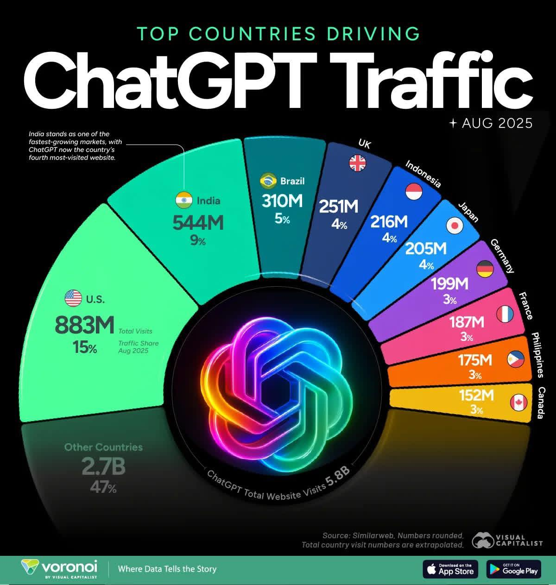
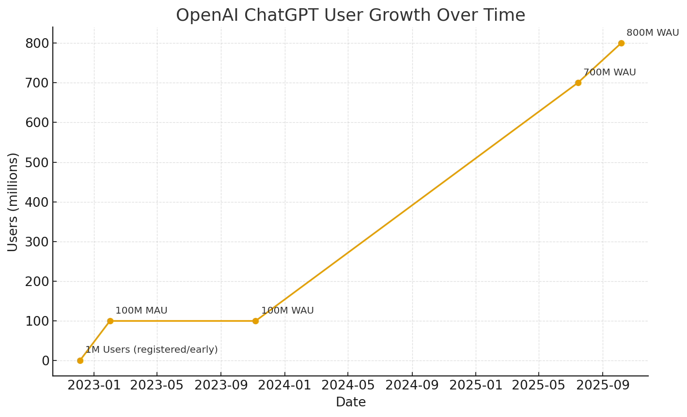
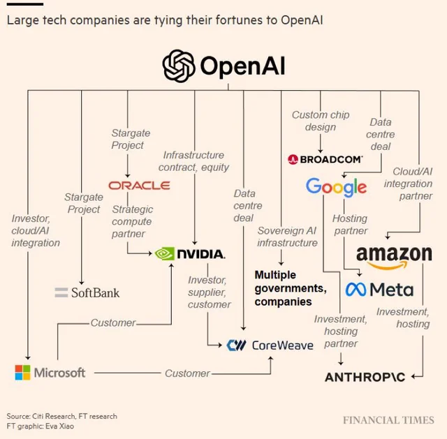
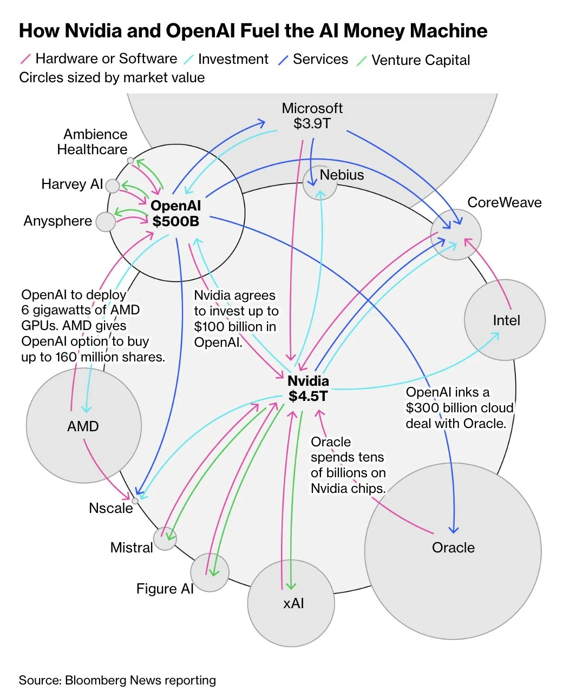
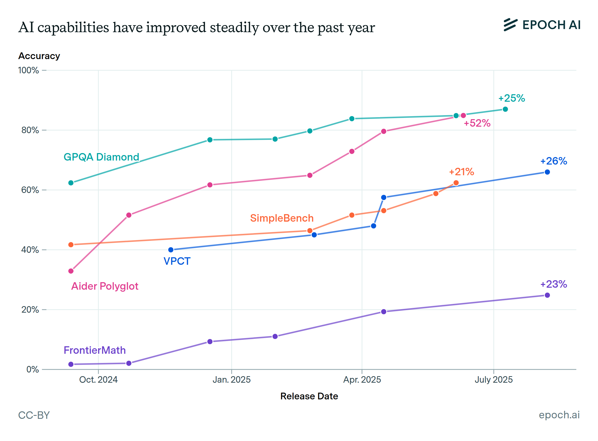

## OpenAI's Latest Moves Signal a Paradigm Shift Towards a New, Agent-Driven Web

**[Detailed Reading Material: OpenAI’s Blueprint to Power the Future Web with AI](./OpenAI’s%20Blueprint%20to%20Power%20the%20Future%20Web%20with%20AI.pdf)**

Supplementary Learning Material:

**[OpenAI's Vision for an AI-Driven Future Learning Guide](panaversity-openai-vision-guide.md)**

**[Taking a Self-Assessment Quiz](./quiz.md)**

ChatGPT has reached 800 million users in just two years, a milestone that took the internet 13 years to reach. 
The data, highlighted by the Financial Times and confirmed by Sam Altman, marks the fastest technology adoption curve in history. 

Source: Financial Times

---

AI is humanity’s *next great transformation*—the fourth big technological era after steam, electricity, and digital computing. AI will massively **augment** human capability, **re-wire industries**, and **disrupt** jobs and geopolitics—so leaders must pair rapid adoption with strong governance, cybersecurity, and workforce upskilling.

**Big idea:** We’re entering the “age of AI,” characterized by global *augmentation, collaboration, and disruption*—AI as a force-multiplier for people and organizations rather than a simple automation tool.

**What will change:**

* **Industries & productivity:** AI will accelerate innovation across sectors and reshape how work gets done—moving routine tasks to machines and elevating human roles toward creativity, oversight, and strategy. 
* **Technology convergence:** Progress will be amplified by AI’s intersection with adjacent tech waves (e.g., quantum, 5G/IoT, robotics).
* **Human–AI teaming:** The emphasis is on augmentation—humans plus AI—rather than outright replacement, with collaboration becoming the default operating model.

AI's influence permeates everyday life—powering smartphone features, recommendations, and navigation—and extends to key sectors:
- **Healthcare**: Enables early cancer detection, personalized treatments, and accelerated drug discovery.
- **National Security**: Analyzes data for threat detection, improves combat awareness, and strengthens cyber defenses.
- **Finance and Economics**: Detects fraud, predicts customer behavior, and optimizes supply chains.
- **Public Governance**: Informs policies, manages energy grids, and supports smart cities.
- **Professional Fields**: Assists scientists, engineers, and artists in research, design, and creative work.
- **Society at Large**: Adapts education, job training, and personal well-being to individual needs, boosting efficiency and innovation across industries.

**Risks & guardrails emphasized:**

* **Cybersecurity, privacy, and bias** risks expand as AI scales; governance, security-by-design, and transparency are positioned as non-negotiables. 
* **Workforce disruption:** Job tasks shift significantly; leaders should plan reskilling and change management, not just tech rollouts.

**What should leaders do:**

* **Adopt fast—but responsibly:** Pair AI deployment with robust **governance**, **cybersecurity**, and **ethical frameworks**.
* **Invest in people:** Build AI literacy and reskilling programs so teams can work effectively with AI systems.
* **Collaborate across sectors:** Government, industry, and academia should coordinate standards and best practices to steer the transition.

---

## Key ChatGPT / OpenAI Stats (Latest)

* **Weekly active ChatGPT users:** ~**800 million**
* **Messages handled:** **~2.5B per day** (≈29k/sec) as of July 2025.
* **U.S. adoption:** **34% of U.S. adults have used ChatGPT** (Pew, June 2025). 
* **ChatGPT Plus subscribers:** Reported **~15.5M** by end of 2024.
* **Market share (AI chatbots, web traffic):** **~81%** worldwide in Sept 2025 (Statcounter). 
* **Revenue run-rate:** **~$12B annualized** as of late July 2025.
* **Valuation:** **~$500B** after an Oct 2025 secondary share sale—**now the world’s most valuable startup**.
* **Enterprise footprint:** Over **1M+ paying business users** reported in 2024; continued enterprise focus and new partnerships through 2025.
* **Infrastructure deals:** OpenAI’s compute partnerships with Nvidia, AMD, Oracle (and others) [**“could easily top $1T”**](https://finance.yahoo.com/news/openai-now-done-1-trillion-225429595.html).

OpenAI has locked in a series of massive, multi-billion-dollar partnerships:

1. U.S. Government (Project Stargate) — $500 B
2. Nvidia — $100 B
3. AMD — up to $100 B
4. Intel — $25 B
5. TSMC — $20 B
6. Microsoft — $13 B
7. Oracle — $10 B
8. Broadcom — $ 10 B

At this pace, OpenAI’s valuation could top $1 trillion by 2026.

## [Trillion-Dollar AI Game](https://www.facebook.com/share/v/1Fzahw8Uh3/)

At the heart of this trillion-dollar game is OpenAI, the $500 billion behemoth that has become the ringmaster. 

---
## [AI capabilities have steadily improved over the past year](https://epoch.ai/data-insights/ai-capabilities-over-past-year)

Across benchmarks measuring skills in research-level math, agentic coding, visual understanding, common sense reasoning, and more, AI capabilities have grown rapidly and consistently over the last 12 months.

While these benchmarks do not capture all of the nuanced abilities needed for economically valuable tasks, the clear upward trends reflect genuine improvements in AI’s utility. This growth in capabilities shows no sign of slowing down.

---

## [OpenAI’s Nick Turley on transforming ChatGPT into an operating system](https://techcrunch.com/2025/10/08/openais-nick-turley-on-transforming-chatgpt-into-an-operating-system/)

### Summary of the Article: OpenAI’s Nick Turley on Transforming ChatGPT into an Operating System

Nick Turley, who joined OpenAI in 2022 as head of ChatGPT, has overseen its growth to 800 million weekly active users. In an interview at OpenAI's developer conference, he outlined a vision to evolve ChatGPT from a basic conversational tool—likened to the "command line era"—into a comprehensive operating system-like platform. This would integrate third-party apps, similar to how web browsers host web applications, allowing users to access specialized services for tasks like productivity, coding, or e-commerce without OpenAI building everything itself.

#### Key Vision and Strategy
- **Platform Ecosystem**: ChatGPT would act as a central hub, partnering with companies like Expedia, DoorDash, and Uber to enable seamless interactions, such as booking travel or ordering food. It aims to foster innovative apps that leverage AI's conversational capabilities, much like mobile platforms enabled services like ride-sharing.
- **Broader Integration**: The platform would unify OpenAI's products (e.g., productivity tools, video generation with Sora) through user accounts, personalization, and identity features. Future expansions could include social media and hardware, with rumors of an OpenAI browser and collaborations on AI devices.
- **Mission Alignment**: Turley sees ChatGPT as a direct vehicle for OpenAI's goal of beneficial AGI, helping users worldwide with real-world applications, from coding education to social support for autistic children.

#### Challenges and Solutions
- **App Distribution and Promotion**: OpenAI is addressing how to promote apps, potentially allowing paid priority but prioritizing user experience and relevance. For competing apps (e.g., multiple food delivery options), it would show choices, use preferences, or seek user input.
- **Privacy and Data**: Developers must minimize data collection and disclose requests, with app reviews for compliance. Upcoming features include "partitioned memory" to separate conversation topics (e.g., health vs. entertainment) and user controls inspired by Apple's model for selective data sharing.

#### Recent Developments and Future Plans
The launch of integrated third-party apps marks a shift from earlier efforts like plugins and the GPT Store, which saw limited adoption. These apps enable interactive experiences and revenue opportunities, positioning ChatGPT as an e-commerce hub. OpenAI plans to refine these through developer feedback, roll out privacy enhancements soon, and expand into new categories while drawing lessons from tech history to drive innovation.

**Overall**: ChatGPT is shifting from a single assistant to a platform where third-party, interactive apps live directly inside the chat.

---

## [Could ChatGPT Become The Next Big Browser?](https://www.forbes.com/sites/anishasircar/2025/10/10/openai-dev-day-2025-could-chatgpt-become-the-next-big-browser/)

Here’s a crisp summary of the Forbes piece (Oct 10, 2025):

### Big idea

OpenAI wants ChatGPT to act like a **browser/OS hybrid**—a single conversational place where **apps, agents, and content live together** in one thread.

### What’s launching

* **Apps SDK:** Developers can embed **interactive apps inside ChatGPT**. Launch partners include **Canva, Figma, Spotify, Coursera, Zillow**—so you can design, learn, listen, or browse listings without leaving the chat.
* **AgentKit:** A **drag-and-drop workflow builder** (plus Python) to create goal-oriented agents that call APIs, tie into enterprise systems, ship embeddable chat components, and run **evaluation** for agent accuracy. Think Zapier/Lindy-style tooling **inside** ChatGPT.
* **Model access:** Expanded APIs for **GPT-5 Pro** (reasoning) and **Sora 2** (video); **GPT-5 Codex** is GA with **Slack integrations** and enterprise controls.

### Why it matters

* Positions OpenAI as both **consumer platform** and **developer ecosystem**—roles akin to iOS/Android, but **conversation replaces clicks**.
* Could consolidate fragmented user flows (brainstorm → design → check licensing → share) **inside one chat**.
* If it sticks, ChatGPT becomes a **new gateway to the web**, shifting discovery, commerce, and UI patterns from pages/tabs to **threads/prompts**.

### Friction & risks the article flags

* **Control & gatekeeping:** OpenAI sits between users and the web; raises **privacy, interoperability, and platform power** concerns.
* **Security & data handling:** Third-party apps/agents inside chat introduce **new privacy risks**; trust and review processes are critical.
* **Lock-in for devs:** Policies/monetization could constrain developers—echoes of mobile app stores.
* **Regulatory heat:** A “gatekeeper” conversational platform may face **DMA-style scrutiny**.
* **Adoption unknowns:** People may not want to **live entirely** in ChatGPT; earlier “custom GPTs” fizzled.
* **Competitive pressure:** OpenAI courts developers while **Google, Anthropic, Amazon** vie for them; **Meta/DeepSeek** push strong **open-source** options.

### Notable quotes/stance

* **Nick Turley (ChatGPT product):** “We **never meant to build a chatbot**; we meant to build a **super assistant**.” He doesn’t expect users to spend all day in ChatGPT—more like **start in ChatGPT, then branch to apps/sites**.

### Bottom line

Dev Day 2025 is OpenAI’s bid to own the **next interface of the internet**. If successful, **apps move from tabs to threads**, and “search” evolves into **conversation**—but questions about **openness, privacy, and platform control** are just beginning.

---

**San Francisco, CA** - OpenAI's recent flurry of announcements, including the introduction of "Agent Kit" and an "App SDK," has ignited speculation that the artificial intelligence leader is not just building new tools, but laying the groundwork for a fundamentally new era of the internet. This vision points towards a "post-app" web where intelligent agents, rather than traditional websites and applications, become the primary way users interact with the digital world.

The core of this shift lies in two key releases unveiled at OpenAI's recent DevDay conference:

**Agent Kit:** This comprehensive suite of tools empowers developers to create, deploy, and manage sophisticated AI agents. It includes:

* **Agent Builder:** A no-code interface for designing and training autonomous agents that can perform complex tasks.
* **ChatKit:** A tool for embedding and customizing conversational AI experiences within existing applications and websites.
* **Evals:** A framework for testing and evaluating the performance of AI agents to ensure reliability and safety.

**App SDK:** This software development kit allows developers to build applications directly on top of ChatGPT, effectively creating an app store within the conversational AI. This will enable users to seamlessly access and interact with third-party services through natural language.

These announcements are more than just incremental updates; they represent a strategic move to position OpenAI's technology as the foundational layer of the next-generation internet. The vision, as articulated by experts and gleaned from OpenAI's direction, is one where users no longer need to navigate a complex web of websites and apps. Instead, they will interact with a single, intelligent agent that can understand their needs and orchestrate a variety of services to fulfill them.

### The Dawn of an Agent-Centric Internet

This new paradigm, often referred to as the "agent-centric" or "post-app" web, promises a more intuitive and personalized online experience. Imagine telling your AI assistant to "plan a weekend trip to the coast for my family," and having it not only research destinations and book accommodations but also arrange transportation, make restaurant reservations, and even suggest activities based on your family's preferences.

This level of automation is made possible by the seamless integration of various services through the App SDK. Developers will be incentivized to create "apps" for this new ecosystem, allowing their services to be discoverable and usable by AI agents.

### Implications for the Digital Landscape

The potential ramifications of this shift are vast and could impact various stakeholders:

* **Users:** The primary benefit for users is a more streamlined and intuitive online experience. The cognitive load of navigating multiple websites and apps could be significantly reduced, making the internet more accessible and efficient.
* **Developers:** The Agent Kit and App SDK represent a significant opportunity for developers to create innovative new services and reach users in a new way. However, it also presents the challenge of adapting to a new platform and potentially a new set of rules dictated by OpenAI.
* **Businesses:** Companies will need to rethink their online presence, moving from a website-centric model to one that is "agent-friendly." This will likely involve developing APIs and creating "apps" for the ChatGPT ecosystem to ensure their services are accessible to AI agents.
* **The Web Itself:** The very structure of the internet could be transformed. The dominance of the web browser and the traditional website could wane as users increasingly interact with the digital world through conversational interfaces.

### The Road Ahead

While the vision of an agent-driven web is compelling, there are still significant hurdles to overcome. Issues of data privacy, security, and the potential for algorithmic bias will need to be carefully addressed. Furthermore, the success of this new ecosystem will depend on widespread adoption from both developers and users.

Nevertheless, OpenAI's recent announcements are a clear indication of its ambition to shape the future of the internet. By providing the tools to build and integrate intelligent agents, OpenAI is not just predicting the future; it is actively building it. The era of the agent-centric web may be closer than we think.

---

## OpenAI’s Blueprint to Power the Future Web with AI

An analytical article exploring OpenAI's vision for the future, offering insight into how these tools signal a broader shift in web and AI infrastructure.

**[OpenAI’s Blueprint to Power the Future Web
with AI](OpenAI’s%20Blueprint%20to%20Power%20the%20Future%20Web%20with%20AI.pdf)**

---

## The AI Agent Race: Meet OpenAI's Competition

The race to build the infrastructure for the next era of the internet is heating up, and OpenAI is far from alone in its ambition to create a world of intelligent AI agents. Hot on its heels are tech giants, nimble startups, and a burgeoning open-source community, all vying to provide the tools and platforms that will define how we interact with technology. Here's a look at what other key players are doing in the burgeoning field of AI agents.

### Google: A Multi-Pronged, Enterprise-Focused Approach

Google is leveraging its deep expertise in AI and cloud computing to offer a comprehensive suite of tools for building and deploying AI agents, with a strong emphasis on enterprise applications.

* **Google Agentspace:** This platform is designed to help businesses build, manage, and scale AI agents for their workforce. It provides a secure environment for agents to handle tasks like sending emails, scheduling meetings, and connecting to various business applications.
* **Vertex AI Agent Builder:** A key part of the Google Cloud ecosystem, the Vertex AI Agent Builder offers a more developer-focused experience. It provides tools to create sophisticated, production-ready agents with fine-grained control over their reasoning and collaboration capabilities.
* **Agent Development Kit (ADK):** For developers who want maximum flexibility, Google offers the ADK. This open-source framework is model-agnostic and allows for the creation of complex, multi-agent systems that can be deployed anywhere.

A key aspect of Google's strategy is the **Agent2Agent (A2A) protocol**, an open standard for agent communication. This initiative aims to create an interoperable ecosystem where agents built on different platforms can seamlessly interact, preventing vendor lock-in and fostering a more collaborative AI landscape.

### Microsoft: Integrating Agents into the Fabric of Work

Microsoft is deeply integrating AI agents into its existing ecosystem of productivity and enterprise software, with a focus on enhancing workflows and automating business processes.

* **Microsoft Copilot Studio:** This low-code platform empowers both professional developers and business users to create and customize their own AI-powered copilots. These agents can be integrated into Microsoft 365 applications, websites, and other business systems.
* **Azure AI Foundry Agent Service:** For more advanced use cases, Azure offers a robust set of tools for building and deploying sophisticated AI agents. This includes a wide range of pre-built tools for tasks like web searches, data analysis, and connecting to third-party services.
* **AI Agent Tools in Azure Databricks:** Recognizing the importance of data in training and grounding AI agents, Microsoft has integrated AI agent tools directly into its Databricks platform. This allows developers to build agents that can interact with and analyze large datasets.

Microsoft's approach is centered around its **Copilot** brand, which aims to bring AI assistance to every aspect of a user's digital life, from writing emails to analyzing business data.

### Meta: An Internal Push for an AI-Powered Future

While Meta's external-facing agent development tools are not as prominent as those of Google and Microsoft, the company is making a significant internal push to integrate AI agents into its own operations. CEO Mark Zuckerberg has been vocal about his vision for AI agents to handle a wide range of tasks, from coding to research and development. This internal focus suggests that Meta is developing a deep understanding of what it takes to build and deploy effective AI agents, which could translate into powerful developer tools in the future.

### Anthropic: Empowering Developers with a Powerful Model

Anthropic, a leading AI research company, is focused on providing developers with a highly capable and safe large language model, Claude, and the tools to build agents on top of it.

* **Claude Agent SDK:** This software development kit gives developers the tools to build a wide range of AI agents, from financial analysts to customer support bots. The SDK is designed to give developers a high degree of control over the agent's behavior and to ensure that it operates in a safe and predictable manner.

Anthropic's strategy is to empower developers with a powerful and reliable foundation model, allowing them to create innovative and specialized AI agents for a variety of applications.

### The Thriving Startup and Open-Source Ecosystem

Beyond the tech giants, a vibrant ecosystem of startups and open-source projects is also driving innovation in the AI agent space.

* **Startups:** Companies like **Adept AI**, **Crew AI**, and **Lindy AI** are developing innovative platforms for automating complex tasks, orchestrating multi-agent systems, and providing no-code solutions for building AI agents. These startups are often focused on specific industries or use cases, bringing a high degree of specialization to the market.
* **Open-Source Platforms:** The open-source community is playing a crucial role in democratizing access to AI agent technology. Frameworks like **AutoGen**, **AutoGPT**, and **LangChain** provide developers with the tools to build and experiment with their own AI agents, fostering a collaborative and innovative environment.

In conclusion, while OpenAI has made significant strides in defining the future of AI agents, it is by no means the only player in the game. A diverse and competitive landscape of tech giants, startups, and open-source projects is rapidly emerging, each with its own unique vision for how AI agents will shape the future of the web and our interaction with the digital world.
