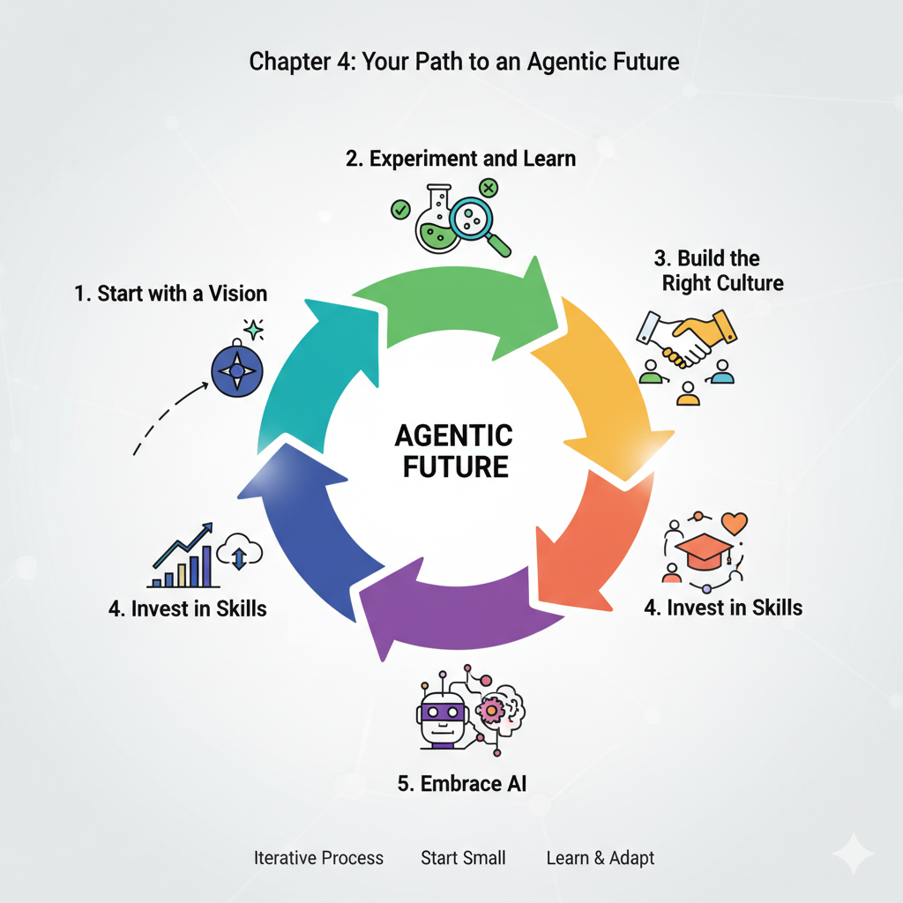

# The Agentic Organization: A Learning Guide to the Future of Business

**Panaversity's Learning Handbook Series**

**October 2025**

**How to use this book**

Each chapter follows the Panaversity Teaching Method inspired by the Schaum’s Outline series: a short theory primer, basic check‑in questions, many step‑by‑step solved problems, practice problems with answers at the end of the chapter, and stretch challenges. Remember the goal is to convert knowledge into intelligence by applying real world examples.

- **Teacher use**: Open with 2–3 check‑ins, model 1–2 worked examples, assign practice, then a brief reflection.
- **Student use**: Skim the primer, answer check‑ins first, study 2–3 worked examples, then do practice and check answers.
- **Time guide**: For each chapter 30 minute session, aim ~5 min check‑ins, 10 min examples, 10 min practice, ~3–5 min reflect.

## Table of contents
- [Introduction](#introduction)
- [Chapter 1: The Dawn of a New Era](#chapter-1-the-dawn-of-a-new-era)
- [Chapter 2: The Building Blocks of an Agentic Organization](#chapter-2-the-building-blocks-of-an-agentic-organization)
- [Chapter 3: AI: The Engine of the Agentic Organization](#chapter-3-ai-the-engine-of-the-agentic-organization)
- [Chapter 4: Your Path to an Agentic Future](#chapter-4-your-path-to-an-agentic-future)
- [Conclusion](#conclusion)

## Introduction

Welcome to the future of business! In this book, we'll explore a new and exciting way of running companies called the "agentic organization." You might be wondering, what is an organization, and why do we need a new way of organizing things?

Think of an organization as a team of people working together to achieve a common goal. For a long time, most companies have been organized like machines, with a boss at the top giving orders and everyone else following a strict set of rules. This worked well in the past, but the world is changing fast, and we need a new kind of organization that can keep up.

That's where the agentic organization comes in. It's a more flexible, smarter, and faster way of working, and it's powered by a technology you've probably heard of: Artificial Intelligence, or AI.

This book is designed for beginners. You don't need to know anything about business, strategy, or technology to understand it. We'll break down the big ideas into small, easy-to-understand pieces. We'll also use a special learning method to help you master the concepts. Each chapter will have:

* **A Brief Theory Introduction:** We'll start with the basics.
* **Check the Basics:** A few simple questions to make sure you've got the main ideas.
* **Solved Problems:** Real-world examples to show you how these ideas work in practice.
* **Practice Problems:** A chance for you to test your knowledge.
* **Advanced Questions:** A challenge for those who want to dig deeper.

By the end of this book, you'll have a solid understanding of what an agentic organization is and why it's the future of business. Let's get started!

***

## Chapter 1: The Dawn of a New Era

### Brief Theory Introduction

For over a century, most companies have been run like machines. Think of a classic car factory: a clear hierarchy, specialized roles, and a top-down management style. This "machine model" was designed for efficiency and predictability in a stable world. But today's world is anything but stable. New technologies, changing customer expectations, and global competition mean that companies need to be able to adapt and change quickly.

This is where the **agentic organization** comes in. The word "agentic" comes from the idea of an "agent," which is someone or something that can act independently. An agentic organization, therefore, is one where individuals and teams are empowered to act on their own, make decisions, and respond to challenges without waiting for permission from the top.

The main driver of this shift is the rise of **Artificial Intelligence (AI)**, especially a new type of AI called **generative AI**. This is the technology behind tools like ChatGPT, which can create new text, images, and ideas. In an agentic organization, AI isn't just a tool; it's a partner that helps people work smarter and faster.

In short, we're moving from a world of rigid, slow-moving "machine" organizations to a new era of fast, flexible, and intelligent "agentic" organizations.

### Check the Basics

1.  What is the "machine model" of an organization?
2.  What does the word "agentic" mean?
3.  What is the main technology driving the shift to agentic organizations?

### Introduce Solved Problems

**Problem 1: The Struggling Retailer**

**Scenario:** "Classic Clothes" is a retail company that has been selling clothes for 50 years. They have a traditional, hierarchical structure. The CEO and a small team of top executives make all the important decisions, from the clothes they sell to the marketing campaigns they run. In recent years, Classic Clothes has been losing customers to new online stores that seem to know exactly what young shoppers want. Why is the company's "machine" structure a problem?

**Solution:**

* **Slow Decision-Making:** In Classic Clothes, every big decision has to go up the chain of command to the CEO. This takes a lot of time. By the time a new clothing line is approved, the trend might already be over.
* **Lack of Agility:** The company is not good at adapting to change. The new online stores use data to see what's popular and can launch new designs in a matter of weeks. Classic Clothes is stuck in its old ways and can't react that quickly.
* **Poor Information Flow:** The people who know the most about what customers want are the salespeople in the stores. But in a top-down structure, their feedback rarely reaches the decision-makers at the top.
* **Disengaged Employees:** When employees are just told what to do and have no say in the decisions, they can become unmotivated. They don't feel a sense of ownership or pride in their work.

**Problem 2: The Thriving Tech Startup**

**Scenario:** "Innovate Inc." is a new tech startup that has created a popular mobile app. They have a very "agentic" way of working. The company is organized into small, cross-functional teams. Each team has the freedom to come up with new ideas, test them with users, and make changes to the app without needing approval from the founders. What are the strengths of this "agentic" approach?

**Solution:**

* **Speed and Agility:** Innovate Inc. can move much faster than a traditional company. If a team has a good idea, they can build and release it in a matter of days. This allows them to constantly improve their product and stay ahead of the competition.
* **Customer-Focused:** The teams at Innovate Inc. are in direct contact with their users. They use feedback and data to make sure they're building a product that people actually want.
* **Empowered Employees:** The employees at Innovate Inc. are highly motivated because they have a lot of autonomy and responsibility. They feel like they're making a real impact on the success of the company.
* **Innovation:** Because teams are free to experiment, they're more likely to come up with new and creative ideas. This culture of innovation is a key reason for the company's success.

### Assign Practice Problems

1.  Read the following description of a company and decide if it's more "machine-like" or "agentic." Explain your reasoning.

    "Global Bank is a large, international bank with a history of over 100 years. It has a strict dress code, a clear reporting structure, and a detailed rulebook for every process. Major decisions are made by a committee of senior executives at the bank's headquarters."

2.  Imagine you're the CEO of a "machine-like" company that wants to become more "agentic." What's the very first, small step you could take to start this change?

### Challenge with Advanced Questions

1.  What are the potential risks or downsides of a highly "agentic" organizational model?
2.  Create a short proposal for a "machine-like" company to start becoming more "agentic." Your proposal should outline the first three steps they should take.

***

### Chapter 1: Answer Key

**Check the Basics:**

1.  The "machine model" of an organization is a traditional, hierarchical structure with a top-down management style, designed for efficiency and predictability.
2.  "Agentic" means having the ability to act independently and make one's own choices.
3.  The main technology driving the shift to agentic organizations is Artificial Intelligence (AI), especially generative AI.

**Practice Problems:**

1.  Global Bank is a classic example of a "machine-like" organization. The strict dress code, clear reporting structure, and detailed rulebook all point to a culture of control and compliance, rather than autonomy and empowerment. The fact that major decisions are made by a small group of senior executives at the top is another key characteristic of the machine model.
2.  There are many possible answers to this question. A good first step would be to choose a small, low-risk area of the business and start to empower the employees in that area. For example, a retail company could give its store managers more autonomy to make decisions about a single product category. The key is to start small, learn from the experience, and then gradually scale the change to other parts of the company.

**Advanced Questions:**

1.  Some potential risks of a highly "agentic" model include:
    * **Lack of coordination:** If everyone is acting independently, it can be difficult to ensure that everyone is working towards the same goals.
    * **Inconsistent customer experience:** If different teams have the freedom to do things their own way, it can lead to an inconsistent experience for customers.
    * **Duplication of effort:** Different teams might end up working on the same problem without realizing it.
    * **"Bad" decisions:** If employees are empowered to make their own decisions, they will inevitably make some mistakes.
2.  A good proposal would include the following steps:
    * **Step 1: Create a sense of urgency.** The leaders of the company need to explain why the change is necessary and why the company can't afford to stay the same.
    * **Step 2: Form a powerful guiding coalition.** The change effort needs to be led by a team of respected and influential leaders from across the company.
    * **Step 3: Create a vision for change.** The guiding coalition needs to create a clear and compelling vision for what the company will look like in the future.

***

## Chapter 2: The Building Blocks of an Agentic Organization

### Brief Theory Introduction

So, what does an agentic organization actually look like? In this chapter, we'll explore the key characteristics that make these organizations so different from the traditional "machine" model.

The McKinsey article that inspired this book identifies five "pillars" of the agentic organization: the **business model**, the **operating model**, **governance**, the **workforce, people, and culture**, and **technology and data**. Let's break down some of the key ideas within these pillars.

* **Empowered Edge:** In a traditional company, power is concentrated at the center. In an agentic organization, power is pushed to the "edge" – to the people and teams who are closest to the customers and the market. This means that employees at all levels are trusted to make important decisions.
* **Decentralized Networks:** Instead of a rigid, top-down hierarchy, agentic organizations are often structured as a network of small, autonomous teams. These teams can be formed and reformed quickly to tackle different projects and challenges.
* **Nimble Resource Allocation:** In a fast-changing world, a company needs to be able to shift its resources (money, people, and time) to where they're needed most. Agentic organizations are great at this. They don't get bogged down in long-term, inflexible plans. They can quickly reallocate resources to new opportunities as they arise.
* **A Culture of Trust and Experimentation:** For an agentic organization to work, there has to be a high level of trust. Leaders have to trust their employees to make good decisions, and employees have to feel safe to take risks and try new things, even if they sometimes fail.

## The Restaurant Analogy

**Start with a familiar story:**

Imagine two restaurants in your neighborhood:

### Restaurant A: 'The Strict Kitchen'

- **The head chef** controls EVERYTHING
- Waiter: 'A customer wants no onions in their burger'
- Chef: 'Wait! I need to approve that first. Let me check the recipe book. Fill out Form 234.'
- Customer waits 20 minutes for a simple request
- Waiters feel like robots, just following orders
- **Result:** Slow service, unhappy customers, frustrated staff

### Restaurant B: 'The Empowered Kitchen'

- **Every waiter** can make decisions
- Customer: 'Can I have no onions and add extra cheese?'
- Waiter: 'Absolutely! Let me take care of that right away!'
- Waiter tells the kitchen directly, problem solved in 2 minutes
- Waiters feel trusted and valued
- **Result:** Fast service, happy customers, motivated staff"

**The Big Question:**
"Which restaurant would survive in today's competitive world? Which one would YOU want to work at?"

**The Connection:**
"Restaurant B is an example of an **AGENTIC ORGANIZATION**. Today, we'll learn why giving people power to make decisions creates better organizations!"

---

## CORE CONCEPT #1: Empowered Edge

### What Does "Empowered Edge" Mean?

**Simple Definition:**
Power is given to the people who actually MEET the customers and DO the work (not just the bosses at the top).

### The Pizza Delivery Analogy

### ❌ Traditional Organization (Power at the Center):

**Scenario:** A pizza arrives cold at a customer's house.

```
Customer complains to Delivery Guy
        ↓
Delivery Guy calls Store Manager
        ↓
Store Manager calls Regional Manager
        ↓
Regional Manager calls Head Office
        ↓
Head Office approves a refund
        ↓
Process takes 3 days
        ↓
Customer never orders again!

```

**Problems:**

- Too slow
- Customer is angry
- Delivery guy feels powerless
- Company loses customer

---

### ✅ Agentic Organization (Power at the Edge):

**Scenario:** Same situation - pizza arrives cold.

```
Customer complains to Delivery Guy
        ↓
Delivery Guy IMMEDIATELY says:
"I'm so sorry! Let me give you:
- A full refund RIGHT NOW
- A free pizza for next time
- Priority delivery next order"
        ↓
Process takes 2 minutes
        ↓
Customer is impressed and stays loyal!

```

**Benefits:**

- Fast solution
- Customer is happy
- Delivery guy feels empowered
- Company keeps customer

---

### Real-World Example: ConnectFast Telecom

### The Old Way:

**Customer:** "My internet isn't working and I need it for my online class!"

**Service Agent:** "I understand, but I need to escalate this to my supervisor. Please wait 24-48 hours."

**Result:** Student misses class, customer switches to competitor

### The New Way (Empowered):

**Customer:** "My internet isn't working and I need it for my online class!"

**Service Agent:** "I can see the issue. I'm sending you a backup device right now by express delivery - you'll have it in 2 hours. I'm also giving you a 20% discount this month for the inconvenience."

**Result:** Student makes their class, customer becomes loyal fan

---

### 💡 The Key Insight:

**Who knows the problem best?**

- ❌ The CEO in the head office? NO!
- ✅ The person talking to the customer? YES!

**So why not give THEM the power to fix it?**

---

## CORE CONCEPT #2: Decentralized Networks

### What Does "Decentralized Networks" Mean?

**Simple Definition:**
Instead of one big boss controlling everything, you have many small teams that can make their own decisions and work independently.

---

### The School Project Analogy

### ❌ Traditional Hierarchy (Centralized):

**Imagine organizing your school festival:**

```
              PRINCIPAL
                 ↓
           VICE PRINCIPAL
                 ↓
         HEAD OF ACTIVITIES
                 ↓
    ┌────────┬────────┬────────┐
   Food    Music   Decorations  Games
   Team    Team      Team       Team

```

**How it works:**

- Principal must approve EVERY decision
- Want to change decoration colors? Ask the principal
- Want to add a new food stall? Ask the principal
- Want different music? Ask the principal
- **Result:** Everything takes forever, teams wait around, festival is boring

---

### ✅ Decentralized Network (Agentic):

**Same school festival, different approach:**

```
    FESTIVAL GOAL: "Create the best student experience"
            ↓
    ┌───────┼───────┬───────┬───────┐
   Food    Music   Decor   Games   Social
   Team    Team    Team    Team    Media
   (5 ppl) (4 ppl) (6 ppl) (5 ppl) (3 ppl)

```

**How it works:**

- Each team has a budget (e.g., $500)
- Each team decides what to do
- Teams communicate with each other directly
- Teams can form new collaborations (Music + Social Media team up for live streaming)
- **Result:** Fast decisions, creative ideas, amazing festival

**The teams coordinate through:**

- Shared goal (best student experience)
- Weekly 15-minute check-ins
- Shared messaging group
- Trust and communication

---

### Real-World Example: FreshBites Food Company

### The Challenge:

Launch a new healthy snack across the country

### Old Approach (Centralized):

- Head office creates ONE marketing campaign
- Same TV ad in every city
- Same message for everyone
- **Problem:** What works in Karachi might not work in Lahore!

### New Approach (Decentralized):

- Create 5 local teams (Karachi, Lahore, Islamabad, Peshawar, Quetta)
- Each team gets:
    - Rs. 50,000 budget
    - Freedom to create local campaigns
    - Authority to make decisions

**Results:**

**Karachi Team:**

- Focused on busy professionals
- Campaign: "Healthy snacks for your hectic life"
- Used Instagram influencers
- **Huge success!**

**Lahore Team:**

- Focused on families
- Campaign: "Healthy treats your kids will love"
- Used school partnerships
- **Big hit!**

**Islamabad Team:**

- Focused on students
- Campaign: "Brain food for exam season"
- Used university events
- **Very popular!**

**The Magic:**
Each team understood THEIR city better than head office ever could!

---

### ⚠️ But Wait - Are There Challenges?

**Yes! Three main ones:**

### Challenge 1: Inconsistent Branding

- **Problem:** Each team might create totally different looks
- **Solution:** Give all teams basic brand guidelines (logo, colors, main message must stay the same, but execution can vary)

### Challenge 2: Duplication of Effort

- **Problem:** Two teams might do the same work
- **Solution:** Create a shared platform where teams post their ideas and learnings

### Challenge 3: Coordination

- **Problem:** Teams might work in opposite directions
- **Solution:** Weekly video calls where teams share updates

---

## CORE CONCEPT #3: Nimble Resource Allocation

### What Does "Nimble Resource Allocation" Mean?

**Simple Definition:**
Quickly moving money, people, and time to where they're needed most (not being stuck in rigid plans).

---

### The Cricket Team Analogy

### ❌ Traditional Approach (Rigid):

**Before the season starts:**

- Coach decides: "Bowler A will bowl 10 overs every match"
- "Batsman B will open every match"
- **This is the plan. We stick to it NO MATTER WHAT.**

**During the season:**

- Bowler A gets injured → But the plan says he bowls, so we wait for him
- Opponent has weakness against spin → But plan says use fast bowlers, so we do that
- Batsman B is out of form → But plan says he opens, so he keeps opening
- **Result:** Team loses because they can't adapt

---

### ✅ Nimble Approach (Flexible):

**Before the season:**

- Coach says: "We have these resources. Let's use them smartly based on what's happening."

**During the season:**

- Bowler A injured? → Move Bowler C up, he's in great form!
- Playing against spin-weak team? → Use more spin bowlers today!
- Batsman B struggling? → Move him down the order, let Batsman D open!
- **Result:** Team adapts and wins

---

### Real-World Example: Tech Startup

### The Situation:

A small app development company with 20 employees and $100,000 budget

### Traditional Approach:

**January planning:**

- Project A: 10 people, $50,000 (12 months)
- Project B: 10 people, $50,000 (12 months)
- **This is the plan for the whole year!**

**What happens:**

- March: Project A's client cancels
- April: HUGE opportunity comes up for Project C
- **But:** Can't change! Money and people are locked in for the year
- **Result:** Company misses opportunity, wastes resources on cancelled project

---

### Nimble Approach:

**January planning:**

- General goal: "Deliver value to clients and grow"
- Flexible budget: Review every month
- Flexible teams: Can be reorganized quickly

**What happens:**

- March: Project A client cancels
- Company immediately:
    - Moves 8 people from Project A to Project B
    - Allocates 2 people to explore new opportunities
    - Keeps $40,000 as flexible budget
- April: HUGE opportunity for Project C appears
- Company immediately:
    - Forms new Project C team (5 people)
    - Allocates $30,000 from flexible budget
    - Keeps Project B running with smaller team
- **Result:** Company seizes opportunity, grows revenue by 300%!

---

### 🎯 Why Is This Important Today?

**The world changes FAST:**

- New technologies appear overnight
- Customer preferences shift quickly
- Competitors launch new products
- Economic conditions change

**Organizations that can't adapt QUICKLY will die!**

**Think about:**

- Blockbuster (video rental) → Couldn't adapt → Died
- Netflix → Adapted quickly → Thriving
- Nokia → Couldn't adapt to smartphones → Lost market
- Apple → Nimble and innovative → Dominates

---

## CORE CONCEPT #4: Culture of Trust & Experimentation

### Why Does This Matter?

**For agentic organizations to work, you need TWO things:**

---

### 1. TRUST

### The Trust Equation:

**Leaders must trust employees:**
"I believe you'll make good decisions even without my approval."

**Employees must feel safe:**
"I can try new things without fear of being fired if I fail."

---

### The Classroom Analogy:

### ❌ Low-Trust Classroom:

- Teacher: "Copy exactly what I write on the board"
- Student: "Can I try solving it a different way?"
- Teacher: "NO! Do it MY way or fail!"
- **Result:** Students become robots, no creativity, no learning

### ✅ High-Trust Classroom:

- Teacher: "Here's the problem. Try to solve it your way."
- Student tries three different methods, two fail, one works
- Teacher: "Excellent! You discovered a new approach!"
- **Result:** Students learn deeply, develop problem-solving skills

---

### 2. EXPERIMENTATION

**The Key Principle:**
"Failing fast is better than never trying!"

---

### The Video Game Analogy:

**When you play a new video game:**

- Try jumping over the wall → Fail
- Try going around → Fail
- Try using a special power → SUCCESS!
- **You learn by experimenting!**

**Same in organizations:**

- Try marketing strategy A → Doesn't work
- Try marketing strategy B → Doesn't work
- Try marketing strategy C → HUGE SUCCESS!
- **But you had to TRY A and B to discover C!**

---

### Real-World Example: Google's "20% Time"

**What is it?**
Google lets engineers spend 20% of their work time (1 day per week) on ANY project they want.

**Traditional boss reaction:**
"WHAT? Pay them to work on random stuff? That's wasted money!"

**Google's logic:**

- Trust employees to be creative
- Let them experiment
- Some projects will fail (that's okay!)
- Some projects will be HUGE successes

**Results:**

- Gmail → Started as a 20% project
- Google News → Started as a 20% project
- AdSense → Started as a 20% project
- **Billions of dollars in revenue from "wasted time"!**

---

## 🔗 BRINGING IT ALL TOGETHER

### The Four Pillars Working Together:

```
    EMPOWERED EDGE
    (Give power to people doing the work)
            +
    DECENTRALIZED NETWORKS
    (Small teams make decisions)
            +
    NIMBLE RESOURCE ALLOCATION
    (Quickly adapt to changes)
            +
    TRUST & EXPERIMENTATION
    (Safe to try and fail)
            =
    AGENTIC ORGANIZATION
    (Fast, innovative, successful!)

```

---

### The Complete Picture: Modern Army Analogy

### ❌ Old Army (Machine-like):

- General gives orders from headquarters
- Soldiers wait for instructions
- If situation changes, soldiers must wait for new orders
- **Slow, inflexible, vulnerable**

### ✅ Modern Army (Agentic):

- General gives overall mission: "Secure the city"
- Small squads decide HOW to do it
- If situation changes, squads adapt immediately
- Squads communicate and coordinate
- **Fast, flexible, effective**

**This is why modern militaries train for "decentralized command"!**

---

## 📊 REAL-WORLD COMPARISON CHART

| Aspect | Traditional Organization | Agentic Organization |
| --- | --- | --- |
| **Decision-Making** | Only top managers | Everyone at all levels |
| **Structure** | Rigid hierarchy (pyramid) | Flexible networks (web) |
| **Planning** | Long-term, fixed plans | Short-term, adaptable plans |
| **Mistakes** | Punished severely | Learning opportunities |
| **Innovation** | Rare, top-down | Constant, bottom-up |
| **Speed** | Slow (everything needs approval) | Fast (decisions made locally) |
| **Employee Feeling** | Like a cog in machine | Empowered and valued |

---

## 💭 PRACTICE SCENARIOS

### Quick Classification Game:

**Identify: Machine-like or Agentic?**

### Scenario 1:

A coffee shop where baristas must ask the manager before giving a customer a free refill.

- **Answer:** Machine-like (no empowerment at the edge)

### Scenario 2:

A university where professors can design their own courses and teaching methods.

- **Answer:** Agentic (empowered edge, trust)

### Scenario 3:

A company that reorganizes its teams every 6 months based on what projects are most important.

- **Answer:** Agentic (nimble resource allocation, decentralized networks)

### Scenario 4:

A retail store where all pricing decisions must be approved by head office.

- **Answer:** Machine-like (centralized control)

---

## 🎯 KEY TAKEAWAYS FOR STUDENTS

### Remember These 4 Core Ideas:

1. **Empowered Edge** = Give power to people closest to the action
    - *Like the waiter who can make decisions without asking the chef*
2. **Decentralized Networks** = Small teams working independently
    - *Like school festival teams that coordinate but decide independently*
3. **Nimble Resource Allocation** = Quickly shift resources to opportunities
    - *Like a cricket captain changing the bowling lineup based on the match*
4. **Trust & Experimentation** = Safe to try new things and fail
    - *Like Google's 20% time that created Gmail*

---

### Your Future Career:

**Ask yourself:**

- Do I want to work in a machine-like organization where I just follow orders?
- Or in an agentic organization where I have power to make decisions?

**Think about:**

- Which type of organization will thrive in the future?
- What skills do I need to succeed in an agentic organization?
    - Decision-making
    - Communication
    - Collaboration
    - Adaptability
    - Creative problem-solving

---

## 🔍 DISCUSSION QUESTIONS

**Get students thinking:**

1. **Personal Experience:**
"Think of a group project you did. Was it more machine-like (one person controls everything) or agentic (everyone contributes)? Which worked better?"
2. **Local Business:**
"Think of a restaurant or shop you visit. Do the employees seem empowered or do they always have to check with the manager?"
3. **Your School:**
"Is your school more machine-like or agentic? Give one example."
4. **Future Scenario:**
"If you started your own business tomorrow, would you make it machine-like or agentic? Why?"

---

## ⚠️ ADDRESSING POTENTIAL CONCERNS

### "Won't This Create Chaos?"

**Student might think:**
"If everyone can make decisions, won't it be total chaos?"

**Answer:**
No! Because:

1. **Shared Goals:** Everyone knows the main objective
2. **Guidelines:** There are still rules and principles
3. **Communication:** Teams stay in touch
4. **Training:** People are trained to make good decisions

**Analogy:** Soccer team

- No one is telling players what to do every second
- But they all know the goal: score and win
- They coordinate and communicate
- They follow the rules of the game

---

### "What If Someone Makes a Bad Decision?"

**Answer:**

1. **Learning opportunity:** Analyze what went wrong
2. **Shared responsibility:** Team helps prevent bad decisions
3. **Quick correction:** Mistakes are caught and fixed fast
4. **Better than alternative:** Waiting for approval can cause bigger problems

---

## 📚 SUMMARY: The Bottom Line

**Traditional Organizations (Machine-like):**

- ❌ Slow
- ❌ Inflexible
- ❌ Top-down control
- ❌ Fear of failure
- ❌ Struggling in modern world

**Agentic Organizations:**

- ✅ Fast
- ✅ Adaptable
- ✅ Distributed power
- ✅ Learning from failure
- ✅ Thriving in modern world

---

## 🎓 FINAL MESSAGE

"The world is changing faster than ever before. Organizations that can't adapt quickly will disappear.

**The future belongs to agentic organizations** - those that:

- Trust their people
- Adapt quickly
- Learn from failures
- Empower everyone to make decisions

**And the future belongs to YOU** - if you learn to:

- Take initiative
- Make good decisions
- Work in teams
- Embrace change
- Learn from mistakes

**This isn't just theory - this is how the best organizations in the world operate TODAY!**"


### Assign Practice Problems

1.  Match the characteristics of an agentic organization (Empowered Edge, Decentralized Networks, Nimble Resource Allocation) with the following real-world examples:
    * A software company that allows its engineers to spend 20% of their time working on their own projects.
    * A global consulting firm that assembles project teams from a pool of experts around the world, depending on the client's needs.
    * A retail company that gives its store managers the authority to set their own prices and promotions based on local competition.

2.  Think of a company you know (it could be a place you've worked, a store you shop at, or a brand you follow). Do you think it's more "machine-like" or "agentic"? Give one reason for your answer.

### Challenge with Advanced Questions

1.  What are some of the potential risks of a highly decentralized organization? How could a company mitigate those risks?
2.  Design a system for "nimble resource allocation" for a hypothetical university. How would the university decide which departments and research projects get funding in a fast and flexible way?

***

### Chapter 2: Answer Key

**Check the Basics:**

1.  "Empowered edge" means that power and decision-making authority are pushed to the people and teams who are closest to the customers and the market.
2.  A decentralized network is a flexible and adaptable structure of small, autonomous teams, while a traditional hierarchy is a rigid, top-down structure.
3.  "Nimble resource allocation" is important because it allows a company to quickly shift its resources to new opportunities and challenges as they arise.

**Practice Problems:**

1.  * A software company that allows its engineers to spend 20% of their time working on their own projects. - **Empowered Edge**
    * A global consulting firm that assembles project teams from a pool of experts around the world, depending on the client's needs. - **Decentralized Networks**
    * A retail company that gives its store managers the authority to set their own prices and promotions based on local competition. - **Empowered Edge** (Note: Could also be argued as Nimble Resource Allocation, as it allows local adaptation.)
2.  This is a subjective question, but a good answer would provide a specific reason. For example, a student might say that their university is "machine-like" because there are a lot of rules and regulations that students have to follow, and it's difficult to get new ideas approved.

**Advanced Questions:**

1.  The risks of a highly decentralized organization are similar to the risks of a highly "agentic" model in general. To mitigate these risks, a company could:
    * **Establish a clear set of shared goals and values.** This will help to ensure that everyone is pulling in the same direction, even if they're working on different things.
    * **Create a system for sharing information and best practices.** This will help to prevent duplication of effort and ensure that everyone is learning from each other's successes and failures.
    * **Put in place a clear set of decision-making guidelines.** This will help to ensure that employees are making good decisions, even when they're acting independently.
2.  A system for "nimble resource allocation" at a university could involve:
    * **A "venture capital" fund for new ideas.** The university could set aside a pool of money that departments and research groups could apply to for funding for new and innovative projects.
    * **A regular review process.** The university could review its budget on a regular basis (say, every six months) and reallocate resources based on which departments and projects are performing the best.
    * **A focus on outcomes, not inputs.** Instead of just giving departments a budget and telling them to spend it, the university could set clear goals for what it wants each department to achieve and then give them the flexibility to figure out the best way to spend their money to achieve those goals.

***

## Chapter 3: AI: The Engine of the Agentic Organization

### Brief Theory Introduction

We've talked about how the agentic organization is a new way of working, but what's the technology that makes it all possible? The answer is **Artificial Intelligence (AI)**.

For beginners, AI can be a confusing topic. You might think of robots from science fiction movies, but the reality is that AI is already all around us, from the recommendation engines on Netflix to the navigation apps on our phones.

In the context of the agentic organization, we're particularly interested in a type of AI called **generative AI**. This is the technology that allows computers to create new content, like text, images, and code. You've probably heard of tools like ChatGPT – that's a great example of generative AI in action.

So, how does AI help to create an agentic organization? The McKinsey article suggests that AI can play three key roles:

* **Coach:** AI can act as a personal coach for every employee. It can provide them with the information they need to do their jobs, help them learn new skills, and even give them feedback on their performance. For example, a salesperson could use an AI coach to prepare for a meeting with a new client. The AI could provide information about the client's company, suggest talking points, and even simulate the conversation so the salesperson can practice.
* **Collaborator:** AI can also be a powerful collaborator. It can help teams brainstorm ideas, analyze data, and even write reports. This frees up people to focus on the more creative and strategic aspects of their work. For example, a marketing team could use a generative AI tool to come up with ideas for a new advertising campaign.
* **Catalyst:** Finally, AI can be a catalyst for change. It can help to break down the information silos that exist in traditional organizations. When everyone has access to the same information, it's easier for them to collaborate and make good decisions. AI can also automate many of the routine, repetitive tasks that take up so much of our time, freeing us up to focus on more important work.

### Check the Basics

1.  What is generative AI?
2.  What are the three roles that AI can play in an agentic organization?
3.  How can AI help to break down information silos?

### Introduce Solved Problems

**Problem 1: The AI-Powered Marketing Team**

**Scenario:** The marketing team at a beverage company, "FizzPop," is preparing to launch a new energy drink. In the past, this would have been a long and difficult process. The team would have spent weeks brainstorming ideas, conducting market research, and creating ad copy.

This time, they're using a new generative AI tool. Analyze how this tool helps them to be more "agentic."

**Solution:**

* **Brainstorming:** The team starts by asking the AI tool to generate ideas for the new drink's name, slogan, and target audience. The AI comes up with hundreds of creative ideas in a matter of seconds. This gives the team a great starting point for their own brainstorming.
* **Market Research:** The team then uses the AI tool to analyze social media trends and competitor activity. The AI can quickly identify what's popular with their target audience and what their competitors are doing. This helps them to position their new drink in the market.
* **Content Creation:** Once they have a clear strategy, the team uses the AI tool to help them create the ad copy, social media posts, and even the script for a TV commercial. The AI can generate high-quality content in a fraction of the time it would take a human to write it.
* **Personalization:** The team can also use the AI to create personalized marketing messages for different groups of customers. For example, they can create one set of ads for young people who are interested in sports and another set for students who need to stay up late studying.

By using the AI tool as a collaborator, the FizzPop marketing team is able to work much faster and more effectively. They can test more ideas, make better decisions, and create more targeted and effective marketing campaigns.

**Problem 2: The AI-Powered Resource Allocation System**

**Scenario:** A large construction company, "BuildIt," has dozens of projects running at the same time. In the past, it was very difficult for the company's managers to know how to allocate resources (like workers, equipment, and materials) to each project in the most efficient way.

Now, BuildIt is using a new AI-powered resource allocation system. The system uses data from all of the company's projects to predict potential problems and suggest the best way to allocate resources. Analyze how this system works.

**Solution:**

* **Data Collection:** The system collects real-time data from all of BuildIt's construction sites. This includes information about the progress of the work, the availability of workers and equipment, and the delivery of materials.
* **Predictive Analytics:** The AI uses this data to predict potential problems before they happen. For example, it might predict that a project is going to be delayed because of a shortage of a certain material.
* **Optimization:** The system then uses this information to suggest the best way to allocate resources. For example, it might suggest moving workers from a project that's ahead of schedule to one that's falling behind.
* **Real-Time Adjustments:** The system is constantly updating its recommendations based on the latest data. This allows BuildIt's managers to make real-time adjustments to their plans and keep all of their projects on track.

By using the AI system, BuildIt is able to make much better decisions about how to allocate its resources. This leads to more efficient projects, lower costs, and happier clients.

### Assign Practice Problems

1.  Identify a potential use case for an AI "coach" in a hospital. How could AI help doctors and nurses to do their jobs better?
2.  Think of a routine, repetitive task that you do in your daily life (at school, at home, or at work). How could a generative AI tool help you to automate that task?

### Challenge with Advanced Questions

1.  What are the ethical considerations of using AI as a "coach" for employees? For example, how can a company ensure that the AI is giving fair and unbiased feedback?
2.  Create a plan for a company to introduce new AI tools to its workforce without causing fear or resistance. What steps could the company take to ensure that its employees are comfortable and confident using the new technology?

***

### Chapter 3: Answer Key

**Check the Basics:**

1.  Generative AI is a type of artificial intelligence that can create new content, such as text, images, and code.
2.  The three roles that AI can play in an agentic organization are coach, collaborator, and catalyst.
3.  AI can help to break down information silos by giving everyone in the organization access to the same information.

**Practice Problems:**

1.  An AI "coach" in a hospital could:
    * Help doctors to stay up-to-date on the latest medical research.
    * Provide nurses with real-time information about their patients' conditions.
    * Help surgeons to plan and practice complex procedures.
2.  There are many possible answers to this question. For example, a student could say that a generative AI tool could help them to automate the process of taking notes in class. The student could use an AI-powered transcription service to automatically transcribe the lecture, and then use a generative AI tool to summarize the key points.

**Advanced Questions:**

1.  Some ethical considerations of using AI as a "coach" for employees include:
    * **Bias:** AI systems are trained on data, and if that data is biased, the AI system will be biased as well. A company needs to make sure that its AI coach is not giving unfair or discriminatory feedback to its employees.
    * **Privacy:** An AI coach will have access to a lot of data about an employee's performance. A company needs to be transparent about how it is using this data and it needs to make sure that the data is being stored securely.
    * **Dehumanization:** If employees are getting all of their feedback from an AI, it could lead to a more dehumanized and impersonal work environment. A company needs to make sure that AI is being used to supplement, not replace, human interaction.
2.  A good plan for introducing new AI tools would include the following steps:
    * **Communicate the "why."** The company needs to explain why it is introducing the new tools and how they will benefit employees.
    * **Provide training and support.** The company needs to provide employees with the training and support they need to be successful with the new tools.
    * **Start small.** The company should start by introducing the new tools to a small group of employees and then gradually roll them out to the rest of the company.
    * **Listen to feedback.** The company should listen to feedback from employees and be willing to make changes to the tools and the implementation plan based on that feedback.

***

## Chapter 4: Your Path to an Agentic Future

### Brief Theory Introduction

We've explored what an agentic organization is, why it's the future of business, and the role that AI plays in making it all possible. Now, you might be wondering, how does a company actually become more agentic?

The journey to becoming an agentic organization is not something that can be accomplished overnight. It's a gradual process of change that requires a lot of experimentation and learning. The McKinsey article suggests a few key steps that companies can take to get started:



* **Start with a Vision:** The first step is for the company's leaders to create a clear vision for what they want to achieve. Why do they want to become more agentic? What are the specific goals they're trying to accomplish?
* **Experiment and Learn:** Instead of trying to change the entire company all at once, it's better to start with small experiments. A company could choose one or two "lighthouse" projects – small, high-impact projects where they can test out new, more agentic ways of working.
* **Build the Right Culture:** Becoming an agentic organization is as much about changing the company's culture as it is about changing its structure. Companies need to foster a culture of trust, transparency, and continuous learning.
* **Invest in Skills:** To thrive in an agentic organization, employees will need new skills. They'll need to be good at problem-solving, collaboration, and using AI tools. Companies need to invest in training and development to help their employees build these skills.
* **Embrace AI:** Finally, companies need to embrace AI as a core part of their business. This means not just using AI tools, but also thinking about how AI can be used to fundamentally redesign the way work gets done.

The journey to becoming an agentic organization is a marathon, not a sprint. But by taking a thoughtful, experimental approach, companies can start to build the foundations for a more agile, innovative, and successful future.

### Check the Basics

1.  Why is it better to start with small experiments rather than trying to change the whole company at once?
2.  What are some of the key elements of an agentic culture?
3.  Why is it important for companies to invest in training and development?

### Introduce Solved Problems

**Problem 1: The First Steps of a Traditional Manufacturer**

**Scenario:** "SteelWorks" is a traditional manufacturing company that has been making steel for over 100 years. The company's leaders have read about the agentic organization and they want to start moving in that direction. Walk through the first few steps they should take.

**Solution:**

* **Step 1: Create a Guiding Coalition:** The CEO of SteelWorks starts by forming a small team of enthusiastic and forward-thinking leaders from different parts of the company. This "guiding coalition" will be responsible for leading the change effort.
* **Step 2: Define the Vision:** The guiding coalition works together to create a clear and compelling vision for the future of SteelWorks. They decide that their goal is to become the most innovative and customer-focused steel company in the world.
* **Step 3: Choose a Lighthouse Project:** The team decides to start with a single lighthouse project. They choose a small, but important, production line and they empower the team that runs that line to experiment with new ways of working. They give the team the autonomy to make its own decisions about how to improve quality and efficiency.
* **Step 4: Provide Support and Resources:** The guiding coalition makes sure that the lighthouse team has the resources and support it needs to be successful. They provide the team with training in new problem-solving techniques and they give them access to new data and technology.
* **Step 5: Learn and Adapt:** The guiding coalition closely monitors the progress of the lighthouse project. They celebrate the team's successes and they learn from their failures. They then use these learnings to inform their plans for scaling the change to other parts of the company.

By starting small and learning as they go, SteelWorks is able to begin its journey to becoming a more agentic organization in a way that is manageable and low-risk.

**Problem 2: The Empowered Manager**

**Scenario:** Maria is a manager at a large insurance company. She has read this book and she's inspired to make her team more "agentic." She doesn't have the power to change the whole company, but she wants to do what she can to empower her team. Analyze the steps she can take.

**Solution:**

* **Increase Transparency:** Maria starts by being more transparent with her team. She shares more information about the company's goals and performance, and she explains the "why" behind the decisions she makes.
* **Delegate Authority:** Maria starts to delegate more authority to her team members. Instead of telling them what to do, she gives them clear goals and then lets them figure out the best way to achieve them.
* **Encourage Experimentation:** Maria creates a safe space for her team to experiment and try new things. She makes it clear that it's okay to fail, as long as they learn from their mistakes.
* **Coach and Support:** Maria sees her role as a coach and a supporter, rather than a boss. She spends more time listening to her team members, helping them to solve problems, and providing them with the resources they need to be successful.
* **Recognize and Reward:** Maria makes sure to recognize and reward her team members for their initiative and creativity. This helps to reinforce the new, more agentic culture she's trying to build.

Even though Maria can't change the entire company, she can still make a big difference within her own team. By taking these small steps, she can create a more empowering and engaging environment for her team members, which will lead to better performance and higher morale.

### Assign Practice Problems

1.  Create a checklist of at least five questions that a company could use to assess its "agentic" readiness.
2.  Imagine you're a student working on a group project for a class. How could you apply the principles of the agentic organization to make your group more effective?

### Challenge with Advanced Questions

1.  What are the biggest challenges that a large, established company might face in trying to transition to a more agentic model? How could they overcome those challenges?
2.  Create a detailed change management plan for a company that is moving towards a more agentic structure. Your plan should include specific actions, a timeline, and a way to measure success.

***

### Chapter 4: Answer Key

**Check the Basics:**

1.  It's better to start with small experiments because it's less risky and it allows the company to learn and adapt as it goes.
2.  Some of the key elements of an agentic culture are trust, transparency, and a willingness to experiment and learn from failure.
3.  It's important for companies to invest in training and development because employees will need new skills to thrive in an agentic organization.

**Practice Problems:**

1.  Here are five questions a company could use to assess its "agentic" readiness:
    * How quickly can we make important decisions?
    * How easily can we shift our resources to new opportunities?
    * Do our employees feel empowered to take initiative and make decisions?
    * Do we have a culture of trust and transparency?
    * Are we using data and technology to make better decisions?
2.  To make a group project more "agentic," students could:
    * **Establish a clear set of shared goals.**
    * **Divide the work up into small, autonomous tasks.**
    * **Give each group member the authority to make decisions about their own tasks.**
    * **Communicate openly and honestly with each other.**
    * **Be willing to experiment and try new things.**

**Advanced Questions:**

1.  The biggest challenges a large, established company might face in transitioning to a more agentic model include:
    * **Resistance to change:** People are often resistant to change, especially in large, established companies where they've been doing things the same way for a long time.
    * **Middle management:** Middle managers may feel threatened by the idea of an agentic organization, as it could make their own roles obsolete.
    * **Bureaucracy:** Large companies often have a lot of bureaucracy and red tape, which can make it difficult to implement change.
    * **Legacy systems:** Large companies often have old, outdated IT systems that are not well-suited to a more agile and data-driven way of working.

    To overcome these challenges, a company could:
    * **Communicate a clear and compelling vision for change.**
    * **Get the buy-in of key stakeholders, including middle managers.**
    * **Start with small, low-risk experiments to build momentum and demonstrate the benefits of the new way of working.**
    * **Invest in new technology and training.**
2.  A detailed change management plan would include the following elements:
    * **A clear vision and goals for the change.**
    * **A communication plan to keep employees informed and engaged.**
    * **A training plan to help employees develop the new skills they will need.**
    * **A plan for restructuring the organization and redesigning key processes.**
    * **A set of metrics to track progress and measure success.**

***

## Conclusion

We've covered a lot of ground in this book. We've learned about the shift from the old "machine" model of organizations to the new, more dynamic "agentic" model. We've explored the key characteristics of an agentic organization, the role that AI plays in making it all possible, and the practical steps that companies can take to start their journey to a more agentic future.

The world of work is changing faster than ever before. The old rules no longer apply. The companies that will succeed in the 21st century will be the ones that are able to adapt, innovate, and unleash the full potential of their people.

The agentic organization is not just a new management fad. It's a fundamental rethinking of how we work together to solve problems and create value. It's a more human-centered approach to business, where people are empowered to use their creativity and ingenuity to make a real impact.

The journey to becoming an agentic organization is not easy, but it's a journey that every company needs to start. The future of work is agentic, and the future is now.