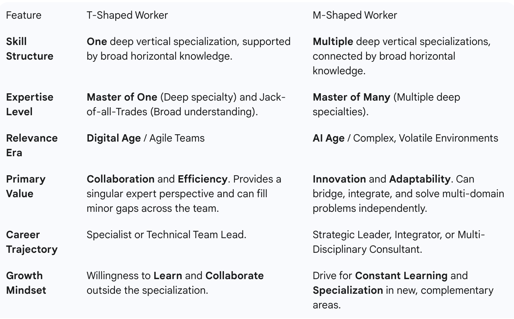

# The Rise of Agentic Organizations: How AI Is Redefining the Future of Work and Business

**[Watch Overview Video in English: Agentic Organizations: The Future of Work](https://youtu.be/3kQq9q56udk)**

**[Watch Overview Video in Urdu/Hindi: Agentic Organizations: The Future of Work](https://youtu.be/Dq2u0_jI4qk)**

**[Detailed Reading Material: The agentic Organization: Contours of the next paradigm for the AI era](https://www.mckinsey.com/capabilities/people-and-organizational-performance/our-insights/the-agentic-organization-contours-of-the-next-paradigm-for-the-ai-era)**

Supplementary Learning Material:

**[The Agentic Organization: A Learning Guide to the Future of Business](panaversity-openai-vision-guide.md)**

**[Taking a Self-Assessment Quiz](./quiz.md)**

**[Taking a Self-Assessment Graduate Quiz](./graduate_level_quiz.md)**

---

## What is the article about?

The article argues that we are entering a new way of organizing work and companies—one where humans and AI “agents” (software or robotic systems that act with some autonomy) work together closely. McKinsey calls firms that adopt this structure **agentic organizations**. They say this shift may be as big as the move from the industrial era to the digital era. ([McKinsey & Company][1])

The article explains what this new paradigm looks like, why many current AI efforts are falling short, and what leaders need to do to embrace the change.

---

Here’s a **simple, clear explanation** of the chart for people with no background in business or technology.

## **What Is This Chart About?**

This chart shows how the way businesses and organizations work has changed over time—from farming and factories, to the internet age, and now to the age of Artificial Intelligence (AI).

It compares **four big eras**:

1. **Craft and Agriculture** (pre-1800s)
2. **Industrial** (1800s–1900s)
3. **Digital** (2000s–now)
4. **AI Era** (starting now)

Each row of the chart shows how things like work, technology, and leadership looked in each era.

## **Key Areas Explained**

### 🏢 **Business Model**

* **Craft Era**: People made things by hand and sold directly (like a local baker or tailor).
* **Industrial Era**: Big factories made physical products like cars or soap and sold them through stores.
* **Digital Era**: Products became digital—like apps, social media, and online shopping.
* **AI Era**: AI tools (like smart assistants) help deliver services that are personalized in real time. Work is powered by AI behind the scenes.

### 👩‍🏭 **Operating Model (How Work Is Organized)**

* **Craft**: Small teams like a farmer and their workers.
* **Industrial**: Big hierarchies (lots of layers of bosses and workers doing repetitive jobs).
* **Digital**: Cross-functional teams (people from different departments work together using digital tools).
* **AI**: Flat teams where humans and AI "agents" (smart programs or robots) work side-by-side on tasks from start to finish.

### 🏛️ **Governance (How Decisions Are Made)**

* **Craft**: Local decisions, face-to-face.
* **Industrial**: Long-term planning, rigid rules.
* **Digital**: Agile planning—plans change quickly, and teams adjust as they go.
* **AI**: Decisions happen in real time with AI guidance, but humans stay accountable.

### 👥 **People and Culture**

* **Craft**: Artisans with deep hands-on skill.
* **Industrial**: Workers specialized in one job, following plans.
* **Digital**: "T-shaped" workers (they know one skill deeply, but also understand other areas and collaborate).
* **AI**: Mix of deep and broad skills ("M-shaped" workers), constant learning, and change embraced.

### 💻 **Technology and Data**

* **Craft**: Hand tools, handwritten notes.
* **Industrial**: Big machines and early computers (mainframes).
* **Digital**: PCs, mobile, internet, cloud storage.
* **AI**: Robots, sensors, drones, massive AI networks that learn from huge amounts of data.

### 🌟 **Iconic Examples**

* **Craft**: Handmade bread, art, local goods.
* **Industrial**: Companies like Ford or Toyota.
* **Digital**: Google, Facebook, Spotify.
* **AI**: Still evolving—no single leader yet.

## **What’s the Big Picture?**

The chart shows that **AI is not just another tool—it’s creating a whole new way of working**, just like the Industrial Revolution did over 200 years ago or the rise of the internet 20 years ago.

Work is shifting from:

* People doing all the tasks manually ➡️ to working alongside smart machines.
* Rigid job roles ➡️ to flexible, cross-skilled teams.
* Slow decisions ➡️ to instant, AI-supported decisions.

We’re now in the early stages of this new AI-powered era—and organizations that embrace it may lead the future.

---

## Why do we need a new paradigm? (The “gen AI paradox”)

* Over the past few years, many companies have adopted generative AI tools—chatbots, copilots, etc.—with big hopes. But for most, the improvements haven’t translated into large financial gains. ([McKinsey & Company][2])
* This is partly because these AI tools are usually used in a **horizontal** way—helping across many tasks or teams—but without deeply embedding them into the core business processes. Their impact becomes diffuse and hard to measure. ([McKinsey & Company][2])
* The article argues that real value comes when AI agents are built **vertically**—integrated into key workflows, not just bolted onto existing systems. ([McKinsey & Company][2])

In short: many AI tools are still operating at the surface level; McKinsey says the next wave must reinvent how work is done, not just speed it up.

---

## What is an “agentic organization”?

An agentic organization is one in which human workers and AI agents (virtual and physical) are designed to work together, sharing responsibilities, and executing tasks at scale. ([McKinsey & Company][1]) Some examples of “physical agents” include robots, drones, or autonomous machines that interact with the physical world. ([McKinsey & Company][1])

In this model:

* AI agents do more than just help with tasks—they can plan, remember context, coordinate with systems, and act autonomously toward goals. ([McKinsey & Company][2])
* Human roles shift toward oversight, strategy, judgment, and exception-handling—stepping in when decisions need human wisdom. ([McKinsey & Company][2])
* Processes are redesigned around agents. We don’t just insert AI into existing workflows; we build workflows with agents at their core. ([McKinsey & Company][2])
* A new technical infrastructure is required—what McKinsey names the **agentic AI mesh**—to allow agents to communicate, integrate with systems, scale, and be governed safely. ([McKinsey & Company][2])

---

## How agents deliver value

When done right, agentic systems can transform work in several ways:

1. **Faster execution**
   Because agents can coordinate and run parts of workflows in parallel, the overall process becomes quicker. ([McKinsey & Company][2])

2. **Real-time adaptation**
   Agents can adjust dynamically to changing conditions (e.g. supply chain disruptions). ([t-systems.com][3])

3. **Personalization at scale**
   Agents can tailor responses or actions to individual customers or contexts, much more fluidly than manual systems. ([t-systems.com][3])

4. **Resilience and monitoring**
   Agents can constantly monitor how they are doing, detect failures, and adjust proactively. ([McKinsey & Company][2])

Real case examples include:

* In banking: AI agents pulling data from multiple systems to prepare draft credit-risk reports, which humans then finalize—reducing turnaround time. ([blog.tmcnet.com][4])
* In operations/supply chains: agents predicting shipment delays, re-allocating inventory, negotiating with systems, etc. ([NeuralTrust][5])

---

## What organizations must do to become agentic

The article isn’t just visionary—it gives guidance on how to make the shift. These are the key moves:

### 1. Choose a clear strategic focus

Don’t spread efforts everywhere. Pick a few high-impact areas (e.g. finance, supply chain, customer interactions) where agentic AI can make a real difference. ([McKinsey & Company][2])

### 2. Redesign workflows with agents in mind

You can’t just plug agents into old systems. You have to reimagine processes from the ground up, reallocating parts to agents vs humans. ([McKinsey & Company][2])

### 3. Build organizational capacity

This includes:

* New skills (e.g. prompt engineering, agent orchestration) ([McKinsey & Company][2])
* Cross-functional teams combining domain experts + AI/tech folks ([McKinsey & Company][2])
* Strong governance, oversight, audit mechanisms to manage risks ([McKinsey & Company][2])
* Infrastructure investments, clean data, modular systems ([McKinsey & Company][2])

### 4. Leadership must own the change

This isn’t just an IT project. The CEO and senior leadership must drive and sponsor the transformation, set goals, measure progress, and embed responsibility across the organization. ([McKinsey & Company][2])

### 5. Launch “lighthouse” agentic projects

Start with a few visible, high-impact pilot projects to prove value, while simultaneously building the larger agentic infrastructure (the mesh). ([McKinsey & Company][2])

---

## Risks & challenges to watch for

* **Autonomous risk and sprawl:** Agents operating without proper oversight can lead to unpredictable behavior or operational chaos. ([McKinsey & Company][2])
* **Governance and trust:** You must embed rules, auditing, permissions, escalation paths. ([VAST Data][6])
* **Technical debt & lock-in:** Designing a rigid architecture can lock you into vendors or old systems. The mesh must be modular and vendor-agnostic. ([McKinsey & Company][2])
* **Cultural resistance:** People may distrust autonomous systems or fear job losses. But the article’s view is that human judgment, creativity, and oversight remain critical. ([McKinsey & Company][2])
* **Complexity & cost:** This transformation is hard and expensive. Many organizations struggle to go beyond pilots. ([McKinsey & Company][2])

---

## What this means for people (non-technical readers)

* Work will shift: Routine, manual tasks may increasingly be handled by AI systems. Human roles will focus more on decision-making, supervision, creativity, and exceptions.
* You’ll see more “smart systems” working behind the scenes—systems that not only respond but proactively act on behalf of users or businesses.
* Trust and transparency become more important: organizations will need ways to explain AI actions, and let humans intervene.
* The change will happen gradually: we will likely see early versions of this in customer service bots, supply chains, finance departments, before full-scale adoption.
* The organizations that adapt better may gain competitive advantage; those that don’t may struggle to keep up.

---

## Bottom line (in simple terms)

McKinsey’s view: we’re on the verge of a big leap in how companies operate. Rather than AI being a tool we switch on here and there, in the agentic model AI becomes a co-worker (or team) that acts autonomously within defined rules. To get there, you must rethink work from the ground up—tech, human roles, governance, and leadership all must evolve.

[1]: https://www.mckinsey.com/capabilities/people-and-organizational-performance/our-insights/the-agentic-organization-contours-of-the-next-paradigm-for-the-ai-era?utm_source=chatgpt.com "The agentic organization: A new operating model for AI | McKinsey"
[2]: https://www.mckinsey.com/capabilities/quantumblack/our-insights/seizing-the-agentic-ai-advantage?utm_source=chatgpt.com "Seizing the agentic AI advantage - McKinsey"
[3]: https://www.t-systems.com/de/en/insights/newsroom/expert-blogs/seizing-the-agentic-ai-advantage-1071474?utm_source=chatgpt.com "Seizing the agentic AI advantage - T-Systems"
[4]: https://blog.tmcnet.com/blog/rich-tehrani/ai/seizing-the-agentic-ai-advantage-mckinseys-playbook-for-scalable-impact.html?utm_source=chatgpt.com "Seizing the Agentic AI Advantage: McKinsey's Playbook for Scalable ..."
[5]: https://neuraltrust.ai/blog/agentic-ai-security-control-plane?utm_source=chatgpt.com "Expanding on McKinsey's Agentic AI Vision: The Critical Role of the ..."
[6]: https://www.vastdata.com/sharedeverything/can-the-agentic-mesh-solve-the-enterprise-ai-paradox?utm_source=chatgpt.com "Can the Agentic Mesh Solve the Enterprise AI Paradox? - VAST Data"
