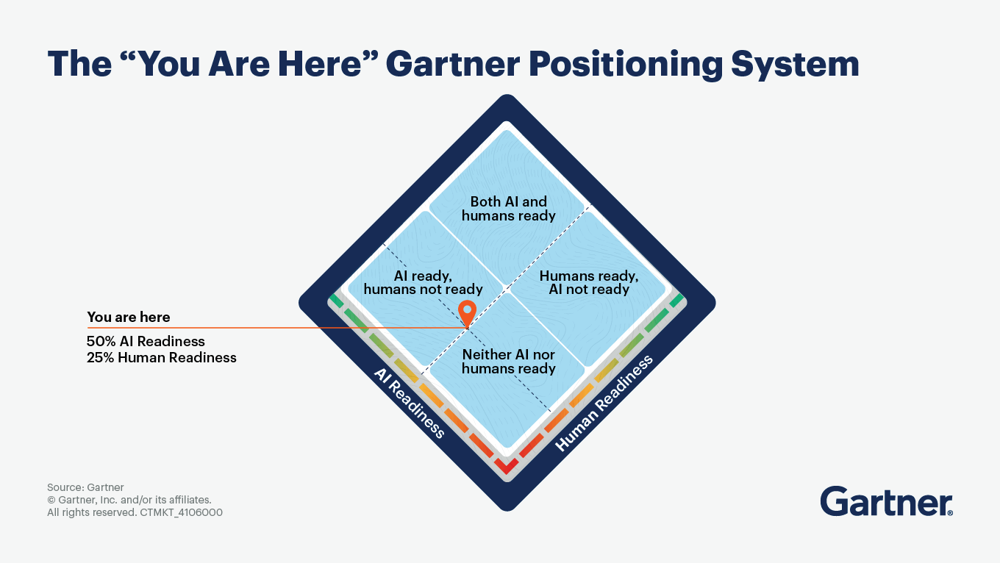

# Navigating the Crossroads of AI and Human Readiness in IT

*Highlights from the 2025 Gartner IT Symposium/Xpo opening keynote—and a practical playbook for CIOs*

## Abstract

AI is surging ahead, but organizations aren’t capturing value at the same pace. At the 2025 Gartner IT Symposium/Xpo, speakers Daryl Plummer and Alicia Mullery underscored a central tension: AI capabilities are accelerating while human readiness, operating models, and accuracy controls lag. The result is sobering odds—roughly one in five AI initiatives achieves ROI and only one in fifty delivers true transformation. This paper translates the keynote’s message into a CIO-ready playbook: how to balance “AI readiness” and “human readiness,” stand up accuracy and agentic capabilities safely, manage escalating costs and vendor choices, and build the skills and change programs required to sustain value.

---

## 1) The “You Are Here” Positioning System

Gartner’s positioning concept (visualized as a diamond with quadrants) frames progress along two axes—**AI Readiness** and **Human Readiness**:

* **Neither AI nor humans ready:** experiments stall; pilots don’t leave the lab.
* **AI ready, humans not ready:** technically sound systems fail to scale because roles, trust, and processes are unclear.
* **Humans ready, AI not ready:** strong demand and change appetite, but models/tools can’t meet accuracy or safety bars.
* **Both AI and humans ready:** the *golden path*—organizations ship trustworthy systems, adapt roles, and continuously compound value.

Most enterprises today sit in the middle-left: **AI capabilities exist, but people, controls, and operating models are underprepared.** The mandate for CIOs is to move diagonally into the top-right by developing humans and systems in lockstep.

---

## 2) Why Balance Matters: The Value Gap

* **Reality check:** Only ~20% of AI initiatives return ROI; ~2% drive true transformation.
* **Interest vs. trust:** While 87% of employees want AI tools, only 32% trust leadership to navigate the change.
* **Accuracy & oversight:** GenAI error rates can approach 25% depending on use case, yet 84% of CIOs lack a formal accuracy-tracking process.
* **Costs compound:** For every AI tool procured, expect ~10 ancillary costs (data engineering, monitoring, privacy reviews, model evaluation, fine-tuning, red-teaming, retraining pipelines, etc.).

**Implication:** Technology alone won’t deliver value. CIOs must treat *human readiness*—skills, incentives, operating model, and trust—as a first-class requirement equal to model quality and infrastructure.

---

## 3) The Golden Path Framework

A CIO playbook to advance both axes in tandem.

### Stage A — **Discover (0–90 days)**

**Goal:** Prove value hypotheses with guardrails.

* **Use-case sieve:** Rank candidates by (1) decision criticality, (2) workflow attach points, (3) data availability/quality, (4) compliance risk, (5) *double readiness* (tech + human).
* **Value thesis:** For each use case, define a *decision improved*, not just a *task automated*.
* **Human-in-the-loop (HITL) plan:** Specify which decisions require review, by whom, and how feedback updates the system.

### Stage B — **De-risk (90–180 days)**

**Goal:** Lift accuracy, safety, and trust to deployment thresholds.

* **Accuracy Survival Kit** (see §5): metrics, two-factor error checks, eval harness, incident playbooks.
* **Change micro-pilots:** 3–4 week cycles to test role changes, prompts/policies, and incentives with small cohorts.
* **Capability handshakes:** Define contracts between data, model, app, and control planes (inputs, outputs, latency, confidence signals).

### Stage C — **Deploy (180–270 days)**

**Goal:** Ship narrowly, scale reliably.

* **Production SLAs:** latency bands, SLOs for accuracy and safety, escalation paths.
* **Policy enforcement:** approvals, provenance logging, PII/PHI handling, and audit artifacts.
* **Agent boundaries:** explicit scopes, allowed actions, and rollback/replay.

### Stage D — **Diffuse (270–365 days)**

**Goal:** Institutionalize learning and compound value.

* **Pattern library:** reusable prompts, tools, datasets, eval sets, and UX patterns.
* **Enablement:** AI literacy, role-based trainings, office hours, and a “citizen dev” lane with guardrails.
* **Portfolio management:** continue/kill decisions by business value, readiness shifts, and cost-to-serve.

---

## 4) A Readiness Scorecard (Practical, not perfect)

Use a lightweight rubric to compare and sequence use cases. Score 0–5 on each line; multiply to highlight bottlenecks.

**AI Readiness (AR):**

* Data fitness (coverage, freshness, quality)
* Model fitness (baseline accuracy on eval set)
* Tooling fitness (APIs, connectors, security posture)
* Observability (telemetry, traces, drift detection)

**Human Readiness (HR):**

* Role clarity (who decides, who reviews)
* Trust & policy (acceptable use, risk posture, comms plan)
* Skill fit (prompt/context engineering, tool fluency)
* Workflow integration (change impact, incentives, UX)

**Readiness Index:** `RI = (Avg AR) × (Avg HR)`
Prioritize high value × high RI. For medium RI, invest to close the weakest factor, then proceed. For low RI, pause or rethink.

---

## 5) The Accuracy Survival Kit

Given error rates and thin oversight in many shops, formalize accuracy like uptime:

1. **Define truth & tolerance**

   * Task-level metrics: exact match, F1, BLEU/ROUGE for text, adjudicated scores for complex reasoning.
   * Decision thresholds: when is HITL mandatory? What confidence bound or ambiguity signal triggers review?

2. **Two-factor error checking**

   * **Internal**: self-critique, tool-augmented verification, retrieval-backed citations.
   * **External**: second model/pass (different family), rules/constraints, or human verification for critical steps.

3. **Evaluation harness**

   * Gold sets sampled from real workflows; adversarial tests; red-team scenarios.
   * Regression gates in CI/CD for prompts, agents, and models.

4. **Incident & drift playbooks**

   * Misuse, hallucination spikes, data drift, tool outages—how to detect, roll back, notify, and learn.

5. **Accountability**

   * Name an **Accuracy Owner** per use case; publish dashboards; review monthly with product & risk.

---

## 6) Beyond Chat: Decision-Making Agents

Conversational agents unlock convenience; **decision-making agents** unlock leverage. Start with bounded domains:

* **B2B negotiation aides:** scenario simulation, counter-proposal drafting with policy constraints.
* **Expert workflows:** IT change tickets, SRE runbooks, procurement compliance checks.
* **Structured planning:** project plans, dependency maps, risk registers with automated evidence gathering.

**Guardrails:** tool scopes, allowlists, approval checkpoints, and full action logs. Pair agents with business rules and retrieval so they decide *with evidence*.

---

## 7) Cost and Vendor Strategy: Think “Digital Nation States”

Expect spend beyond licenses: data pipelines, observability, evals, red teaming, governance, and continuous retraining. Build a **TCO Bill of Materials** for each use case:

* **Build/Run:** model usage, vector/RAG infra, data ETL, notebooks/feature stores, eval compute.
* **Govern:** security reviews, privacy, compliance, lineage/provenance, access controls.
* **Improve:** labeling, feedback ops, prompt/model tuning, experiment management.

**Vendor choice** is strategic: hyperscalers vs. specialists, open vs. closed models, and regional “AI sovereignty.” To avoid lock-in:

* Standardize on **interchangeable interfaces** (OpenAI/Vertex/Bedrock SDKs, model routing).
* Separate **control plane** (governance, evals, policy) from **model plane** (providers).
* Keep **data and eval assets** in your tenancy; version prompts/tools like code.

---

## 8) Building Human Readiness: Skills, Roles, and Change

Human readiness isn’t just job protection; it’s value creation. Aim to develop **“Swiss Army Knife”** contributors—curious, tool-literate, and outcome-oriented.

### Core Skill Blocks

* **AI literacy for all:** strengths/limits, privacy & security basics, how to read an AI dashboard.
* **Context engineering:** data selection, grounding strategies, prompt scaffolds, and evaluation.
* **Agent ops:** writing small tools, defining action policies, reviewing action logs.
* **Risk & compliance fluency:** acceptable use, bias, copyright, and data handling.

### Role Patterns

* **Product Owner (AI):** value hypotheses, KPIs, and stakeholder comms.
* **Accuracy Owner:** metrics, eval sets, incident response.
* **Prompt/Context Engineer:** retrieval design, tool orchestration, prompt versioning.
* **Change Lead:** training, incentives, and adoption.

### Change Management for Managers

* Train managers first; they set norms.
* Tie adoption to **specific outcomes** (e.g., cycle time ↓, case deflection ↑, margin ↑).
* Publicize wins & misses—normalize learning with weekly “what we retired, what we kept, what we scaled.”

**2030 outlook:** ~75% of IT work executed by humans augmented with AI; ~25% by AI alone. Start now to redefine value-creating work: expanding into new markets, shipping AI-accelerated features, and improving margins with differentiated service levels.

---

## 9) Metrics That Matter

Move beyond “# of prompts sent.” Track:

* **Business:** revenue lift, cost-to-serve, margin per workflow, time-to-resolution, NPS/CSAT.
* **Adoption:** active users, depth of use by role, abandonment reasons.
* **Quality:** task accuracy, critical error rate, coverage of gold/eval sets.
* **Risk:** PII leaks prevented, policy breach incidents, model drift alerts and time-to-mitigation.
* **Ops:** latency SLO attainment, tool failure rates, retraining cadence.

Tie compensation and OKRs to a subset of these metrics to align behavior with value.

---

## 10) 12-Month Action Roadmap (Executive Summary)

**0–90 days**

* Stand up an **AI Value Office** (product + risk + platform).
* Score top 10 use cases with the **Readiness Scorecard**; pick 3 to pursue.
* Implement the **Accuracy Survival Kit** v1 and a basic eval harness.
* Launch level-set **AI literacy** for managers; run two micro-pilots.

**90–180 days**

* Ship first production use case with SLAs and HITL checkpoints.
* Create a **pattern library** (prompts, tools, eval sets).
* Negotiate vendor contracts with portability clauses and model-routing plan.

**180–365 days**

* Scale to 5–7 use cases; publish quarterly value reports.
* Formalize **Agent Ops** (tool allowlists, action logs, approval workflows).
* Expand training to “Swiss Army Knife” tracks; certify **Accuracy Owners**.
* Institutionalize **continue/kill** reviews and reinvest savings.

---

## 11) FAQ (Quick Answers for Stakeholders)

**Why must we balance AI and human readiness?**
Because technology capability without prepared people, processes, and trust rarely sustains ROI. Value appears when systems are accurate *and* teams are trained, incentivized, and integrated around them.

**How do we build human readiness?**
Invest in AI literacy, context engineering, and manager-first change programs. Create clear roles (Accuracy Owner, Prompt/Context Engineer) and attach adoption to business outcomes. Run short, measurable micro-pilots to rehearse new ways of working.

**How do we handle accuracy risk?**
Adopt the Accuracy Survival Kit: define task-level metrics and tolerances, require two-factor error checks for critical steps, maintain eval harnesses, and assign accountability. Treat accuracy like uptime—with dashboards and incident response.

**Are conversational agents enough?**
Not for advanced value. Bounded, decision-making agents—paired with retrieval, tools, and policy constraints—unlock leverage in negotiations, expert tasks, and structured planning.

**What about cost and vendor lock-in?**
Budget for the full TCO, not just licenses. Separate control and model planes, keep eval assets in your tenancy, and negotiate for portability. Use model routing to preserve flexibility.

---

## Conclusion: Elevate to Value

The keynote’s central message is pragmatic: **greatness lies in the golden middle—where AI capability and human capability rise together.** With a readiness scorecard, an accuracy-first operating model, agentic patterns, and a deliberate talent program, CIOs can move the dot on the “You Are Here” map—out of experiments, into reliable deployment, and onward to compounding value.
