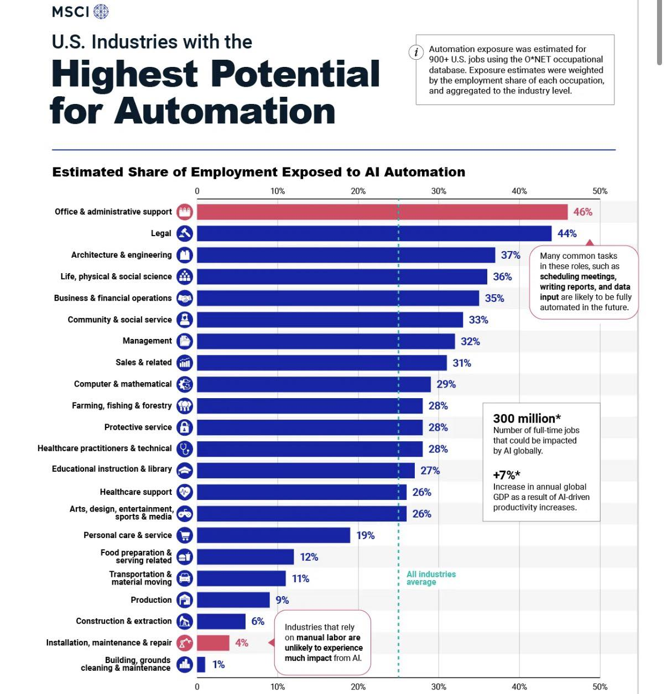

# Navigating the Crossroads of AI and Human Readiness in IT

*Highlights from the 2025 Gartner IT Symposium/Xpo opening keynote—and a practical playbook for CIOs*

**[Watch Overview Video in English: AI's Great Value Paradox](https://youtu.be/jPEeszvkRhs)**

**[Watch Overview Video in Urdu/Hindi: AI's Great Value Paradox](https://youtu.be/rsEcTIiW5Ws)**

**[Navigating AI Transformation: A Strategic Guide for Beginners](ai_transformation_guide.md)**

**[Taking a Self-Assessment Quiz](quiz.md)**

## Executive Summary

The artificial intelligence revolution presents a critical paradox for today's leaders. While AI's potential to automate tasks is immense—with sectors like **Office & Administrative Support (46%)** and **Legal (44%)** facing significant disruption—the realization of this potential is falling catastrophically short. Data from Gartner reveals that a mere **20% of AI initiatives achieve a return on investment**, and only a staggering **2% deliver transformational impact**.

This disconnect is not a technology problem; it is a human and organizational one. AI capabilities are accelerating, but human readiness, operating models, and essential controls are lagging. The CIO's most urgent mandate is therefore to bridge this gap. Sustainable value creation and competitive advantage will not come from deploying AI alone, but from orchestrating a dual strategy that advances technological capabilities and human preparedness in lockstep.

### **The Argument: Bridging the Gap Between AI Potential and Human Readiness**

#### **1. The Sobering Reality: An Unbalanced Revolution**

The promise of AI is clear: a potential **7% increase in annual global GDP** and the automation of up to **300 million jobs** globally. However, as insights from the 2025 Gartner IT Symposium/Xpo underscore, organizations are failing to capture this value. The core tension is an imbalance: **AI is surging ahead while the human elements required to support it—skills, processes, and change management—are left behind.** The result is a landscape of failed projects and wasted investment, where grand technological ambition meets the friction of organizational inertia.

#### **2. Mapping the Disruption: Where AI Will Hit Hardest**

The MSCI data provides a clear map of this impending disruption. The roles most exposed to automation are not on the factory floor, but in the corporate office.
* **Knowledge-Based and Administrative Roles:** Fields like **Office & Administrative Support (46%)**, **Legal (44%)**, **Architecture & Engineering (37%)**, and **Business & Financial Operations (35%)** are at the epicenter of the AI wave. Common tasks central to these roles—scheduling, data entry, report writing, and analysis—are precisely what current AI is designed to handle.
* **Manual Labor Roles:** In stark contrast, industries reliant on manual dexterity and physical intervention, such as **Building Maintenance (1%)**, **Installation & Repair (4%)**, and **Construction (6%)**, remain largely insulated.

This data demonstrates that the AI revolution is fundamentally a white-collar transformation. It is a direct challenge to the processes and skills that have defined knowledge work for decades.

#### **3. The CIO's Mandate: From Technologist to Organizational Architect**

Connecting the "what" of the MSCI data with the "why" of the Gartner analysis reveals the CIO's true challenge. The reason only one in fifty AI projects is transformational is that organizations are deploying advanced tools into environments not ready to absorb them.

To reverse this trend, CIOs must pivot from being technology implementers to architects of a dual-readiness strategy:

* **Balance "AI Readiness" with "Human Readiness":** For every dollar spent on AI models and platforms, a commensurate investment must be made in workforce training, process re-engineering, and change management. Deploying an AI to automate legal document review is useless if the legal team's workflows, skills, and incentive structures remain unchanged.
* **Prioritize Accuracy and Governance:** As AI agents become more autonomous, establishing robust controls for accuracy and ethical oversight is non-negotiable. This builds trust and mitigates the risk of costly errors that undermine project ROI.
* **Build a Sustainable Value Engine:** The goal is not a series of one-off AI projects but a sustained capability. This requires a strategic approach to managing escalating costs, selecting vendors, and building the internal skills necessary to scale successes and adapt to the next wave of technological change.

In conclusion, the data is unequivocal. The potential for AI to drive productivity is enormous, but realizing it depends entirely on closing the human readiness gap. The challenge for every CIO is to look beyond the technology and lead the comprehensive organizational transformation required to turn AI's immense potential into tangible, sustainable value.

---

## Industries that’ll likely be Replaced by AI First

### 📊 **Overview of the Infographic**

This infographic from **MSCI** is titled "U.S. Industries with the Highest Potential for Automation." It presents a horizontal bar chart that illustrates the **Estimated Share of Employment Exposed to AI Automation** across various U.S. industries.

The chart visually ranks industries based on the percentage of their workforce whose tasks are susceptible to being automated by Artificial Intelligence.

### **Key Findings from the Chart**

The data reveals a wide range of exposure to AI automation across different sectors:

**Highest Exposure Industries:**
* **Office & administrative support:** Tops the list with **46%** of employment exposed to automation.
* **Legal:** A close second with **44%** exposure.
* **Architecture & engineering:** Shows significant potential for automation at **37%**.
* **Business & financial operations:** Ranks high with **35%** exposure.

> A note on the chart clarifies that common tasks in these top-ranking fields, such as **scheduling meetings, writing reports, and data input**, are prime candidates for full automation in the future.

**Lowest Exposure Industries:**
* **Construction & extraction:** **6%**
* **Installation, maintenance & repair:** **4%**
* **Building, grounds cleaning & maintenance:** The lowest at just **1%**.

> An accompanying note explains that **industries reliant on manual labor** are unlikely to experience a significant impact from AI.

**Average Exposure:**
* A dotted line on the chart indicates that the **All Industries average** for employment exposure to AI automation is **26%**.

---

### **Global Impact Projections**

The infographic also provides two significant global statistics related to AI's impact:

* **300 million:** The estimated number of full-time jobs that could be impacted by AI globally.
* **+7%:** The potential increase in annual global GDP as a result of AI-driven productivity increases.

### **Methodology**

A small text box at the top right explains that the automation exposure was estimated for over 900 U.S. jobs using the O\*NET occupational database. These estimates were then weighted by the employment share of each occupation to arrive at the industry-level figures.

In summary, the image provides a data-driven analysis of which U.S. industries are most and least likely to be transformed by AI automation, highlighting a clear distinction between cognitive, office-based roles and manual, physical labor roles.

---

## 1) Introduction: The Value Paradox

Organizations today find themselves caught in a paradox. While artificial intelligence technologies advance at an unprecedented pace, the ability to capture and sustain value from these investments remains elusive. Gartner analysts Daryl Plummer and Alicia Mullery articulate a sobering reality: the path to greatness lies neither in uncritical adoption of AI nor in dismissive skepticism, but rather in navigating the nuanced middle ground where genuine value crystallizes.
The Gartner positioning system illustrates this challenge vividly. Most organizations occupy the lower-left quadrant where AI readiness reaches only 50% and human readiness languishes at 25%. This asymmetry reveals the fundamental obstacle to value realization: technological capability has outpaced organizational preparedness to leverage it effectively.

---

## 2) The AI Readiness Imperative

Technical capabilities in search and content generation have matured considerably, yet critical dimensions remain problematic. Generative AI systems demonstrate error rates reaching 25% in certain applications, creating substantial risk for organizations deploying these tools without adequate safeguards. More concerning, 84% of CIOs and IT leaders lack formal processes to monitor AI accuracy, effectively flying blind in their AI initiatives.

The concept of an "accuracy survival kit" emerges as essential infrastructure. This framework encompasses three components: comprehensive metrics for measuring AI output quality, two-factor error checking mechanisms that validate results through independent verification, and realistic performance standards aligned with business requirements rather than aspirational benchmarks. Without these foundations, organizations expose themselves to cascading failures where AI errors compound rather than resolve business challenges.
Beyond accuracy, the evolution from conversational agents to decision-making agents represents the next frontier. While chatbots and content generators provide incremental productivity gains, autonomous agents capable of complex B2B negotiations or expert-level task execution promise transformational impact. However, these advanced capabilities demand corresponding advances in governance, oversight, and integration with existing business processes.

## 3) The “You Are Here” Positioning System

Gartner’s positioning concept (visualized as a diamond with quadrants) frames progress along two axes—**AI Readiness** and **Human Readiness**:

* **Neither AI nor humans ready:** experiments stall; pilots don’t leave the lab.
* **AI ready, humans not ready:** technically sound systems fail to scale because roles, trust, and processes are unclear.
* **Humans ready, AI not ready:** strong demand and change appetite, but models/tools can’t meet accuracy or safety bars.
* **Both AI and humans ready:** the *golden path*—organizations ship trustworthy systems, adapt roles, and continuously compound value.

Most enterprises today sit in the middle-left: **AI capabilities exist, but people, controls, and operating models are underprepared.** The mandate for CIOs is to move diagonally into the top-right by developing humans and systems in lockstep.

---

## 4) The Human Readiness Gap

While AI technology presents implementation challenges, human readiness constitutes the more formidable obstacle. Despite 87% of employees expressing interest in AI tools, only 32% trust organizational leadership to guide transformation effectively. This trust deficit creates organizational fog that obscures the path to value creation.

The human readiness gap manifests in multiple dimensions. Skills deficits prevent employees from effectively leveraging AI capabilities. Psychological barriers rooted in job security concerns inhibit adoption and experimentation. Organizational culture often lacks the adaptability required for rapid iteration and learning. Leadership frequently approaches AI as a purely technical challenge rather than a sociotechnical transformation requiring coordinated change across people, processes, and technology.

The emergence of **"Swiss Army Knife" workers (M-Shaped Workers)** illustrates the human capacity organizations must cultivate. These individuals possess sufficient technical literacy to identify problems, adequate curiosity to explore AI solutions, and practical judgment to apply AI tools appropriately. They represent not specialists in AI development but rather adaptive generalists who fluidly integrate AI into their problem-solving repertoire.
Developing such workers requires modern AI literacy programs that extend beyond basic tool training. Context engineering—the ability to frame problems and structure inputs to maximize AI utility—represents a critical competency. Prompt design, output evaluation, and iterative refinement constitute practical skills that amplify AI effectiveness across diverse applications.

---

## 5) Why Balance Matters: The Value Gap

* **Reality check:** Only ~20% of AI initiatives return ROI; ~2% drive true transformation.
* **Interest vs. trust:** While 87% of employees want AI tools, only 32% trust leadership to navigate the change.
* **Accuracy & oversight:** GenAI error rates can approach 25% depending on use case, yet 84% of CIOs lack a formal accuracy-tracking process.
* **Costs compound:** For every AI tool procured, expect ~10 ancillary costs (data engineering, monitoring, privacy reviews, model evaluation, fine-tuning, red-teaming, retraining pipelines, etc.).

**Implication:** Technology alone won’t deliver value. CIOs must treat *human readiness*—skills, incentives, operating model, and trust—as a first-class requirement equal to model quality and infrastructure.

---

## 6) The Economic Calculus

AI implementation carries economic complexity that organizations frequently underestimate. For each AI tool procured, approximately ten ancillary costs emerge across data management, model oversight, integration, training, and ongoing maintenance. These hidden expenses can transform apparently cost-effective solutions into expensive disappointments when fully accounted.
Vendor selection has evolved into a strategic decision with profound implications. Gartner frames this choice as selecting a "digital nation state"—a metaphor that captures the comprehensive relationship organizations establish with major AI providers. Hyperscalers offer extensive ecosystems and integration capabilities but risk creating dependency. Innovative startups provide specialized solutions and agility but introduce uncertainty regarding long-term viability.
Model lock-in represents a particularly insidious risk. Organizations that deeply integrate proprietary AI models into core processes may find themselves constrained in future decision-making, unable to migrate without substantial cost and disruption. AI sovereignty considerations—the ability to control and understand the AI systems upon which business operations depend—must inform vendor evaluation alongside traditional criteria of cost and capability.

---

## 7) The Golden Path Framework

A CIO playbook to advance both axes in tandem.

### Stage A — **Discover (0–90 days)**

**Goal:** Prove value hypotheses with guardrails.

* **Use-case sieve:** Rank candidates by (1) decision criticality, (2) workflow attach points, (3) data availability/quality, (4) compliance risk, (5) *double readiness* (tech + human).
* **Value thesis:** For each use case, define a *decision improved*, not just a *task automated*.
* **Human-in-the-loop (HITL) plan:** Specify which decisions require review, by whom, and how feedback updates the system.

### Stage B — **De-risk (90–180 days)**

**Goal:** Lift accuracy, safety, and trust to deployment thresholds.

* **Accuracy Survival Kit** (see §5): metrics, two-factor error checks, eval harness, incident playbooks.
* **Change micro-pilots:** 3–4 week cycles to test role changes, prompts/policies, and incentives with small cohorts.
* **Capability handshakes:** Define contracts between data, model, app, and control planes (inputs, outputs, latency, confidence signals).

### Stage C — **Deploy (180–270 days)**

**Goal:** Ship narrowly, scale reliably.

* **Production SLAs:** latency bands, SLOs for accuracy and safety, escalation paths.
* **Policy enforcement:** approvals, provenance logging, PII/PHI handling, and audit artifacts.
* **Agent boundaries:** explicit scopes, allowed actions, and rollback/replay.

### Stage D — **Diffuse (270–365 days)**

**Goal:** Institutionalize learning and compound value.

* **Pattern library:** reusable prompts, tools, datasets, eval sets, and UX patterns.
* **Enablement:** AI literacy, role-based trainings, office hours, and a “citizen dev” lane with guardrails.
* **Portfolio management:** continue/kill decisions by business value, readiness shifts, and cost-to-serve.

---

## 8) A Readiness Scorecard (Practical, not perfect)

Use a lightweight rubric to compare and sequence use cases. Score 0–5 on each line; multiply to highlight bottlenecks.

**AI Readiness (AR):**

* Data fitness (coverage, freshness, quality)
* Model fitness (baseline accuracy on eval set)
* Tooling fitness (APIs, connectors, security posture)
* Observability (telemetry, traces, drift detection)

**Human Readiness (HR):**

* Role clarity (who decides, who reviews)
* Trust & policy (acceptable use, risk posture, comms plan)
* Skill fit (prompt/context engineering, tool fluency)
* Workflow integration (change impact, incentives, UX)

**Readiness Index:** `RI = (Avg AR) × (Avg HR)`
Prioritize high value × high RI. For medium RI, invest to close the weakest factor, then proceed. For low RI, pause or rethink.

---

## 9) The Accuracy Survival Kit

Given error rates and thin oversight in many shops, formalize accuracy like uptime:

1. **Define truth & tolerance**

   * Task-level metrics: exact match, F1, BLEU/ROUGE for text, adjudicated scores for complex reasoning.
   * Decision thresholds: when is HITL mandatory? What confidence bound or ambiguity signal triggers review?

2. **Two-factor error checking**

   * **Internal**: self-critique, tool-augmented verification, retrieval-backed citations.
   * **External**: second model/pass (different family), rules/constraints, or human verification for critical steps.

3. **Evaluation harness**

   * Gold sets sampled from real workflows; adversarial tests; red-team scenarios.
   * Regression gates in CI/CD for prompts, agents, and models.

4. **Incident & drift playbooks**

   * Misuse, hallucination spikes, data drift, tool outages—how to detect, roll back, notify, and learn.

5. **Accountability**

   * Name an **Accuracy Owner** per use case; publish dashboards; review monthly with product & risk.

---

## 10) Beyond Chat: Decision-Making Agents

Conversational agents unlock convenience; **decision-making agents** unlock leverage. Start with bounded domains:

* **B2B negotiation aides:** scenario simulation, counter-proposal drafting with policy constraints.
* **Expert workflows:** IT change tickets, SRE runbooks, procurement compliance checks.
* **Structured planning:** project plans, dependency maps, risk registers with automated evidence gathering.

**Guardrails:** tool scopes, allowlists, approval checkpoints, and full action logs. Pair agents with business rules and retrieval so they decide *with evidence*.

---

## 11) Cost and Vendor Strategy: Think “Digital Nation States”

Expect spend beyond licenses: data pipelines, observability, evals, red teaming, governance, and continuous retraining. Build a **TCO Bill of Materials** for each use case:

* **Build/Run:** model usage, vector/RAG infra, data ETL, notebooks/feature stores, eval compute.
* **Govern:** security reviews, privacy, compliance, lineage/provenance, access controls.
* **Improve:** labeling, feedback ops, prompt/model tuning, experiment management.

**Vendor choice** is strategic: hyperscalers vs. specialists, open vs. closed models, and regional “AI sovereignty.” To avoid lock-in:

* Standardize on **interchangeable interfaces** (OpenAI/Vertex/Bedrock SDKs, model routing).
* Separate **control plane** (governance, evals, policy) from **model plane** (providers).
* Keep **data and eval assets** in your tenancy; version prompts/tools like code.

---

## 12) Building Human Readiness: Skills, Roles, and Change

Human readiness isn’t just job protection; it’s value creation. Aim to develop **“Swiss Army Knife”** contributors—curious, tool-literate, and outcome-oriented.

### Core Skill Blocks

* **AI literacy for all:** strengths/limits, privacy & security basics, how to read an AI dashboard.
* **Context engineering:** data selection, grounding strategies, prompt scaffolds, and evaluation.
* **Agent ops:** writing small tools, defining action policies, reviewing action logs.
* **Risk & compliance fluency:** acceptable use, bias, copyright, and data handling.

### Role Patterns

* **Product Owner (AI):** value hypotheses, KPIs, and stakeholder comms.
* **Accuracy Owner:** metrics, eval sets, incident response.
* **Prompt/Context Engineer:** retrieval design, tool orchestration, prompt versioning.
* **Change Lead:** training, incentives, and adoption.

### Change Management for Managers

* Train managers first; they set norms.
* Tie adoption to **specific outcomes** (e.g., cycle time ↓, case deflection ↑, margin ↑).
* Publicize wins & misses—normalize learning with weekly “what we retired, what we kept, what we scaled.”

---
## 13) The 2030 Horizon

Gartner projects that by 2030, 75% of IT work will be performed by humans augmented with AI, while 25% will be executed by AI autonomously. This forecast demands proactive workforce planning that anticipates both displacement and creation of roles. The challenge for CIOs extends beyond managing the transition to identifying new value-creating work that leverages AI capabilities while retaining essential human judgment.

Potential value creation domains include market expansion enabled by AI-powered localization and customer insights, product and service innovation accelerated by rapid prototyping and testing, and margin enhancement through operational optimization that preserves quality while reducing costs. These opportunities require reimagining IT's role from technology provider to strategic value architect.
Change management for managers constitutes a critical enabler. Middle management faces particular challenges as AI automates coordination tasks while elevating the importance of coaching, strategic thinking, and cross-functional collaboration. Organizations must prepare managers to lead hybrid teams where humans and AI agents collaborate, requiring new competencies in AI oversight, ethical decision-making, and adaptive leadership.

---

## 14) Metrics That Matter

Move beyond “# of prompts sent.” Track:

* **Business:** revenue lift, cost-to-serve, margin per workflow, time-to-resolution, NPS/CSAT.
* **Adoption:** active users, depth of use by role, abandonment reasons.
* **Quality:** task accuracy, critical error rate, coverage of gold/eval sets.
* **Risk:** PII leaks prevented, policy breach incidents, model drift alerts and time-to-mitigation.
* **Ops:** latency SLO attainment, tool failure rates, retraining cadence.

Tie compensation and OKRs to a subset of these metrics to align behavior with value.

---

## 15) FAQ (Quick Answers for Stakeholders)

**Why must we balance AI and human readiness?**
Because technology capability without prepared people, processes, and trust rarely sustains ROI. Value appears when systems are accurate *and* teams are trained, incentivized, and integrated around them.

**How do we build human readiness?**
Invest in AI literacy, context engineering, and manager-first change programs. Create clear roles (Accuracy Owner, Prompt/Context Engineer) and attach adoption to business outcomes. Run short, measurable micro-pilots to rehearse new ways of working.

**How do we handle accuracy risk?**
Adopt the Accuracy Survival Kit: define task-level metrics and tolerances, require two-factor error checks for critical steps, maintain eval harnesses, and assign accountability. Treat accuracy like uptime—with dashboards and incident response.

**Are conversational agents enough?**
Not for advanced value. Bounded, decision-making agents—paired with retrieval, tools, and policy constraints—unlock leverage in negotiations, expert tasks, and structured planning.

**What about cost and vendor lock-in?**
Budget for the full TCO, not just licenses. Separate control and model planes, keep eval assets in your tenancy, and negotiate for portability. Use model routing to preserve flexibility.

---

## Conclusion: The Middle Path

The 2025 Gartner IT Symposium/Xpo keynote articulates a fundamental insight: sustainable AI value emerges neither from technological determinism nor from skeptical resistance, but from the disciplined navigation of the middle path. This path requires simultaneous attention to AI readiness and human readiness, recognition that both technology and people must evolve together, and acceptance that transformation is a journey rather than a destination.
The sobering statistics—only 20% of AI initiatives achieving ROI, merely 2% delivering transformation—reflect not AI's inherent limitations but rather organizational unreadiness to capture the value AI makes possible. The organizations that will thrive in the AI era are those that recognize this reality and commit to building both dimensions of readiness with equal rigor.

For CIOs standing at this crossroads, the imperative is clear: unlock and sustain real value by getting both AI and humans ready to transcend their current limitations. The golden middle ground where true value resides awaits those willing to walk this balanced path with determination, discipline, and strategic foresight.

The keynote’s central message is pragmatic: **greatness lies in the golden middle—where AI capability and human capability rise together.** With a readiness scorecard, an accuracy-first operating model, agentic patterns, and a deliberate talent program, CIOs can move the dot on the “You Are Here” map—out of experiments, into reliable deployment, and onward to compounding value.
