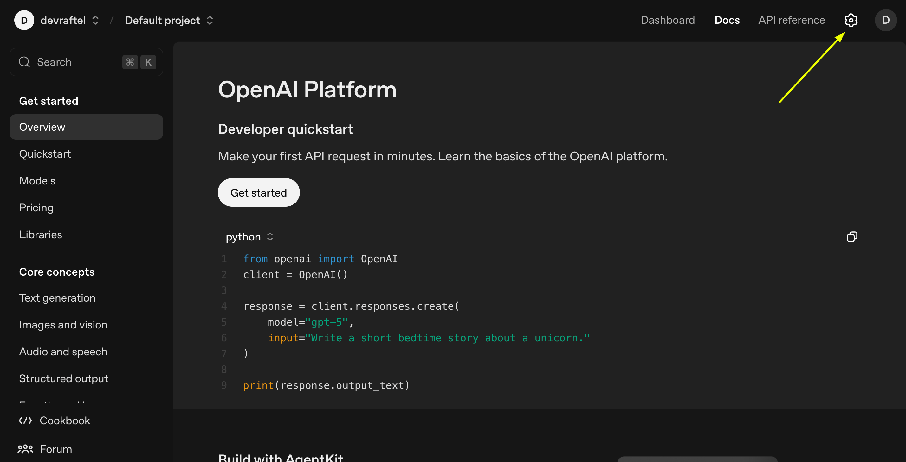
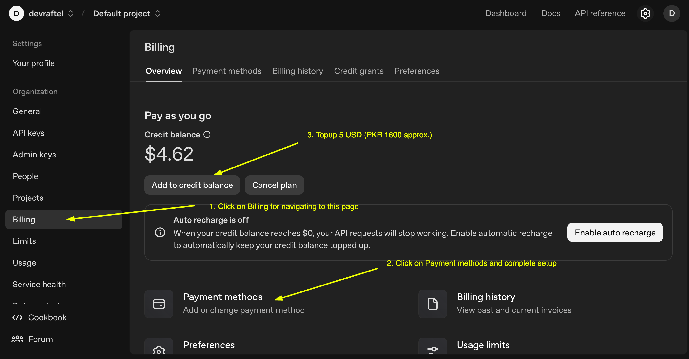

# Pre-Setup Guide: Getting Ready for Week 2 Session 1

Complete these steps **before** the class to ensure you can follow along smoothly.

---

## Required Setup (Complete All Steps)

### Step 1: Create OpenAI Platform Account (5 minutes)

1. Go to [https://platform.openai.com](https://platform.openai.com)
2. Click **Sign up** in the top right corner
3. Choose one of these options:
   - Sign up with Google
   - Sign up with email and password
4. Verify your email address if required

**✅ Success check:** You should see the OpenAI Platform dashboard

---

### Step 2: Set Up Billing (10 minutes)

OpenAI requires a payment method to test agent workflows created in Agent Builder.

**Accepted payment methods in Pakistan:**

- International credit cards (Visa, Mastercard)
- SadaPay virtual card
- NayaPay virtual card

**Steps:**

1. Find the Settings Icon on top right corner next to profile icon (top right)
2. Select **Settings**

3. From left sidebar select **Billing**
3. Click **Payment Methods** -> **Add payment method**
4. Enter your card details:
   - Card number
   - Expiration date
   - CVV/CVC
   - Billing address (use your accurate address)
5. Click **Save**

**For SadaPay/NayaPay users:**

- Open your SadaPay or NayaPay app
- Create a virtual card (if you don't have one)
- Copy the card details
- Use them in the OpenAI billing
- Make sure your card has at least $5-6 balance (PKR 1600+)

**✅ Success check:** You should see "Payment method added" confirmation

---

### Step 3: Add Initial Credit ($5 minimum) (5 minutes)

1. Stay in **Settings** → **Billing**
2. Click **Add to credit balance**
3. Enter amount: **$5.00** (minimum recommended)
4. Click **Continue**
5. Review the charge
6. Click **Confirm payment**

**💡 Why $5?**

- Agent Builder testing uses minimal credits (usually under $0.5-1 for the whole session)
- $5 gives you room to experiment and practice later
- Unused credit stays in your account

**✅ Success check:** Your credit balance should show $5.00

---

### Step 4: Verify Your Organization (2 minutes)

OpenAI creates a default organization for you automatically.

1. Click on → **Settings** icon
2. Go to **Organization** tab
3. You should see your organization name (usually your email prefix)
4. Click on verify and follow the process to complete verification (Optional but it opens Preview Testing feature)

**✅ Success check:** You can see verified organization.

---

### Step 5: Test Access to Agent Builder (3 minutes)

Verify everything is working:

1. From the dashboard, click **Agent Builder** in the left menu
   - Or go directly to: [https://platform.openai.com/playground/agent-builder](https://platform.openai.com/playground/agent-builder)
2. You should see the Agent Builder canvas
3. Look for **Templates** button at the top
4. Click it to see available templates

**✅ Success check:** You can see the Agent Builder interface and templates

---

## Pre-Class Checklist

Print or save this checklist and confirm before class:

- ✅ I can log in to platform.openai.com
- ✅ My payment method is added and verified
- ✅ I have at least $5 credit in my account
- ✅ I can access Agent Builder interface
- ✅ I can see the Templates button
- ✅ I have a stable internet connection
- ✅ I have a notebook or document ready for notes
- ✅ I have verified my Organization

---

## Cost Expectations

**What uses credits:**

- Running agent previews (testing)
- Using GPT models in nodes
- File search operations
- Each test conversation

**What's free:**

- Building workflows (dragging nodes)
- Saving drafts
- Viewing documentation
- Publishing versions

**💡 Tip:** Monitor your usage in Settings → Usage to see real-time costs

---

## Security & Safety Tips

1. **Never share your API key** with anyone (we won't use API keys in this session, but keep them private always)
2. **Use a strong password** for your OpenAI account
3. **Enable two-factor authentication** (optional but recommended)
4. **Don't store real customer data** in practice agents—use fake/sample data only
5. **Set up spending limits** in Settings → Billing → Limits (recommended: $10/month to start)

---

## Ready to Go!

Once you've completed all steps above, you're ready for Week 2 Session 1.

**See you in class!** 🚀

---

## Quick Links Reference

- Platform login: [https://platform.openai.com](https://platform.openai.com)
- Billing settings: [https://platform.openai.com/settings/organization/billing/overview](https://platform.openai.com/settings/organization/billing/overview)
